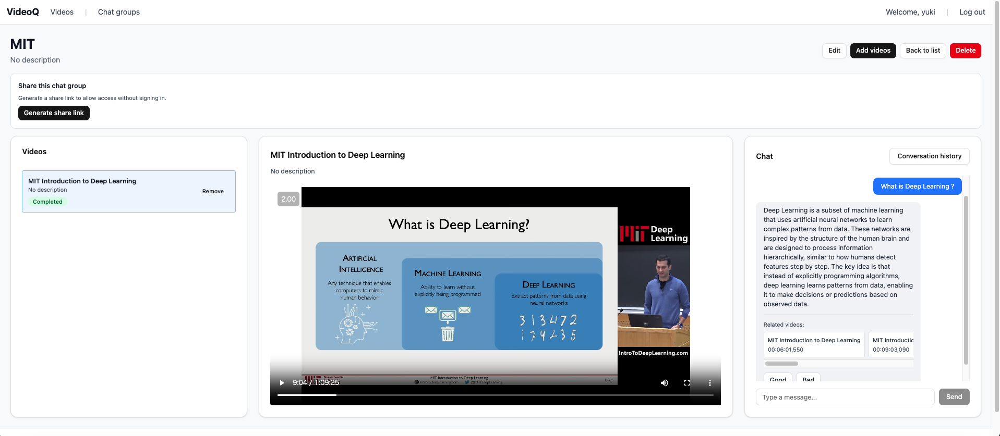

# VideoQ

🎥 **AIに質問するだけで、見たいシーンに瞬時にジャンプ**

VideoQは、動画を自動で文字起こしし、自然言語で動画と会話できるAI搭載の動画ナビゲーターです。

**[日本語版README](README.md) | [English README](README.en.md)**

🌐 **オンラインで今すぐ試す:** [https://videoq.jp/](https://videoq.jp/)

または、以下の手順でローカル環境にセットアップできます。



## ✨ できること

- **あらゆる動画をアップロード** - MP4、MOV、AVI など
- **質問する** - 「予算について何と言っていた？」「要点をまとめて」など
- **コンテンツを検索** - 何時間もの映像をスクラブせずに特定の瞬間を見つける
- **タグで整理** - カスタムタグと色で動画を整理
- **インサイトを共有** - チームコラボレーション用の共有可能な動画グループを作成
- **ショート動画** - AIの回答で頻繁に参照される人気シーンをTikTokのようにスワイプ閲覧
- **多言語対応** - 日本語・英語インターフェースの切り替え

## 🚀 クイックスタート（5分）

### 必要なもの

- [Docker](https://docs.docker.com/get-docker/) と [Docker Compose](https://docs.docker.com/compose/install/) がインストール済み
- [OpenAI APIキー](https://platform.openai.com/api-keys)（取得方法をご説明します）

### ステップ1: OpenAI APIキーを取得

1. [OpenAI Platform](https://platform.openai.com/api-keys) にアクセス
2. サインアップまたはログイン
3. 「Create new secret key」をクリック
4. キーをコピー（`sk-...` で始まります）


### ステップ2: VideoQをセットアップ

```bash
# プロジェクトをクローンして移動
git clone https://github.com/yukiharada1228/videoq.git
cd videoq

# 設定ファイルをコピー
cp .env.example .env
```

`.env` ファイルを編集してOpenAI APIキーを追加：

```bash
OPENAI_API_KEY=sk-your-key-here
```

### ステップ3: VideoQを起動

```bash
# 全サービスを開始（初回は数分かかる場合があります）
docker compose up --build -d

# データベースをセットアップ
docker compose exec backend python manage.py migrate
docker compose exec backend python manage.py collectstatic --noinput

# 管理者アカウントを作成
docker compose exec backend python manage.py createsuperuser
```

### ステップ4: VideoQを使い始める！

ブラウザで [http://localhost](http://localhost) を開けば準備完了です！

**その他の便利なリンク:**
- **管理パネル:** [http://localhost/api/admin](http://localhost/api/admin) （ユーザー、動画の管理）
- **API ドキュメント:** [http://localhost/api/docs/](http://localhost/api/docs/) （開発者向け）

### 📋 ユーザー管理

**重要:** 新規ユーザーは動画アップロード制限が0（アップロード不可）で作成されます。管理者として、管理パネルを通じてユーザーに適切な動画制限を設定する必要があります。

**動画制限を設定するには:**
1. [管理パネル](http://localhost/api/admin) にアクセス
2. 「Users」をクリック
3. 編集するユーザーを選択
4. 「Video limit」フィールドを設定：
   - `0` = アップロード不可（新規ユーザーのデフォルト）
   - 任意の正の数 = ユーザーがアップロードできる最大動画数
   - 空白 = 無制限アップロード

この設計により、管理者がリソース使用量とユーザー権限を完全に制御できます。

## 🎬 機能の詳細

### ショート動画

VideoQはAIが質問に回答する際に最も頻繁に参照された動画セグメントを追跡します。これらの人気シーンを縦型のショート動画形式で閲覧できます：

- **TikTokのようなナビゲーション** - 上下にスワイプまたは矢印キーでシーン間を移動
- **人気シーン** - 実際のAI使用状況に基づいて最も重要な瞬間を表示
- **クイックプレビュー** - 動画の最も関連性の高い部分に直接ジャンプ
- **共有でも使える** - ショート機能は共有リンクでも動作

### 共有とコラボレーション

サインアップ不要で他者と動画グループを共有：

- **共有リンクの生成** - 動画グループの一意のURLを作成
- **ログイン不要** - 受信者はアカウントなしで動画を視聴しチャット可能
- **フルAIチャットアクセス** - 共有ユーザーも動画について質問可能
- **アクセス制御** - 共有リンクの無効化や再生成がいつでも可能

## 💰 コストを節約したい？ローカル代替手段を使用

VideoQは完全にオフラインで動作し、無料のローカルAIモデルを使用できます。これによりOpenAIのコストを完全に削減できます！

<details>
<summary><strong>🖥️ ローカルWhisper（無料の文字起こし）</strong></summary>

コンピューターのGPUを使用して、より高速で無料の文字起こしを実現。

**クイックセットアップ:**

```bash
# 1. whisper.cppを取得（VideoQルートディレクトリから）
git submodule update --init --recursive
cd whisper.cpp

# 2. ビルド
cmake -B build
cmake --build build -j --config Release

# 3. モデルをダウンロード
bash ./models/download-ggml-model.sh large-v3-turbo

# 4. サーバーを起動
./build/bin/whisper-server -m models/ggml-large-v3-turbo.bin --inference-path /audio/transcriptions -l ja
```

**VideoQを設定:**

`.env` ファイルを編集：
```bash
WHISPER_BACKEND=whisper.cpp
WHISPER_LOCAL_URL=http://host.docker.internal:8080
```

再起動: `docker compose restart backend celery-worker`

</details>

<details>
<summary><strong>🤖 OllamaでローカルAIチャット（無料のChatGPT代替）</strong></summary>

**Ollamaをインストール:**
1. [ollama.com](https://ollama.com) からダウンロード
2. インストールして実行

**モデルを取得:**
```bash
ollama pull qwen3:0.6b  # 小さく高速なモデル
# または
ollama pull llama3:8b   # より大きく高性能なモデル
```

**VideoQを設定:**

`.env` ファイルを編集：
```bash
LLM_PROVIDER=ollama
LLM_MODEL=qwen3:0.6b
OLLAMA_BASE_URL=http://host.docker.internal:11434
```

再起動: `docker compose restart backend celery-worker`

</details>

<details>
<summary><strong>🔍 ローカル埋め込み（無料のテキスト検索）</strong></summary>

**埋め込みモデルを取得:**
```bash
ollama pull qwen3-embedding:0.6b
```

**VideoQを設定:**

`.env` ファイルを編集：
```bash
EMBEDDING_PROVIDER=ollama
EMBEDDING_MODEL=qwen3-embedding:0.6b
OLLAMA_BASE_URL=http://host.docker.internal:11434
```

再起動: `docker compose restart backend celery-worker`

**重要:** OpenAIからローカル埋め込みに切り替える場合、管理パネルで既存の動画を再インデックスする必要があります。

</details>

## 🛠️ 開発・カスタマイズ

<details>
<summary><strong>フロントエンド開発</strong></summary>

UIをカスタマイズしたい？より高速な開発のためにフロントエンドを個別に実行：

```bash
cd frontend
npm install
npm run dev  # http://localhost:3000 で実行
```

バックエンドはDockerで実行したままにしてください。

**技術スタック:**
- React 19 + TypeScript
- Tailwind CSS v4
- Vite 7
- Vitest（テスト用）
- i18next（国際化対応）
- Radix UIコンポーネント

</details>

<details>
<summary><strong>バックエンド開発</strong></summary>

```bash
cd backend
pip install -r requirements.txt
python manage.py runserver
```

**技術スタック:**
- Django 5.2
- Django REST Framework
- Celery（非同期タスク）
- LangChain（AI連携）
- pgvector（セマンティック検索）

</details>

<details>
<summary><strong>テストの実行</strong></summary>

**フロントエンド:**
```bash
cd frontend
npm run test              # テスト実行
npm run test:watch        # ウォッチモード
npm run test:coverage     # カバレッジレポート付き
```

**バックエンド:**
```bash
cd backend
python manage.py test
```

</details>

<details>
<summary><strong>便利なDockerコマンド</strong></summary>

```bash
docker compose ps                                          # 実行中のサービスを確認
docker compose logs -f                                     # 全ログを監視
docker compose logs -f backend                             # バックエンドログのみ監視
docker compose exec backend python manage.py shell         # Djangoシェル
docker compose down                                        # 全て停止
docker compose restart backend                             # バックエンドのみ再起動
```

</details>

## 🏗️ 仕組み

VideoQは現代的で信頼性の高い技術で構築されています：

**フロントエンド:** React 19 + TypeScript + Tailwind CSS v4  
**バックエンド:** Django 5.2 + PostgreSQL + Redis  
**AI:** OpenAI APIs（またはローカルのOllama）+ セマンティック検索用pgvector  
**インフラ:** Docker + Nginx

**魔法はこのように起こります:**
1. **アップロード** → 動画を安全に保存
2. **文字起こし** → AIが音声をテキストに変換（Whisper APIまたはローカル）
3. **インデックス** → テキストを埋め込み付きの検索可能なチャンクに分割
4. **チャット** → あなたの質問を動画コンテンツとマッチング
5. **回答** → AIが関連するコンテキストとタイムスタンプで応答
6. **発見** → 頻繁に参照されたシーンがショートビューで利用可能に

## 🚀 本番デプロイ

<details>
<summary><strong>自分のサーバーにデプロイ</strong></summary>

**フロントエンド設定:**

`frontend/.env.production` を作成：

```bash
# 同一ドメイン（推奨）
VITE_API_URL=/api

# または異なるドメイン
VITE_API_URL=https://api.yourdomain.com/api
```

**バックエンド設定:**

`.env` を更新：

```bash
ALLOWED_HOSTS=yourdomain.com
CORS_ALLOWED_ORIGINS=https://yourdomain.com
SECURE_COOKIES=true
FRONTEND_URL=https://yourdomain.com
```

**ビルドとデプロイ:**

```bash
cd frontend
npm run build  # dist/ フォルダを作成
# dist/ をWebサーバーにアップロード
```

**重要:** セキュリティのため本番環境ではHTTPSを使用してください。

</details>

## ❓ トラブルシューティング

**「localhostでVideoQにアクセスできない」**
- Dockerが実行中か確認: `docker compose ps`
- サービスが開始されているか確認: `docker compose logs`

**「OpenAI APIエラー」**
- `.env` でAPIキーが正しいか確認
- OpenAIアカウントにクレジットがあるか確認
- キーに余分なスペースがないか確認

**「動画アップロードが失敗する」**
- ホストシステムに十分なディスク容量があるか確認（動画は `./backend/media/` に保存されます）
- 動画形式がサポートされているか確認（MP4、MOV、AVI など）
- 大きな動画（>1GB）の場合、nginxは最大1000MBのアップロードを許可するよう設定されています
- アップロードが停止する場合はnginxログを確認: `docker compose logs nginx`

**「文字起こしが遅い」**
- ローカルWhisperの使用を検討（上記のコスト節約セクション参照）
- 大きな動画は時間がかかります - これは正常です

**「ショートモードでシーンが表示されない」**
- ショートはAIチャットの回答で参照されたシーンを表示します
- まずAIに動画について質問して人気シーンを生成してみてください
- 動画の処理が完了しているか確認（ステータスが「完了」になっている必要があります）

**さらにヘルプが必要？** ログを確認: `docker compose logs -f`

## 🤝 貢献

バグを見つけた？機能を追加したい？貢献を歓迎します！

1. リポジトリをフォーク
2. 機能ブランチを作成
3. 変更を加える
4. 必要に応じてテストを追加
5. プルリクエストを送信

## 📄 ライセンス

詳細は [LICENSE](LICENSE) ファイルをご覧ください。