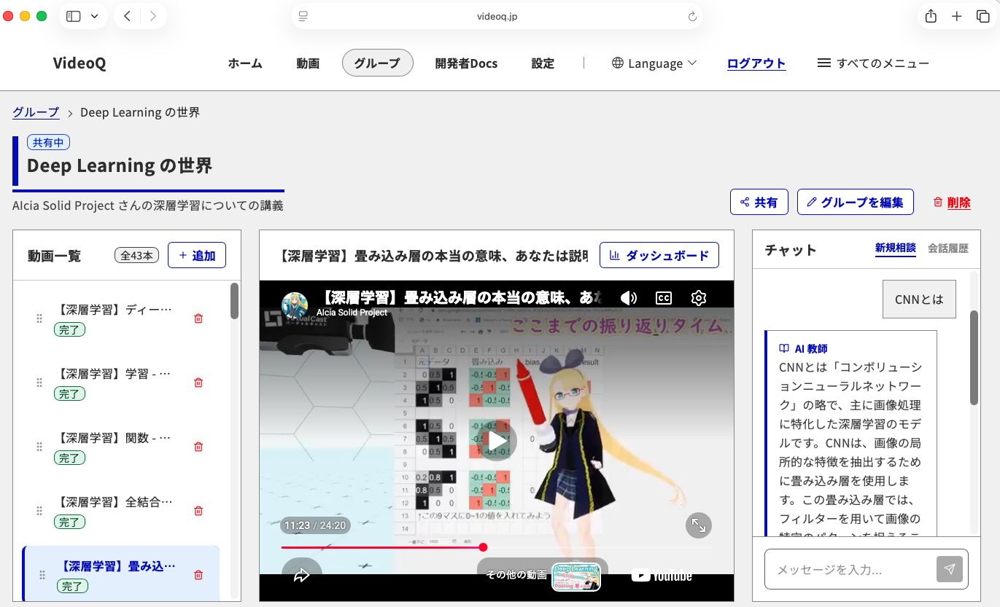

# VideoQ

**Jump instantly to the scenes you want by asking AI questions**

VideoQ is an AI-powered video navigator that automatically transcribes videos and lets you chat with them in natural language.

**[https://videoq.jp/](https://videoq.jp/)**



> **API integration supported** - Connect VideoQ with existing systems through API key authentication and an OpenAI-compatible API. See [Developer API Integration](#developer-api) for details.
>
> **Design documentation** - See [docs/](docs/README.md) for architecture diagrams, ER diagrams, sequence diagrams, and other technical details.

## Features

- **Upload supported video formats** - MP4, MOV, AVI, MKV, WebM, M4V, MPEG, 3GP, and more
- **Ask questions** - For example, "What did they say about the budget?" or "Summarize the key points"
- **Search video content** - Find specific moments without scrubbing through hours of footage
- **Organize with tags** - Manage videos with custom tags and colors
- **Share insights** - Create shareable video groups for team collaboration
- **Multilingual UI** - Switch between Japanese and English interfaces

## Architecture (production)

| Role | Location |
|---|---|
| Web API | [`apps/api/`](apps/api/) — Cloudflare Workers + Hono + Drizzle |
| Async jobs | [`apps/worker/`](apps/worker/) — SQS Lambda (**no Django / Celery**) |
| Schema DDL | Drizzle migrations in `apps/api/drizzle/` |
| Historical Django | [`archive/django-backend/`](archive/django-backend/) (local Docker Compose only) |

Cutover notes: [`docs/architecture/django-cutover.md`](docs/architecture/django-cutover.md).

## Quick Start (5 minutes)

Default `docker compose up` starts the **modern** stack behind **Caddy**: Hono API (`apps/api`), Python worker (`apps/worker`), production frontend (nginx), Postgres, MinIO, ElasticMQ. The `migrate` service stamps/applies Drizzle before api/worker start.

### Requirements

- [Docker](https://docs.docker.com/get-docker/) and [Docker Compose](https://docs.docker.com/compose/install/)
- An [OpenAI API key](https://platform.openai.com/api-keys) (Whisper / chat; embeddings can use local Ollama)
- Optional: [Ollama](https://ollama.com/) on the host for local embeddings (`qwen3-embedding:0.6b`)

### Setup

```bash
git clone https://github.com/yukiharada1228/videoq.git
cd videoq
cp .env.example .env
```

In `.env` set at least:

```bash
OPENAI_API_KEY=sk-...
SECRET_KEY=any-long-random-string   # JWT signing (Hono JWT_SECRET)
```

### Start (one command)

```bash
docker compose up --build -d
```

Open **[http://localhost](http://localhost)** (Caddy :80 → nginx 静的 + `/api` → Hono).

| Service | URL |
|---------|-----|
| App (Caddy → nginx 静的ビルド) | http://localhost |
| API (wrangler local, 直接) | http://127.0.0.1:8787 |
| API docs | http://localhost/api/docs/ |
| MinIO console | http://127.0.0.1:9001 (`minioadmin` / `minioadmin`) |
| ElasticMQ stats | http://127.0.0.1:9325 |

フロントは**本番ビルド**（Vite HMR なし）。UI のホットリロードが要るときだけ:

```bash
docker compose --profile dev up -d web-dev   # http://127.0.0.1:3000
```

```bash
docker compose logs -f gateway api worker web
```

**First steps:** sign up from the UI → upload a video → wait for the worker (transcription + Otsu + index) → chat.

Embeddings default to host Ollama (`EMBEDDING_PROVIDER=ollama`). Pull the model once: `ollama pull qwen3-embedding:0.6b`.

Legacy Django: `docker compose --profile legacy up --build -d` → http://localhost:8080

<details>
<summary><strong>Optional: production object storage (Cloudflare R2 / AWS S3)</strong></summary>

Local compose already uses MinIO. For production R2/S3, set `apps/api` secrets (`R2_*`) and worker `AWS_*` as in [`infra/DEPLOY.md`](infra/DEPLOY.md).

</details>

<details>
<summary><strong>Optional: reduce costs with local AI</strong></summary>

**This step is optional.** Skip it if the default OpenAI setup works for you.

If you want to reduce costs or run fully offline for privacy reasons, you can switch to free local AI models with the following steps.

<details>
<summary><strong>Local Whisper for free transcription</strong></summary>

Use your computer's GPU for faster, free transcription.

**Quick setup:**

```bash
# 1. Fetch whisper.cpp from the VideoQ root directory
git submodule update --init --recursive
cd whisper.cpp

# 2. Build
cmake -B build
cmake --build build -j --config Release

# 3. Download a model
bash ./models/download-ggml-model.sh large-v3-turbo

# 4. Start the server
./build/bin/whisper-server -m models/ggml-large-v3-turbo.bin --inference-path /audio/transcriptions -l ja
```

**Configure VideoQ:**

Edit `.env`:

```bash
WHISPER_BACKEND=whisper.cpp
WHISPER_LOCAL_URL=http://host.docker.internal:8080
```

Restart the services:

```bash
docker compose restart backend celery-worker
```

</details>

<details>
<summary><strong>Local AI chat with Ollama as a free ChatGPT alternative</strong></summary>

**Install Ollama:**
1. Download it from [ollama.com](https://ollama.com)
2. Install and run it

**Pull a model:**

```bash
ollama pull qwen3:0.6b
```

**Configure VideoQ:**

Edit `.env`:

```bash
LLM_PROVIDER=ollama
LLM_MODEL=qwen3:0.6b
OLLAMA_BASE_URL=http://host.docker.internal:11434
```

Restart the services:

```bash
docker compose restart backend celery-worker
```

</details>

<details>
<summary><strong>Local embeddings for free text search</strong></summary>

**Pull an embedding model:**

```bash
ollama pull qwen3-embedding:0.6b
```

**Configure VideoQ:**

Edit `.env`:

```bash
EMBEDDING_PROVIDER=ollama
EMBEDDING_MODEL=qwen3-embedding:0.6b
OLLAMA_BASE_URL=http://host.docker.internal:11434
```

Restart the services:

```bash
docker compose restart backend celery-worker
```

**Important:** If you switch from OpenAI embeddings to local embeddings, you must re-index existing videos from the admin panel.

</details>

</details>

## HTTPS Deployment with Docker Compose

The default Docker Compose stack uses Caddy as its public gateway. Local development remains HTTP by default. Set a production DNS name to enable automatic Let's Encrypt certificate issuance, HTTP-to-HTTPS redirects, and certificate renewal; no Certbot container or renewal cron is required.

1. Point the A/AAAA record for a stable domain (for example, `videoq.example.com`) to the server's public IP address.
2. Allow inbound TCP ports 80 and 443. UDP 443 is optional and enables HTTP/3.
3. Configure the production values in `.env`:

```dotenv
SITE_ADDRESS=videoq.example.com
DJANGO_ENV=production
ALLOWED_HOSTS=videoq.example.com
CORS_ALLOWED_ORIGINS=https://videoq.example.com
FRONTEND_URL=https://videoq.example.com
SECRET_KEY=<a-long-random-value>
```

4. Start the stack:

```bash
docker compose up -d --build
```

Once DNS is active and ports 80/443 are externally reachable, Caddy obtains and renews the certificate automatically. Open `https://videoq.example.com` to confirm that the application is available over HTTPS.

Keeping the same DNS name means a later server or cloud migration only requires a DNS change. The public application URL can remain unchanged.

<a id="developer-api"></a>

## Developer API Integration

VideoQ supports API key authentication for integrations, so you can use it from existing systems and batch jobs through server-to-server communication.

Issue a `vq_...` integration key from "Integration API Keys" in the Settings screen. Use the `X-API-Key` header for the REST API and `Authorization: Bearer <vq_...>` for the OpenAI-compatible API. For integration steps, authentication details, and endpoint-specific sample code in cURL / JavaScript / TypeScript / Python / Go / Java / C# / PHP / Ruby, see the in-app developer docs.

- **Developer docs:** [http://localhost/docs](http://localhost/docs)
- **OpenAPI (Swagger UI):** [http://localhost/api/docs/](http://localhost/api/docs/)
- **ReDoc:** [http://localhost/api/redoc/](http://localhost/api/redoc/)

## MCP (Model Context Protocol) Integration

VideoQ exposes a built-in **analytics-only** remote MCP server at `POST /api/mcp/`. Any MCP client that speaks Streamable HTTP — Claude Code, Cursor, and any client that can launch `mcp-remote` — can connect with just a URL and an API key. No local process to install.

> 🛡️ **Design policy:** Sending RAG chat questions is intentionally excluded. MCP access is limited to **reading and analyzing existing data**.

### Available tools

| Tool | Purpose |
|---|---|
| `list_videos` / `get_video` | List videos and view details (including transcripts) |
| `list_groups` / `get_group` | List groups and their member videos |
| `list_tags` | List tags |
| `get_chat_history` | Chat history for a group (with feedback) |
| `get_chat_analytics` | Question counts, period, daily time series, feedback aggregates |
| `get_chat_analytics_keywords` | Keyword frequency in questions |
| `get_evaluation_summary` | RAGAS average scores (faithfulness / answer_relevancy / context_precision) |
| `list_evaluation_logs` | Per-log RAGAS scores |

List tools support `limit` / `offset` pagination (default 20, maximum 100).

### Setup

#### Step 1: Issue an integration API key

Log in to VideoQ and issue a `vq_...` key from **Settings → Integration API Keys**, then copy it.

#### Step 2: Register the endpoint with your MCP client

The endpoint URL is your VideoQ host followed by `/api/mcp/` — for example, `http://localhost/api/mcp/` for a local Docker setup or `https://your-domain.example.com/api/mcp/` in production. Authenticate with `Authorization: Bearer vq_...` (or the equivalent `X-API-Key` header).

For **Claude Code**:

```bash
claude mcp add --transport http videoq https://your-domain.example.com/api/mcp/ \
  --header "Authorization: Bearer vq_xxxxxxxxxxxxxxxx"
```

For **Claude Desktop / claude.ai (built-in connector, OAuth 2.1)**, paste just the MCP URL into **Settings → Connectors → Add custom connector** and approve the consent screen. No API key needed — VideoQ implements OAuth 2.1 + Dynamic Client Registration (RFC 7591) per the MCP Authorization spec.

```
https://your-domain.example.com/api/mcp/
```

Behind the scenes the client discovers the authorization server via `/.well-known/oauth-protected-resource/api/mcp` and `/.well-known/oauth-authorization-server`, registers itself dynamically at `/api/oauth/register/`, and runs the standard authorization-code flow with PKCE. You can revoke any granted token at any time from **Settings → Connected Apps**.

For a self-hosted production instance, first complete the [Docker Compose HTTPS deployment](#https-deployment-with-docker-compose). The OAuth issuer must match the public HTTPS origin, so set it in `.env` and apply the change to the backend:

```dotenv
OAUTH2_PROVIDER_ISSUER_URL=https://videoq.example.com
```

```bash
docker compose up -d backend
```

Then confirm that the MCP endpoint and OAuth metadata are publicly available before registering the connector:

```text
https://videoq.example.com/api/mcp/
https://videoq.example.com/.well-known/oauth-authorization-server
https://videoq.example.com/.well-known/oauth-protected-resource/api/mcp
```

If you need to fall back to the `mcp-remote` bridge for an older client, configure it with your API key instead:

```json
{
  "mcpServers": {
    "videoq": {
      "command": "npx",
      "args": [
        "mcp-remote",
        "https://your-domain.example.com/api/mcp/",
        "--header",
        "Authorization: Bearer vq_xxxxxxxxxxxxxxxx"
      ]
    }
  }
}
```

Config file locations:
- macOS: `~/Library/Application Support/Claude/claude_desktop_config.json`
- Windows: `%APPDATA%\Claude\claude_desktop_config.json`

**Cursor** and other Streamable HTTP-capable clients use the same URL + header pattern.

#### Step 3: Verify

Restart the client and confirm that the MCP server appears as `videoq`. Try prompts like "Show the RAGAS evaluation summary for group 1" or "What keywords have come up in recent questions?" to trigger the matching tools.

### Troubleshooting

- **`401 Unauthorized`** → The API key (or OAuth token) is missing, malformed, or revoked. Reissue from Settings and update the header, or re-approve the OAuth connector.
- **`404 Not Found`** → The URL is wrong. Confirm the host and the `/api/mcp/` path (trailing slash is optional).
- **OAuth connector cannot discover the server** → Confirm that `https://<host>/.well-known/oauth-authorization-server` and `https://<host>/.well-known/oauth-protected-resource/api/mcp` return JSON. These paths must be served by the API host at the root (not under `/api/`), so nginx / reverse proxies must forward `/.well-known/oauth-*` to the backend.

## Contributing

Found a bug or want to add a feature? Contributions are welcome.

1. Fork the repository
2. Create a feature branch
3. Make your changes
4. Add tests as needed
5. Submit a pull request

## Citation

- 藤吉 弘亘. "AIと共に生きる時代における教育への生成 AI 活用：「藤吉 AI先生」". 情報処理学会 会誌「情報処理」 Vol.66, No.11 (2025).
  - [https://ipsj.ixsq.nii.ac.jp/records/2004788](https://ipsj.ixsq.nii.ac.jp/records/2004788)

## License

See the [LICENSE](LICENSE) file for details.
