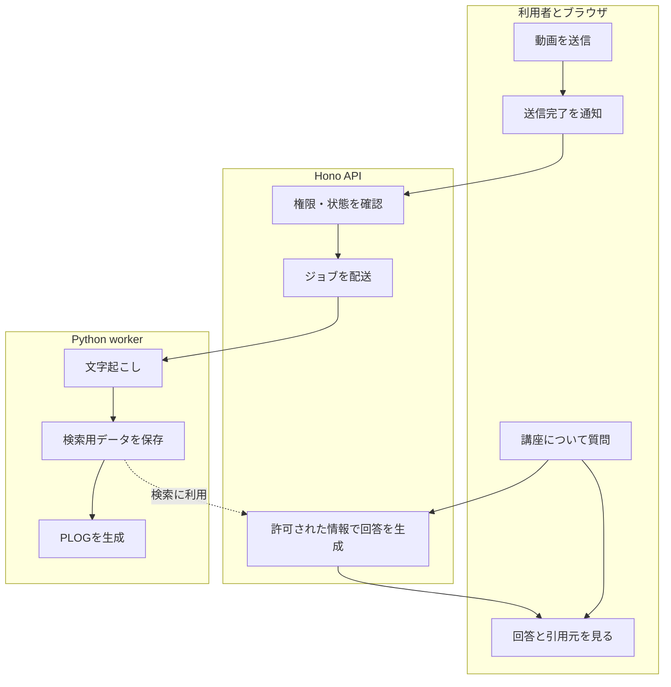

# 担当別に見る処理の流れ

このページは、処理の担当がどこで切り替わるかを確認するための役割別フローです。厳密なBPMN記法ではなく、Mermaidで読みやすく表しています。

## 動画から回答まで

質問への応答はAPIが担当します。workerが処理完了後にブラウザへ直接回答を返す構成ではありません。学習モードには索引に加えてPLOGが必要です。

## 問題が起きたときの担当

| 問題 | 最初に確認する場所 | 次に見る資料 |
|---|---|---|
| ファイルを送れない | ブラウザ、ストレージ、API | [困ったとき](../guides/troubleshooting.md) |
| 動画が処理されない | ジョブ配送、キュー、worker | [ジョブの配送と回復](flowchart.md) |
| 内容と関係のない回答になる | 検索範囲、字幕、プロンプト | [プロンプト設計](prompt-engineering.md) |
| Studyだけ使えない | PLOGの生成状態と順序 | [PLOGと学習モード](../plog/README.md) |

**関連:** 時間順に呼び出しを追うなら[シーケンス図](../design/sequence-diagram.md)、画面操作から追うなら[アクティビティ](../requirements/activity-diagram.md)へ進みます。
