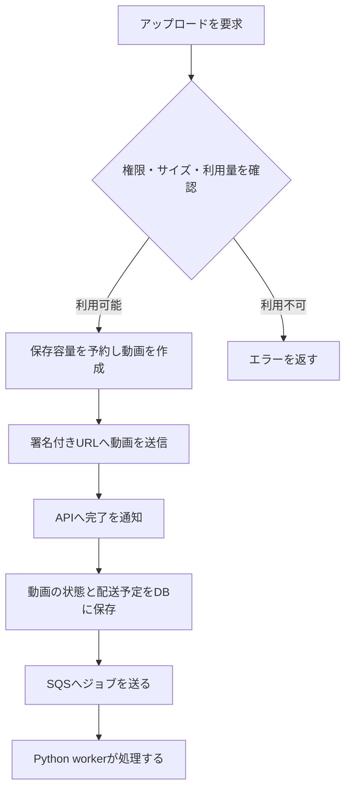
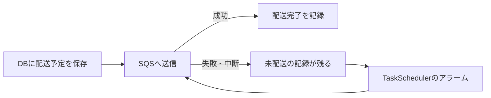

# ジョブの配送と回復

動画を処理するには、「DBに動画を保存する」と「workerへ仕事を届ける」の両方が必要です。途中でAPIやネットワークが止まっても仕事を取りこぼさないように、配送予定をDBにも記録します。

## アップロードからジョブへ

署名付きURLは、対象ファイルを送るための期限付きURLです。ファイル本体はストレージへ送り、APIは権限や状態を管理します。

## 配送に失敗したら

`external_tasks` は配送予定を保存する **outbox** です。業務データと同じトランザクションで記録するため、「DB更新だけ完了し、仕事を忘れる」状態から回復できます。

通常はAPIの処理中に配送します。`TASK_SCHEDULER` のアラームは失敗や中断への備えです。日次の保守処理でも回復を行います。配送完了はworkerの処理完了とは別です。

## workerが途中で止まったら

SQSは同じ仕事を再配送することがあります。workerは `job_executions` に `job_id` ごとの実行記録を持ちます。

- 完了済みのジョブなら、同じ処理を繰り返しません。
- 実行中は期限付きの実行権を取得します。
- 処理が停止した場合は、期限切れ後に再実行できるようにします。
- 後続ジョブのIDは親ジョブから決定し、再試行で別の仕事が増えることを防ぎます。

この仕組みだけで、任意の外部API操作が自動的に一度だけ実行されるわけではありません。処理本体でも再実行時の挙動を設計します。

## 調べる場所

| 見たいこと | 実装 |
|---|---|
| APIの配送予定と送信 | [external-tasks.ts](https://github.com/yukiharada1228/videoq/blob/main/apps/api/src/lib/external-tasks.ts) |
| 回復の予約 | [task-scheduler.ts](https://github.com/yukiharada1228/videoq/blob/main/apps/api/src/durable-objects/task-scheduler.ts) |
| workerの実行権・重複対策 | [job_execution.py](https://github.com/yukiharada1228/videoq/blob/main/apps/worker/worker_python/job_execution.py) |
| 後続ジョブの送信 | [sqs_enqueue.py](https://github.com/yukiharada1228/videoq/blob/main/apps/worker/worker_python/sqs_enqueue.py) |

**関連:** [状態遷移](../design/state-diagram.md)、[非同期処理の変更](../guides/worker.md)、[困ったとき](../guides/troubleshooting.md)。
