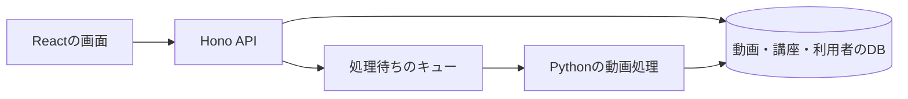
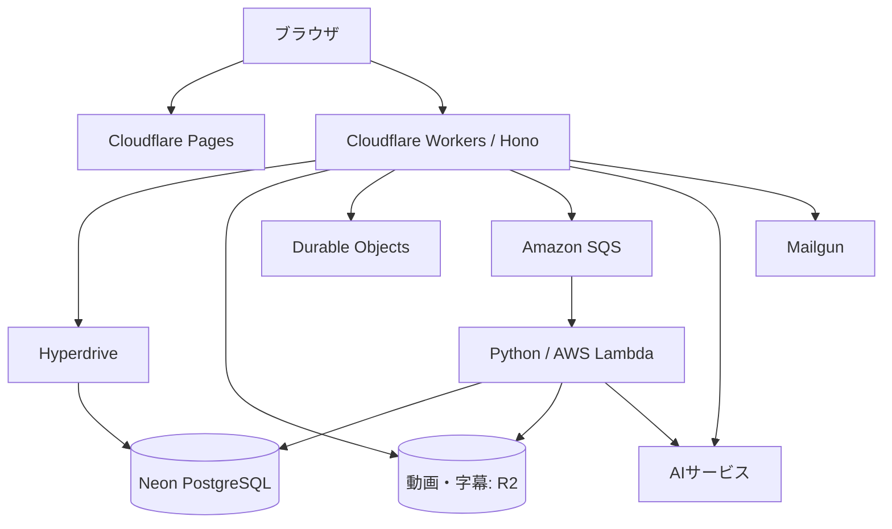

# システムの全体像

VideoQは、利用者の操作にすぐ応答するAPIと、時間のかかる動画処理を分けています。最初は次の図の3つの箱から読むと、各技術の役割を整理できます。

画面はAPIから状態を取得します。workerが文字起こしや索引を保存すると、画面からその結果を利用できるようになります。

## 3つのアプリの責任

| アプリ | 担当 | 主なコード |
|---|---|---|
| Web | 表示、フォーム、質問の入力、結果の再生 | `apps/web/src/` |
| API | 認証・アクセス権、業務処理、ジョブの依頼 | `apps/api/src/` |
| Python worker | 文字起こし、索引、PLOG生成、回答評価 | `apps/worker/worker_python/` |

WebとAPIは `packages/trpc` で操作名・入力・出力の型を共有します。Pythonとの境界はSQSのJSONメッセージとDBです。

## ローカルと本番の対応

| 役割 | ローカル | 本番 |
|---|---|---|
| 画面 | nginxの静的ビルド、またはVite | Cloudflare Pages |
| API | Wranglerの開発サーバー | Cloudflare Workers |
| DB | PostgreSQL + pgvector | Neon PostgreSQL + pgvector |
| APIからDBへの接続 | ローカル接続文字列 | Hyperdrive |
| 動画・字幕などの保管 | MinIO | Cloudflare R2 |
| ジョブキュー | ElasticMQ | Amazon SQS |
| Python worker | キューを継続的に取得するコンテナ | SQSを契機に動くAWS Lambda |
| APIが持つ一時状態 | ローカルのDurable Objects | Cloudflare Durable Objects |

ローカルではCaddyが `http://localhost` の入口になり、画面とAPIへ転送します。開発用Viteはポート3000、文書サイトは3001です。

## 本番の配置

APIはHyperdrive経由、Python workerはPostgreSQL接続で同じDBを利用します。DBの列を変更するときは両方への影響を確認します。

## Durable Objectsの役割

- `RATE_LIMITER`: 短時間の過剰なリクエストを制限します。
- `STUDY_SESSION`: 学習モードの一時状態を保存し、同じセッションの競合を制御します。
- `TASK_SCHEDULER`: 未配送ジョブや放棄されたアップロードの回復を予約します。

回復処理はDOのアラームで予定されます。現在の定期実行は日次の `17 3 * * *`（UTC）で、古い記録の整理と回復を行います。5分ごとのcronを前提に運用しないでください。

実装の入口は [app.ts](https://github.com/yukiharada1228/videoq/blob/main/apps/api/src/app.ts)、実行設定は [wrangler.jsonc](https://github.com/yukiharada1228/videoq/blob/main/apps/api/wrangler.jsonc)です。

**次に読む:** [コードの場所](../getting-started/codebase.md)、[ジョブの配送と回復](flowchart.md)。
