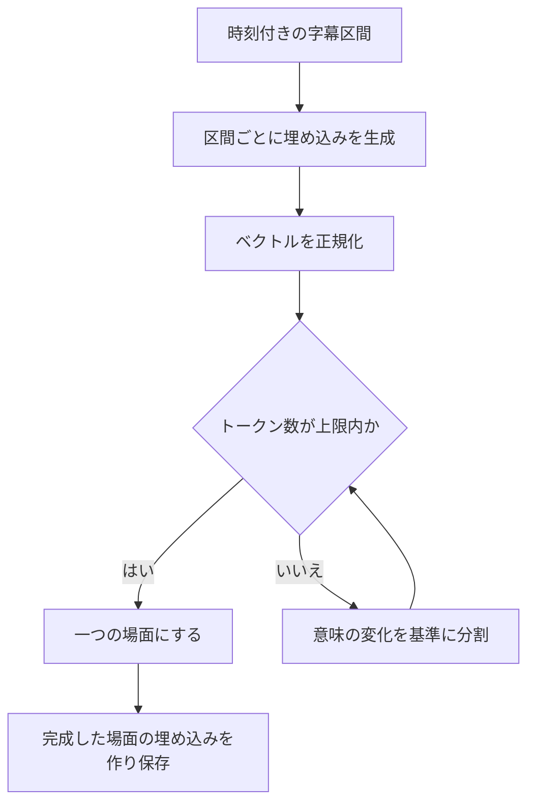

# 文字起こしとシーン検索

質問の前に用意するデータと、質問後に実行する検索を順番に追います。具体的な質問の例から知りたい場合は、[AIが回答を作るまで](../concepts/how-ai-works.md)から読んでください。

## 1. 時刻付きの文章を取得する

| 入力元 | 現在の処理 | 進められない場合 |
|---|---|---|
| アップロード動画 | 保存ファイルを取得し、FFmpegでモノラル音声を抽出。選択されたWhisperで文字起こしし、区間をSRTへ変換 | ファイル・音声がない、文字起こしが失敗する、結果が空 |
| YouTube | SearchAPIで手動字幕、次に自動字幕を取得し、SRTへ変換 | SearchAPIの設定がない、利用できる字幕がない |

YouTubeの経路には、字幕がないときに動画をダウンロードして音声認識するフォールバックはありません。アップロードの経路は、`WHISPER_BACKEND` に応じてOpenAI Whisperかローカルの互換エンドポイントを使います。音声が24 MiBを超える場合は600秒単位に分割して処理し、結果の時刻に各区間の開始位置を加算します。これらは実装上の設定であり、提供元の最新の利用制限を示す値ではありません。

開発時に `ENABLE_HEAVY_PIPELINE` を無効にすると、1秒の仮の文字起こしを返します。状態遷移の確認には使えますが、音声認識や検索の精度は確認できません。このパイプラインでは、映像フレームの解析やスライドのOCRは行いません。

## 2. 字幕を場面にまとめる

SRTの字幕区間には開始時刻・終了時刻・文章があります。WhisperやYouTubeが細かな区間を返した場合、VideoQは動画内の位置を保ちながら、検索用の文章のまとまりにします。

分割には多次元の大津法の基準を使います。埋め込みの空間で、前後のグループをよく分ける境界を探す方法です。長い区間を再帰的に分け、既定の**512トークン**以内に収めます。短い区間は途中で話題が変わっても一つの場面に残ることがあります。LLMがすべての話題を判定する処理ではなく、文章の長さに上限を設ける分割処理です。

一つの字幕区間だけで上限を超える場合はトークンを分け、元の時間幅をトークン数の比率で配分します。このとき途中の時刻は推定値です。分割中に例外が起きた場合は元のSRTをそのまま使うため、その経路では512トークン以内になる保証はありません。

## 3. 検索用データを保存する

索引作成ジョブが場面のSRTを読み、各場面の文章を埋め込みに変換して `scene_embeddings` へ保存します。埋め込みのリクエストは64件ずつまとめます。各行には文章・ベクトルと、所有者、動画ID・タイトル、場面番号、開始・終了時刻が入ります。

索引の作成時には、その動画の既存ベクトルを置き換えます。APIの検索とworkerの索引作成で、埋め込みモデルと次元を一致させる必要があります。現行DBの列は**1536次元**です。モデルの設定を変えただけではDBの列や保存済みベクトルは変わりません。埋め込みモデルを変えた場合は、そのモデルで検索する資料の索引を作り直します。

初回処理では、索引作成が終わるとQ&Aが場面を検索できます。PLOGは後続の別ジョブで生成するため、検索の準備完了と学習モードの準備完了は別です。この後続処理は、字幕編集や検索再索引の後には**実行しません**。後述の[更新範囲と確認手順](#update-scope)と[動画の状態](../design/state-diagram.md)も参照してください。

## 4. モデルが根拠を要求したら検索する

`search_scenes` は自然言語の検索文と、任意でアクセス確認済みの講座内動画IDを受け取ります。APIは次の順で処理します。

1. 許可された範囲外の動画IDが指定されていれば拒否します。
2. 設定された埋め込みプロバイダーで検索文をベクトルにします。
3. 所有者と動画IDで範囲を絞り、PGVectorで類似検索します。
4. 既定で `RETRIEVER_K = 20`、最大20場面の文章・動画タイトルとID・時刻を返します。

例えば「直交するベクトル」という検索文で、質問と同じ単語がなくても「角度が90度」の説明を探せる可能性があります。見つかるかどうかは、文字起こしと埋め込みの内容に依存します。

現在のアプリには、最低類似度による足切りや、別のモデルによる再ランキングはありません。検索結果の数値スコアは、ツールの結果を作るときに取り除きます。「20場面返った」は候補が取得できたという意味で、20場面すべてが質問の根拠になるという意味ではありません。索引にデータがあれば、関連が弱い場面でも0件にならず返ることがあります。

モデルは検索文を変え、1回答につき最大3回まで検索できます。プログラムは動画IDと開始・終了時刻で重複を除き、その回答内で安定した `[1]`、`[2]` などの番号を付けます。この番号は全動画共通の場面IDでも、回答の信頼度でもありません。

## 5. 根拠を回答モデルへ渡す

シーン検索の結果には、引用番号・動画タイトル・時刻・字幕の文章が入ります。講座の登録情報は別のツールで取得します。回答モデルは今回のツール実行で得た結果を読み、設定された指示に従って回答を作ります。

この経路ではWeb検索を行いません。使えるツールは講座の登録情報と索引済みの場面を取得するものです。長い動画の要約も、取得した場面に制約されます。全場面を自動で巡回して網羅性を確認する処理はありません。

## 編集・再構築で何が変わるか {#update-scope}

初回は**文字起こし → シーン索引作成 → PLOG生成**と進みます。更新時は対象が異なり、「再索引」と「PLOG再構築」は別の操作です。

| 操作 | 更新するデータ | 手編集はどうなるか | 完了の確認先 |
|---|---|---|---|
| 初回のアップロード／YouTube取り込み | 字幕を取得し、場面に分割して索引を作成。その後、PLOGの概念・関係・問い・ヒントの生成を登録 | 新しい動画を作る処理。既存動画の手編集を保持するための操作としては使わない | 検索は動画が `completed` になったことを確認。別途、学習グラフの構築状態と内容を確認 |
| 編集した文字起こしの保存 | SRTの保存と `reindex_video_transcript` ジョブの登録を同じDBトランザクションで実施。後でworkerがその動画の場面の文章・ベクトルを置換し、字幕を空にした場合はベクトルを削除。Studyの支援文は、再索引とは独立して保存字幕を直接読む | PLOGの手編集はそのまま残り、古い字幕に基づく問い・ヒントも変わらない | 字幕を開き直して保存を確認し、Q&A検索用の索引の完了は後述のworker側で別途確認。元からある動画の `completed` 表示は、今回の再索引完了を示さない |
| 管理画面から検索用の埋め込みを再索引 | `reindex_all_videos_embeddings` が、保存字幕が空でない完了済み動画を対象に検索索引を再作成。音声の文字起こしやPLOG生成は行わない | 保存字幕とPLOGの手編集は変わらない | 管理画面が返すのは登録したジョブID。そのworkerログ／`job_executions` の状態を確認し、新しい検索で確認 |
| 動画の学習グラフからPLOGを再構築 | 保存字幕から生成し、概念を新しいIDで置換。関係・学習オブジェクト・要約ノードも置換し、古い概念に紐づくDB学習状態を削除 | 概念・関係・問い・ヒントの手編集を置き換える。差分の統合はしない。字幕と検索索引は変わらない | PLOGの `pending`／`running` → `ready` または `failed` を確認し、生成内容も点検。`ready` でも空や学習不能なグラフの場合がある |

同じ字幕を保存しただけでは再索引を登録しません。タイトルや説明文だけの変更でもPLOGは再生成しません。検索再索引はPLOGの概念埋め込みも更新しないため、モデルを変える場合は[埋め込み設定](../guides/embeddings.md)も確認してください。

### PLOGを「古い可能性あり」と扱う条件

最後のPLOG構築または人による確認に使った字幕から、**保存字幕に何らかの変更があった場合**は、所有者が影響する学習データを確認・修正するか、修正済み字幕から再構築するまで「古い可能性あり」と扱います。文章、時刻、文章の削除、字幕を空にする変更も含みます。タイトルだけの変更や、字幕を変えない再索引は、それ自体では学習内容の変更を意味しません。

これは確認の方針であり、アプリが自動検出する状態ではありません。現在のPLOG構築には字幕の版番号やハッシュを保存しておらず、古いことを示すバッジやStudyの自動停止もありません。字幕が変わっても `ready` のまま利用できます。Studyの支援文は保存字幕から近くの文章を直接読むため、Q&A用の再索引が未完了・失敗でも、次の読み込みから修正済み字幕と古い問い・ヒントが混在する可能性があります。

- 誤字や時刻の修正なら、影響する概念名・根拠引用・登場時刻・関係・問い・ヒントを確認します。そのままで正しいか、必要な手修正が済めば利用を続けられ、再構築は必須ではありません。
- 定義・正解・前提関係や大きな文章範囲が変わった場合は、影響するStudy教材の利用を一旦止め、確認・修正または再構築をしてから利用します。編集済み教材を残したい場合は、必要箇所の手修正を優先します。
- 検索再索引だけではPLOGが最新になったと判断できません。PLOG構築中の字幕編集は避けてください。構築にはジョブ開始時に読み込んだ字幕を使います。

再構築する前に、残したい手編集の内容を控えてください。既存の準備完了グラフを再構築するときは確認ダイアログが出ますが、手編集を統合・復元する機能ではありません。[進行中の学習への影響](../plog/README.md#rebuild-and-active-study)も確認してください。

### 誤字幕を直してQ&AとStudyで確認する {#verify-transcript-update}

自分が所有し、初回処理が完了した、講座内の動画で確認します。例えば、音声では**内積**の定義を説明しているのに、字幕が「外積」になっている場合です。

1. 動画詳細を開き、誤字幕の時刻と、影響する学習グラフの問い・ヒントを控えます。残したい手編集の教材もコピーします。
2. 文字起こし欄の**編集**を選び、SRTの番号・時刻を保ちながら用語を直して**保存**します。字幕を開き直すか画面を再読み込みし、修正内容が保存されたことを確認します。ここで分かるのは保存成功であり、非同期の検索更新完了ではありません。
3. Q&Aの検索を確認する前に、今回の再索引ジョブの完了を待ちます。Studyが保存字幕を直接読む処理は、このジョブの完了に依存しません。現行画面には、字幕編集ごとの索引完了表示はありません。ローカル開発では `docker compose logs --since=10m worker` を実行し、`reindex_video_transcript`・動画ID・配送時のジョブIDを保存時刻と照合します。`Successfully reindexed transcript for video …`、または字幕を空にした場合のベクトル削除ログを確認します。運用者は、同じジョブの `job_executions` が `status = 'completed'` になったことも確認できます。キューへの配送やoutboxの完了は配送成功を示すだけです。失敗・未開始なら、一定時間待てば完了すると考えず、workerとAPIの配送ログを調べます。
4. 同じ講座の **Q&A（通常）** で「この授業での内積の定義は？」のように対象を含む新しい質問を送ります。引用先の場面を開き、時刻と修正済み字幕を回答と照合します。以前の画面上の回答や保存済みチャット履歴は再生成されません。モデルが正しい用語を答えただけでは索引完了の証明にならないため、判断できなければ運用者がその動画の `scene_embeddings` の文章と取得した根拠を確認します。
5. 動画の**学習グラフ**へ戻り、該当概念・最初の問い・ヒントの段階を確認します。これらは自動更新されていません。必要な箇所を編集するか、手編集を控えて置換を了承したうえで**再構築**を選びます。`ready` を待ち、実際の生成内容を点検して、欠落や誤りを修正します。再生成しても修正箇所が必ず含まれる保証はありません。
6. 手修正・再構築のどちらの場合も、**Study（学習）→ 最初からやり直す** を選んで確認し、[確認用の新しいセッション](../plog/README.md#verify-in-fresh-session)で修正した概念について尋ねます。前提概念が先に出た場合は順に取り組み、対象概念の最初の問いと続くヒントを確認します。元のタブでQ&A → Studyと切り替えても、消えるのは会話表示だけです。既存の進捗があると、確認用の発言が以前の問いへの返答として採点される場合があります。

更新の実装は、[updateVideo](https://github.com/yukiharada1228/videoq/blob/main/apps/api/src/repositories/video-repository.ts)、[字幕の再索引](https://github.com/yukiharada1228/videoq/blob/main/apps/worker/worker_python/tasks/reindex_video_transcript.py)、[全体再索引](https://github.com/yukiharada1228/videoq/blob/main/apps/worker/worker_python/tasks/reindexing.py)、[PLOGの置換処理](https://github.com/yukiharada1228/videoq/blob/main/apps/worker/worker_python/pipeline/plog_build.py)にあります。

## 回答の問題をどの段階で調べるか

| 症状 | 最初に見るもの |
|---|---|
| スライドの数式に触れない | 音声や字幕で数式が説明されているか |
| 人名や専門用語が違う | 回答用プロンプトを変える前に、保存された文字起こし |
| 引用の再生時刻がずれる | 元字幕の時刻、長い字幕区間を比率で分割していないか |
| 別の授業の話になる | 講座の動画構成、モデルが指定した動画ID、検索文 |
| 検索した文章の関連が弱い | 字幕に必要な説明があるか、埋め込みが一致しているか。現行処理には最低スコアでの除外がない |
| 動画が `completed` でも学習できない | 検索索引とは別に、PLOGの状態とグラフの利用可能性 |

## 実装の参照先

| ファイル | 役割 |
|---|---|
| [transcription.py](https://github.com/yukiharada1228/videoq/blob/main/apps/worker/worker_python/pipeline/transcription.py) | 音声・字幕の取得と開発用の仮データ |
| [scene_otsu/](https://github.com/yukiharada1228/videoq/tree/main/apps/worker/worker_python/pipeline/scene_otsu) | 分割、トークン数の計算、元SRTへのフォールバック |
| [vector_index.py](https://github.com/yukiharada1228/videoq/blob/main/apps/worker/worker_python/pipeline/vector_index.py) | 場面の埋め込みとメタデータの保存 |
| [vector-repository.ts](https://github.com/yukiharada1228/videoq/blob/main/apps/api/src/repositories/vector-repository.ts) | 検索範囲と取得件数 |
| [rag.ts](https://github.com/yukiharada1228/videoq/blob/main/apps/api/src/lib/rag.ts) | ツール実行、場面の重複除去、引用番号 |

**次に読む:** [Q&Aのプロンプトと回答評価](prompt-engineering.md)。
