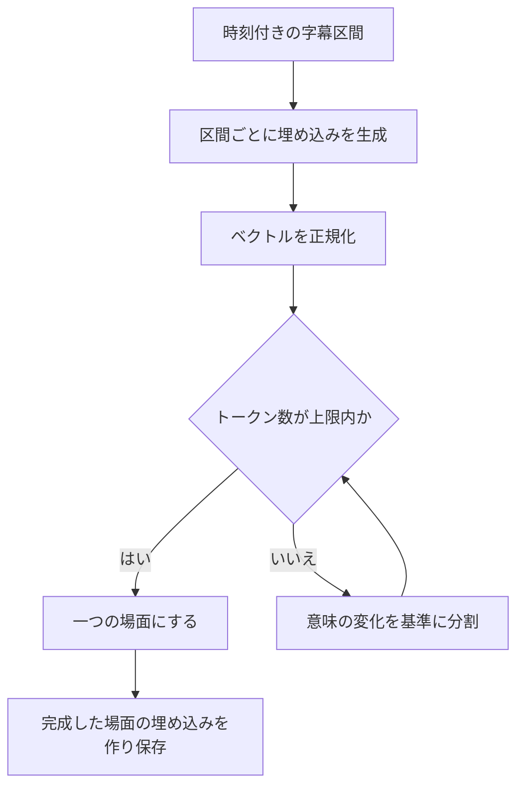

# 文字起こしとシーン検索

質問の前に用意するデータと、質問後に実行する検索を順番に追います。具体的な質問の例から知りたい場合は、[AIが回答を作るまで](../concepts/how-ai-works.md)から読んでください。

## 1. 時刻付きの文章を取得する

| 入力元 | 現在の処理 | 進められない場合 |
|---|---|---|
| アップロード動画 | 保存ファイルを取得し、FFmpegでモノラル音声を抽出。選択されたWhisperで文字起こしし、区間をSRTへ変換 | ファイル・音声がない、文字起こしが失敗する、結果が空 |
| YouTube | SearchAPIで手動字幕、次に自動字幕を取得し、SRTへ変換 | SearchAPIの設定がない、利用できる字幕がない |

YouTubeの経路には、字幕がないときに動画をダウンロードして音声認識するフォールバックはありません。アップロードの経路は、`WHISPER_BACKEND` に応じてOpenAI Whisperかローカルの互換エンドポイントを使います。音声が24 MiBを超える場合は600秒単位に分割して処理し、結果の時刻に各区間の開始位置を加算します。これらは実装上の設定であり、提供元の最新の利用制限を示す値ではありません。

開発時に `ENABLE_HEAVY_PIPELINE` を無効にすると、1秒の仮の文字起こしを返します。状態遷移の確認には使えますが、音声認識や検索の精度は確認できません。このパイプラインでは、映像フレームの解析やスライドのOCRは行いません。

## 2. 字幕を場面にまとめる

SRTの字幕区間には開始時刻・終了時刻・文章があります。WhisperやYouTubeが細かな区間を返した場合、VideoQは動画内の位置を保ちながら、検索用の文章のまとまりにします。

分割には多次元の大津法の基準を使います。埋め込みの空間で、前後のグループをよく分ける境界を探す方法です。長い区間を再帰的に分け、既定の**512トークン**以内に収めます。短い区間は途中で話題が変わっても一つの場面に残ることがあります。LLMがすべての話題を判定する処理ではなく、文章の長さに上限を設ける分割処理です。

一つの字幕区間だけで上限を超える場合はトークンを分け、元の時間幅をトークン数の比率で配分します。このとき途中の時刻は推定値です。分割中に例外が起きた場合は元のSRTをそのまま使うため、その経路では512トークン以内になる保証はありません。

## 3. 検索用データを保存する

索引作成ジョブが場面のSRTを読み、各場面の文章を埋め込みに変換して `scene_embeddings` へ保存します。埋め込みのリクエストは64件ずつまとめます。各行には文章・ベクトルと、所有者、動画ID・タイトル、場面番号、開始・終了時刻が入ります。

索引の作成時には、その動画の既存ベクトルを置き換えます。APIの検索とworkerの索引作成で、埋め込みモデルと次元を一致させる必要があります。現行DBの列は**1536次元**です。モデルの設定を変えただけではDBの列や保存済みベクトルは変わりません。埋め込みモデルを変えた場合は、そのモデルで検索する資料の索引を作り直します。

初回処理では、索引作成が終わるとQ&Aが場面を検索できます。[更新範囲と確認手順](#update-scope)と[動画の状態](../design/state-diagram.md)も参照してください。

## 4. モデルが根拠を要求したら検索する

`search_scenes` は自然言語の検索文と、任意でアクセス確認済みの講座内動画IDを受け取ります。APIは次の順で処理します。

1. 許可された範囲外の動画IDが指定されていれば拒否します。
2. 設定された埋め込みプロバイダーで検索文をベクトルにします。
3. 所有者と動画IDで範囲を絞り、PGVectorで類似検索します。
4. 既定で `RETRIEVER_K = 20`、最大20場面の文章・動画タイトルとID・時刻を返します。

例えば「直交するベクトル」という検索文で、質問と同じ単語がなくても「角度が90度」の説明を探せる可能性があります。見つかるかどうかは、文字起こしと埋め込みの内容に依存します。

現在のアプリには、最低類似度による足切りや、別のモデルによる再ランキングはありません。検索結果の数値スコアは、ツールの結果を作るときに取り除きます。「20場面返った」は候補が取得できたという意味で、20場面すべてが質問の根拠になるという意味ではありません。索引にデータがあれば、関連が弱い場面でも0件にならず返ることがあります。

モデルは検索文を変え、1回答につき最大3回まで検索できます。プログラムは動画IDと開始・終了時刻で重複を除き、その回答内で安定した `[1]`、`[2]` などの番号を付けます。この番号は全動画共通の場面IDでも、回答の信頼度でもありません。

## 5. 根拠を回答モデルへ渡す

シーン検索の結果には、引用番号・動画タイトル・時刻・字幕の文章が入ります。講座の登録情報は別のツールで取得します。回答モデルは今回のツール実行で得た結果を読み、設定された指示に従って回答を作ります。

この経路ではWeb検索を行いません。使えるツールは講座の登録情報と索引済みの場面を取得するものです。長い動画の要約も、取得した場面に制約されます。全場面を自動で巡回して網羅性を確認する処理はありません。

## 編集・再索引で何が変わるか {#update-scope}

初回は**文字起こし → シーン索引作成**と進み、完了すると動画が `completed` になります。

| 操作 | 更新するデータ | 完了の確認先 |
|---|---|---|
| 初回のアップロード／YouTube取り込み | 字幕を取得し、場面に分割して検索索引を作成 | 動画が `completed` になったことを確認 |
| 編集した文字起こしの保存 | SRTの保存と `reindex_video_transcript` の登録を同じDBトランザクションで実施。workerがその動画の場面・ベクトルを置換し、字幕が空ならベクトルを削除 | 字幕の保存を確認し、再索引の完了をworkerログで別途確認 |
| 管理画面から検索用の埋め込みを再索引 | `reindex_all_videos_embeddings` が、保存字幕が空でない完了済み動画の検索索引を再作成。保存字幕は変更しない | 登録したジョブIDのworkerログ／`job_executions` を確認 |

同じ字幕の保存や、タイトル・説明文だけの変更では再索引を登録しません。モデルを変える場合は[埋め込み設定](../guides/embeddings.md)も確認してください。

### 誤字幕を直してQ&Aで確認する {#verify-transcript-update}

1. 所有する動画の詳細を開き、文字起こし欄の**編集**でSRTの番号・時刻を保ちながら用語を直し、**保存**します。
2. 字幕を開き直し、修正内容が保存されたことを確認します。元からある `completed` 表示は、今回の再索引の完了を示しません。
3. `docker compose logs --since=10m worker` で `reindex_video_transcript`・動画ID・ジョブIDを保存時刻と照合し、`Successfully reindexed transcript for video …` を確認します。運用者は同じジョブの `job_executions.status = 'completed'` も確認できます。outboxの完了は配送成功を示すだけです。
4. 同じ講座で対象を含む新しい質問を送り、引用先の時刻・修正済み字幕を回答と照合します。以前の回答や保存済みチャット履歴は再生成されません。

実装は[updateVideo](https://github.com/yukiharada1228/videoq/blob/main/apps/api/src/repositories/video-repository.ts)、[字幕の再索引](https://github.com/yukiharada1228/videoq/blob/main/apps/worker/worker_python/tasks/reindex_video_transcript.py)、[全体再索引](https://github.com/yukiharada1228/videoq/blob/main/apps/worker/worker_python/tasks/reindexing.py)を参照してください。

## 回答の問題をどの段階で調べるか

| 症状 | 最初に見るもの |
|---|---|
| スライドの数式に触れない | 音声や字幕で数式が説明されているか |
| 人名や専門用語が違う | 回答用プロンプトを変える前に、保存された文字起こし |
| 引用の再生時刻がずれる | 元字幕の時刻、長い字幕区間を比率で分割していないか |
| 別の授業の話になる | 講座の動画構成、モデルが指定した動画ID、検索文 |
| 検索した文章の関連が弱い | 字幕に必要な説明があるか、埋め込みが一致しているか。現行処理には最低スコアでの除外がない |

## 実装の参照先

| ファイル | 役割 |
|---|---|
| [transcription.py](https://github.com/yukiharada1228/videoq/blob/main/apps/worker/worker_python/pipeline/transcription.py) | 音声・字幕の取得と開発用の仮データ |
| [scene_otsu/](https://github.com/yukiharada1228/videoq/tree/main/apps/worker/worker_python/pipeline/scene_otsu) | 分割、トークン数の計算、元SRTへのフォールバック |
| [vector_index.py](https://github.com/yukiharada1228/videoq/blob/main/apps/worker/worker_python/pipeline/vector_index.py) | 場面の埋め込みとメタデータの保存 |
| [vector-repository.ts](https://github.com/yukiharada1228/videoq/blob/main/apps/api/src/repositories/vector-repository.ts) | 検索範囲と取得件数 |
| [rag.ts](https://github.com/yukiharada1228/videoq/blob/main/apps/api/src/lib/rag.ts) | ツール実行、場面の重複除去、引用番号 |

**次に読む:** [Q&Aのプロンプトと回答評価](prompt-engineering.md)。
