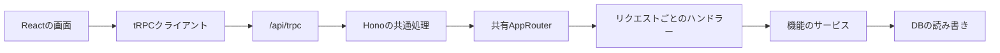

# tRPC API 設計

通常のデータ取得・更新を、画面とAPIで同じ型を使って実装するための詳細資料です。
初めてAPIを変更する場合は、先に[APIを変更する](../guides/api.md)の手順を読んでください。

「procedure」は `videos.get` のような1つの操作、「契約」は入力と出力の約束です。
ここでは、その契約をどこに置き、Honoの処理へどう接続するかを説明します。

## 方針

VideoQ の通常の JSON API は tRPC に統一します。React と Hono の間で
`AppRouter` を共有し、procedure 名、input validation、入出力型を一つの契約として
管理します。OpenAPI schema と API reference UI は生成しません。



## Workspace 境界

```text
packages/trpc/
├── src/init.ts          tRPC 初期化、認証・権限 middleware、error formatter
├── src/inputs/          Zod input（validation と handler 入力型の定義元）
├── src/outputs.ts       Zod output（validation と handler 出力型の定義元）
├── src/model-schemas.ts 共有 DTO の出力検証スキーマ
├── src/routers/         domain router と procedure の接続
├── src/router.ts        AppRouter の合成
├── src/contracts.ts     Zod から導出する入出力 map と handler 契約
├── src/models.ts        出力スキーマから導出する API / SPA 共有 DTO
├── src/context.ts       framework 非依存の request context
└── src/schema.ts        runtime 共有定数

apps/api/src/trpc/
├── context.ts           Hono request から auth と handler を組み立てる
└── handlers/            service を procedure 契約へ接続する

apps/web/src/lib/
├── trpc.ts              batch client、TanStack Query options、procedure 単位の401検知
├── api-error.ts         raw HTTP / tRPC の共通エラー読み取り
└── api.ts               Better Auth・SSE・CSV・upload・media URL adapter
```

`packages/trpc` は Hono、DB、Cloudflare bindings に依存しません。API 実装は
`ctx.call()` の adapter として注入し、Web は `AppRouter` を type-only import します。

入力スキーマは `src/inputs/` に一度だけ定義します。procedure の `.input()` と
`RpcInputMap` が同じスキーマを参照し、handler には `z.output` で default / transform
適用後の型を渡します。SPA の呼び出し側の型は引き続き `AppRouter` から推論します。

出力スキーマは `src/outputs.ts` に全 procedure 分を定義します。`.output()` と
`RpcOutputMap` が同じスキーマを使い、共有 DTO も `src/model-schemas.ts` と
`src/schema.ts` から導出します。出力検証では必須項目・型を確認し、未定義フィールドを
除去します。タグの書き込みは `tagColorSchema` でパレット名に制限しますが、出力では
旧 hex 色の保存データも受け入れます。

## React とキャッシュ

`@trpc/tanstack-react-query` の `createTRPCOptionsProxy` を使い、
`useQuery(trpc.videos.get.queryOptions({ id }))` のように TanStack Query の hooks を呼びます。
Vite SPA の client と QueryClient は共有し、`QueryClientProvider` でキャッシュを渡します。

キャッシュ操作は `useQueryClient()` を使います。個別データには `queryKey()` /
`queryFilter()`、一覧全体には `pathFilter()` を使い、通常 query と infinite query の
両方を更新します。無限スクロールは `infiniteQueryOptions()` と `initialCursor: 0` を使います。

## 認証と権限

- `publicProcedure`: 公開情報、または share token を handler で検証する操作
- `protectedProcedure`: Better Auth の browser session が必要
- `adminProcedure`: superuser を遅延検証

Integration API key と OAuth Bearer は MCP transport 専用です。通常のtRPC、SSE、
CSV、multipart upload、media routeの認証には利用しません。

## Hono に残す endpoint

HTTP protocol または payload transport 自体に意味があるものだけ raw route とします。

- Better Auth と OAuth / OIDC discovery
- Stripe webhook
- MCP Streamable HTTP
- health / readiness
- media binary
- multipart video upload
- chat SSE
- chat history CSV export

新しい通常 JSON 操作は `packages/trpc/src/inputs` に入力スキーマを定義し、
`packages/trpc/src/outputs.ts` に出力スキーマを定義します。
`packages/trpc/src/routers` で `.input()` / `.output()` を接続し、
`apps/api/src/trpc/handlers` に実装を追加します。

## Error contract

tRPC の標準 error code / HTTP status に加え、既存 UI が判断に使う
`applicationCode` と field validation の `details` を error data に保持します。
内部エラーの message は公開時に固定文へ置き換えます。
出力検証の失敗も `INTERNAL_SERVER_ERROR` とし、入力の `VALIDATION_ERROR` と区別します。
出力検証エラーには `applicationCode` や検証の `details` を付けません。

SPA は tRPC 標準の `TRPCClientError` をそのまま受け取り、画面で application code や
details が必要な場合は `getApiError()` を使います。認証切れは link で procedure ごとに
判定し、HTTP 207 の混在 batch にも対応します。同じ HTTP response でのログアウト通知は
一度だけ行います。

tRPC の内部例外は adapter の `onError` で request ID、procedure、error code、
安全なエラー属性と stack frame を記録します。入力値、Cookie、query string、
エラーメッセージ中の SQL parameter や個人情報は記録しません。
