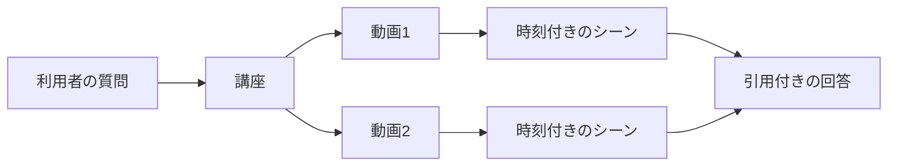

# 動画・講座・シーンの関係

VideoQ では、**動画を登録し、講座にまとめ、その講座について質問する**のが基本の使い方です。まずこの3つを押さえると、画面やコードの名前を追いやすくなります。

## 具体例で考える

「開発環境の準備」と「APIの実装」という2本の動画を、「新メンバー向け研修」という講座に追加したとします。

「APIはどう起動する？」と質問すると、VideoQは講座に含まれる動画の文字起こしを探します。回答に使った場面には時刻を付け、利用者が元の動画へ戻れるようにします。

| 名前 | 意味 | 例 |
|---|---|---|
| 動画（video） | 登録した1本の動画と、そのタイトル・文字起こし・処理状態 | 「APIの実装」 |
| 講座（course） | 質問や共有の対象としてまとめた動画の集合 | 「新メンバー向け研修」 |
| シーン（scene） | 開始・終了時刻を持つ文字起こしの区間 | 02:10〜02:40の起動手順 |
| タグ（tag） | 動画を整理するラベル | 「入門」「バックエンド」 |
| チャットログ | 質問・回答・引用元・フィードバックの記録 | 起動手順への回答 |

## 講座の「メンバー」には2つの意味がある

コードを読むときは、動画と人を区別してください。

- `video_course_members`: **講座に含まれる動画**と表示順を管理する関連テーブル。
- 講座への招待・参加: **講座を利用する人**のアクセス権を管理する機能。

動画を講座から外すことと、保存した動画そのものを削除することも別の操作です。

## 所有者・参加者・管理者

動画や講座には所有者がいます。共有リンクや招待を使うと、他の人も許可された講座を利用できます。利用できる操作は、ログインの有無だけでなく、そのデータへのアクセス権で決まります。

管理者は利用者・利用上限・再索引などを管理します。**画面でボタンを隠すだけでは権限の確認になりません。** APIでも対象データへのアクセスを確認します。[認証と権限](auth.md)を参照してください。

## Q&Aと学習モード

Q&Aは質問に答えるために場面を探します。学習モードは、PLOGという概念のつながりを使って、問いやヒントを提示します。同じ動画を使いますが、必要な準備データは異なります。

**次に読む:** [システムの全体像](../architecture/system-configuration-diagram.md)。テーブルの詳細を調べるときは[データ辞書](../database/data-dictionary.md)へ進みます。
