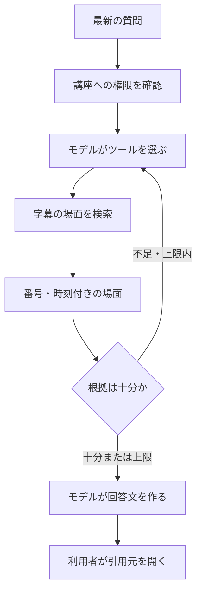

# AIが回答を作るまで

VideoQは動画から文章を用意し、質問に関係する情報を検索して、その情報を使った回答を言語モデルに生成させます。この方式を **RAG（検索拡張生成）** と呼びます。ここでは現在の実装を説明します。すべての回答が正しいことを保証するものではありません。

## AIは動画の何を読んでいる？

アップロードしたファイルでは、workerが**音声**を取り出してWhisperで文字起こしします。YouTubeを登録した場合は、SearchAPIを通じて既存の字幕を取得します。どちらも時刻付きの文章になります。

現在の処理は、動画のフレームを画像認識モデルへ渡したり、OCRでスライドを読んだりしません。図・数式・身振り・画面上の文字が音声や字幕で説明されていない場合、回答の材料に含まれないことがあります。

AIが担当する仕事は一つではありません。

| 仕事 | 入力 | 結果 |
|---|---|---|
| アップロード動画の文字起こし | 抽出した音声 | 時刻付きの文章 |
| 埋め込みの生成 | 字幕の文章や検索文 | 意味の近さを比較するための数値 |
| Q&A | 最新の質問、指示、ツールの結果 | 場面への参照を付けた回答文 |
| 学習データの生成 | 長さを制限した文字起こしの抜粋 | 概念、最初の問い、ヒント |
| 学習モード | 学習者の返答、対象概念、状態や資料 | 理解度の判定、または支援の文章 |
| 回答品質の評価 | 保存した質問、回答、取得資料 | 回答後に記録する品質指標 |

埋め込みは回答文を作るものではなく、言語モデルが読む文章を探すためのものです。準備の詳細は[文字起こしとシーン検索](../architecture/transcription-and-search.md)で説明します。

## 一つの質問を追ってみる

内積を説明する動画が講座にあり、次のように質問したとします。

> 内積は、2つのベクトルのなす角とどう関係しますか？

以下は**仕組みを説明する架空の例**で、本番の会話ログではありません。実際の検索文、取得する場面、検索回数、回答文は変わります。



1. **調べてよい範囲を決める。** APIが講座とアクセス可能な動画IDを確定します。モデルが別の講座の動画を要求しても、その範囲を広げることはできません。
2. **ツールと検索文を選ぶ。** 内容に関する質問なので、モデルには `search_scenes` を使うよう指示しています。例えば「内積 角度 コサインの関係」という検索文を作ります。質問文をそのまま検索するとは限りません。
3. **場面を探す。** APIが検索文を埋め込みに変換し、講座内の索引済み字幕を検索します。1回の検索で取得するのは既定で最大20場面です。回答モデルへ動画全体を送る処理ではありません。
4. **根拠を読む。** ツールからは、例えば次のような結果が返ります。

   ```text
   [1] 内積の授業 00:02:10,000 - 00:02:35,000
   内積は、2つのベクトルの長さとなす角のコサインを掛けたものです。
   ```

5. **必要なら追加で検索する。** 例えば直交する場合の説明も必要だと判断すれば、別の検索文を使います。シーン検索は1回答につき最大3回です。
6. **回答文を作る。** 上の場面を使うと、「内積はベクトルの長さに加えて、なす角のコサインによって決まります。[1]」のような回答が考えられます。文末の番号が取得した場面を指します。
7. **利用者が引用元を確認する。** 引用を選ぶと動画の該当時刻を開きます。時刻は保存済みの字幕から、説明の文章はモデルから来ています。

場面の番号はプログラムが割り当てます。同じ場面を再び取得したときも同じ番号を使い、引用データを画面へ返します。文章のどこに番号を付けるかはモデルが判断します。引用は回答を確認する手掛かりであり、各主張が正しいことの証明ではありません。

## 場面の引用が付かない回答があるのはなぜ？

「この講座には動画が何本ある？」という質問には、登録された講座・動画情報を読む `get_course_info` で回答できます。字幕検索は不要で、登録情報には場面の引用番号を付けません。

**特定の授業**の内容を聞かれた場合は、まず講座情報から対象動画を特定し、その動画IDに絞って検索するよう指示しています。一覧の何番目かと、第何回の授業かは別です。登録済みの説明文は「説明文を見せて」への回答には使えますが、授業内容を説明する際の字幕検索の代わりにはしません。

## 過去の会話を覚えている？

通常Q&Aは、講座のチャットや共有リンクを含め、**質問ごとに独立して回答する機能**として提供します。各質問で対象と調べる範囲を明確にし、前の回答や別の話題を次の回答へ持ち越さないためです。入力欄にも、質問ごとに対象を含める案内を表示します。

ブラウザーは最新の質問だけを送信します。回答モデルは、システムの指示と、その**最新の利用者の質問**から回答生成を始めます。過去の質問やAIの回答を、会話履歴としてモデルへ渡す処理はありません。今回の回答を作る途中のツール呼び出しと結果は、その回答の生成中に参照できます。

そのため「それはなぜ？」だけでは対象が伝わらないことがあります。「直交するベクトルの内積が0になるのはなぜ？」のように、質問内に対象を書くと意図が伝わります。画面に履歴が表示され、チャットログが保存されることと、次のモデル呼び出しで履歴を読むことは別です。

例えば「内積とは？」の後に「具体例を教えて」と送ると、内積という対象を含まない新しい質問として扱います。期待する仕様は、**前の話題を引き継がない**ことです。モデルの返答は変わり得るため、必ず聞き返すという保証もありません。「内積の具体例を教えて」と対象を含めて送ってください。

学習モードでは扱いが異なり、採点のために直前のAIの問いを読み、学習セッションに概念の進行状態とヒントの位置を保持します。[学習モードの判断](../plog/README.md)を参照してください。

## 次の動きを決めるのは誰？

| 判断 | 担当 |
|---|---|
| どの講座・動画へアクセスできるか | APIの権限確認と検索フィルター |
| 登録情報と字幕のどちらを調べ、何を検索するか | ツールの説明とプロンプトに従うモデル |
| 何件取得でき、何回ツールを使えるか | プログラムの上限値と引数検証 |
| どんな文章で説明し、どこに引用を付けるか | 指示に従うモデル |
| 学習モードで修得後にどの概念へ進むか | 保存した学習グラフを使うプログラムの規則 |

モデルには、取得した根拠の範囲で答え、不明なことは不明と伝えるよう指示しています。これはプログラムが回答の正しさを証明する処理とは異なります。現在の検索にはアプリ側の最低類似度による除外がないため、検索結果に無関係な場面が含まれる可能性もあります。長い動画の大まかな要約を求めても、取得した抜粋だけを扱い、全編を網羅しない場合があります。

## データはどこへ送られる？

文字起こし・埋め込み・回答生成・評価では、それぞれに設定されたモデルサービスを呼び出します。各サービスへ、その処理に必要な音声や文章が送られます。文字起こしや埋め込みをローカルに切り替えただけで、すべてのAI処理がローカルになるわけではありません。Q&A、PLOG生成、評価には別の呼び出しがあります。

これはアプリのデータの流れの説明です。提供元による保存や学習利用の方針を保証するものではありません。仕組みの理解や設定方法の説明に、本番の認証情報やアカウント識別子は必要ありません。

## 詳しく調べる

- [文字起こしとシーン検索](../architecture/transcription-and-search.md)：字幕、場面の区切り、埋め込み、検索の上限。
- [Q&Aのプロンプトと回答評価](../architecture/prompt-engineering.md)：モデルへの入力、ツールの判断、失敗時の挙動、品質確認。
- [PLOGと学習モード](../plog/README.md)：生成する問い、採点、ヒント、学習の進行。

Q&Aの実装は [rag.ts](https://github.com/yukiharada1228/videoq/blob/main/apps/api/src/lib/rag.ts)です。ツールは[講座情報](https://github.com/yukiharada1228/videoq/blob/main/apps/api/src/lib/rag-course-info.ts)と[シーン検索結果](https://github.com/yukiharada1228/videoq/blob/main/apps/api/src/repositories/vector-repository.ts)を取得します。挙動が変わった場合は、この実装を基準に文書を更新します。
