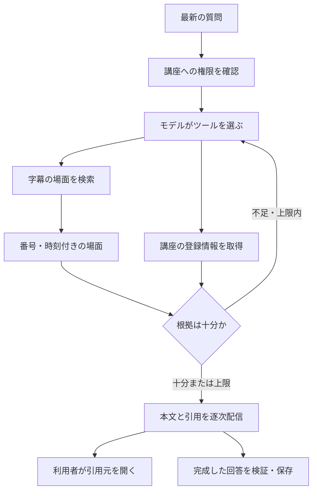

# AIが回答を作るまで

VideoQは動画から文章を用意し、質問に関係する情報を検索して、その情報を使った回答を言語モデルに生成させます。この方式を **RAG（検索拡張生成）** と呼びます（[Lewis et al., 2020](../reference/ai-references.md#rag)）。ここでは現在の実装を説明します。すべての回答が正しいことを保証するものではありません。[AIの手法と参考文献](../reference/ai-references.md)に、各手法の原論文・モデルの公式資料と、VideoQでの応用範囲をまとめています。

## 現在の処理の全体像

**2026-10-01** 時点の実装と照合しています。

| 段階 | 現在の処理 |
|---|---|
| 動画の準備 | 時刻付きの文章を取得してシーンに分割し、1536次元の埋め込みを保存 |
| 根拠の取得 | LangChainのエージェントが、許可された講座の登録情報取得・シーン検索を選択 |
| 回答の生成 | モデルが本文と出典IDの組を生成。動画タイトルと時刻はAPI側で管理 |
| 画面への表示 | 生成中から本文と検証済みの引用を配信し、次の描画フレームでまとめて反映 |
| 保存 | 完成した構造化回答と取得資料を保存 |

以前のStudyモードとPLOG学習グラフは廃止されています。現在のQ&Aは質問ごとに独立し、学習セッション・問題生成・習得度管理は行いません。過去の削除手順は[デプロイの資料](../design/deployment-diagram.md)に残しています。

## AIは動画の何を読んでいる？

アップロードしたファイルでは、workerが**音声**を取り出してWhisperで文字起こしします。YouTubeを登録した場合は、SearchAPIを通じて既存の字幕を取得します。どちらも時刻付きの文章になります。

既定では字幕を使います。`overview_video` で動画全体を見渡し、`skim_video` で候補区間を絞り、`read_video_window` で前後の字幕を読めます。アップロード動画は画像確認が既定で有効です。全体・区間の保存済み静止画も確認でき、`inspect_clip` では粗い画像を高詳細度で読み、`focus_clip` では短区間を約1秒間隔の画像で確認します。`VIDEO_VISUAL_ENABLED=false` で無効にできます。ReActエージェントが質問に必要なツールを選びます。YouTube動画やキャッシュがない動画は字幕のみが対象です。代表静止画のため短い動作や細かな文字は見逃す可能性があります。[設定と制限](../guides/visual-evidence.md)を参照してください。

AIが担当する仕事は一つではありません。

| 仕事 | 入力 | 結果 |
|---|---|---|
| アップロード動画の文字起こし | 抽出した音声 | 時刻付きの文章 |
| 埋め込みの生成 | 字幕の文章や検索文 | 意味の近さを比較するための数値 |
| Q&A | 最新の質問、指示、ツールの結果 | 本文と出典IDを組にした構造化回答 |

埋め込みは回答文を作るものではなく、言語モデルが読む文章を探すためのものです。準備の詳細は[文字起こしとシーン検索](../architecture/transcription-and-search.md)で説明します。

## 一つの質問を追ってみる

内積を説明する動画が講座にあり、次のように質問したとします。

> 内積は、2つのベクトルのなす角とどう関係しますか？

以下は**仕組みを説明する架空の例**で、本番の会話ログではありません。実際の検索文、取得する場面、検索回数、回答文は変わります。


```mermaid
flowchart TD
    Q[最新の質問] --> A[講座への権限を確認]
    A --> M[モデルがツールを選ぶ]
    M --> S[字幕の場面を検索]
    M --> I[講座の登録情報を取得]
    S --> R[番号・時刻付きの場面]
    R --> D{根拠は十分か}
    I --> D
    D -->|不足・上限内| M
    D -->|十分または上限| F[本文と引用を逐次配信]
    F --> C[利用者が引用元を開く]
    F --> V[完成した回答を検証・保存]
```

1. **調べてよい範囲を決める。** APIが講座とアクセス可能な動画IDを確定します。モデルが別の講座の動画を要求しても、その範囲を広げることはできません。
2. **ツールと検索文を選ぶ。** 内容に関する質問なので、モデルには `search_scenes` を使うよう指示しています。例えば「内積 角度 コサインの関係」という検索文を作ります。質問文をそのまま検索するとは限りません。
3. **場面を探す。** APIが検索文を埋め込みに変換し、講座内の索引済み字幕を検索します。1回の検索で取得するのは既定で最大20場面です。回答モデルへ動画全体を送る処理ではありません。
4. **根拠を読む。** ツールからは、例えば次のような結果が返ります。

   ```json
   {"sourceId":1,"title":"内積の授業","startTime":"00:02:10,000","endTime":"00:02:35,000","text":"内積は、2つのベクトルの長さとなす角のコサインを掛けたものです。"}
   ```

5. **必要なら追加で検索する。** 例えば直交する場合の説明も必要だと判断すれば、別の検索文を使います。シーン検索は1回答につき最大3回です。
6. **回答文を作り、逐次表示する。** 上の場面を使うと、「内積はベクトルの長さに加えて、なす角のコサインによって決まります。」というtextと `sourceIds: [1]` の組を返します。本文は生成中から表示します。segmentが閉じて引用の検証が済むと、回答全体の完成を待たずに、その文の直後へ時刻リンクを表示します。
7. **利用者が引用元を確認する。** 引用を選ぶと動画の該当時刻を開きます。時刻は保存済みの字幕から、説明の文章はモデルから来ています。
8. **完成した回答を保存する。** APIが質問・構造化回答・取得資料を保存し、`done` を返します。回答後の自動採点は行いません。

場面の番号はプログラムが割り当てます。同じ場面を再び取得したときも同じ番号を使い、引用データを画面へ返します。モデルは本文と根拠IDの組を返し、本文中へ引用番号を埋め込みません。引用は回答を確認する手掛かりであり、各主張が正しいことの証明ではありません。

## 回答が完成する前に文字が表示されるのはなぜ？

検索の進捗・回答本文・時刻リンクは、別々のストリームイベントです。APIはモデルの構造化出力を途中から読み取り、回答本文と検証済みのリンクだけを送ります。ブラウザーは受信した更新を次の描画フレームでまとめて反映し、1文字ずつ表示を遅らせる演出は加えません。引用はsegmentの完成と、数式・コードの外側にあることを確認するため、本文より少し後に表示される場合があります。

途中まで表示された本文は、保存済みの回答ではありません。配信が中断した場合や最終応答が不正な場合は失敗とし、未完成のチャットを保存しません。完了・中断・利用枠の扱いは[ストリームの契約](../architecture/prompt-engineering.md#ストリームの契約)を参照してください。

## 場面の引用が付かない回答があるのはなぜ？

「この講座には動画が何本ある？」という質問には、登録された講座・動画情報を読む `get_course_info` で回答できます。字幕検索は不要で、登録情報には場面の引用番号を付けません。

講座を指定しない場合、モデルには検索ツールも引用元もなく、講座を選択するよう案内する指示を渡します。この応答も逐次表示しますが、講座のチャット履歴には保存しません。

**特定の授業**の内容を聞かれた場合は、まず講座情報から対象動画を特定し、その動画IDに絞って検索するよう指示しています。一覧の何番目かと、第何回の授業かは別です。登録済みの説明文は「説明文を見せて」への回答には使えますが、授業内容を説明する際の字幕検索の代わりにはしません。

## 過去の会話を覚えている？

通常Q&Aは、講座のチャットや共有リンクを含め、**質問ごとに独立して回答する機能**として提供します。各質問で対象と調べる範囲を明確にし、前の回答や別の話題を次の回答へ持ち越さないためです。

ブラウザーは最新の質問だけを送信します。回答モデルは、システムの指示と、その**最新の利用者の質問**から回答生成を始めます。過去の質問やAIの回答を、会話履歴としてモデルへ渡す処理はありません。今回の回答を作る途中のツール呼び出しと結果は、その回答の生成中に参照できます。

そのため「それはなぜ？」だけでは対象が伝わらないことがあります。「直交するベクトルの内積が0になるのはなぜ？」のように、質問内に対象を書くと意図が伝わります。画面に履歴が表示され、チャットログが保存されることと、次のモデル呼び出しで履歴を読むことは別です。

例えば「内積とは？」の後に「具体例を教えて」と送ると、内積という対象を含まない新しい質問として扱います。期待する仕様は、**前の話題を引き継がない**ことです。モデルの返答は変わり得るため、必ず聞き返すという保証もありません。「内積の具体例を教えて」と対象を含めて送ってください。

## 次の動きを決めるのは誰？

| 判断 | 担当 |
|---|---|
| どの講座・動画へアクセスできるか | APIの権限確認と検索フィルター |
| 登録情報と字幕のどちらを調べ、何を検索するか | ツールの説明とプロンプトに従うモデル |
| 何件取得でき、何回ツールを使えるか | プログラムの上限値と引数検証 |
| どんな文章で説明し、どこに引用を付けるか | 指示に従うモデル |

モデルには、取得した根拠の範囲で答え、不明なことは不明と伝えるよう指示しています。これはプログラムが回答の正しさを証明する処理とは異なります。現在の検索にはアプリ側の最低類似度による除外がないため、検索結果に無関係な場面が含まれる可能性もあります。長い動画の大まかな要約を求めても、取得した抜粋だけを扱い、全編を網羅しない場合があります。

## データはどこへ送られる？

文字起こし・埋め込み・回答生成では、それぞれに設定されたモデルサービスを呼び出します。各サービスへ、その処理に必要な音声や文章が送られます。文字起こしや埋め込みをローカルに切り替えただけで、すべてのAI処理がローカルになるわけではありません。Q&Aには別の呼び出しがあります。

これはアプリのデータの流れの説明です。提供元による保存や学習利用の方針を保証するものではありません。仕組みの理解や設定方法の説明に、本番の認証情報やアカウント識別子は必要ありません。

## 詳しく調べる

- [文字起こしとシーン検索](../architecture/transcription-and-search.md)：字幕、場面の区切り、埋め込み、検索の上限。
- [Q&Aのプロンプトと回答の保存](../architecture/prompt-engineering.md)：モデルへの入力、ツールの判断、失敗時の挙動、品質確認。

Q&Aの実装は [rag.ts](https://github.com/yukiharada1228/videoq/blob/main/apps/api/src/lib/rag.ts)です。ツールは[講座情報](https://github.com/yukiharada1228/videoq/blob/main/apps/api/src/lib/rag-course-info.ts)と[シーン検索結果](https://github.com/yukiharada1228/videoq/blob/main/apps/api/src/repositories/vector-repository.ts)を取得します。挙動が変わった場合は、この実装を基準に文書を更新します。
