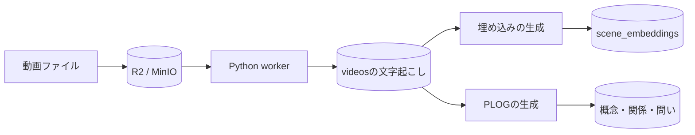
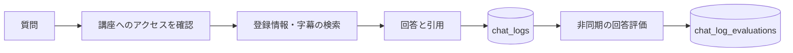

# データが保存される場所

動画ファイル本体と、動画についての情報は別の場所に保存されます。問題を調べるときは、どちらのデータを確認すべきかを切り分けます。

## 動画から検索データへ

`videos` はタイトル、所有者、ファイルへの参照、文字起こし、処理状態などを持ちます。ファイル本体をDBの行に保存する構成ではありません。

`scene_embeddings` は文字起こしの区間を意味で検索するためのデータです。APIが質問を検索用の数値に変換し、許可された動画の中から近い場面を探します。

## 質問と回答

チャットの記録と、その回答を評価した結果は別のテーブルです。回答が返ったことと、評価が終わったことは分けて扱います。

## その他の保存先

| データ | 保存先・管理する仕組み |
|---|---|
| ブラウザのログイン状態 | Better Authの `session` とブラウザCookie |
| ユーザーが保存した外部APIキー | DB内に暗号化して保存 |
| MCPのAPIキー・OAuth | `apikey`、`oauth_*` など |
| 未配送のジョブ | `external_tasks` |
| workerの実行記録 | `job_executions` |
| 学習モードの一時状態 | `STUDY_SESSION` Durable Object |

**関連:** [データ辞書](data-dictionary.md)、[ER図](er-diagram.md)、[ジョブの配送と回復](../architecture/flowchart.md)。
