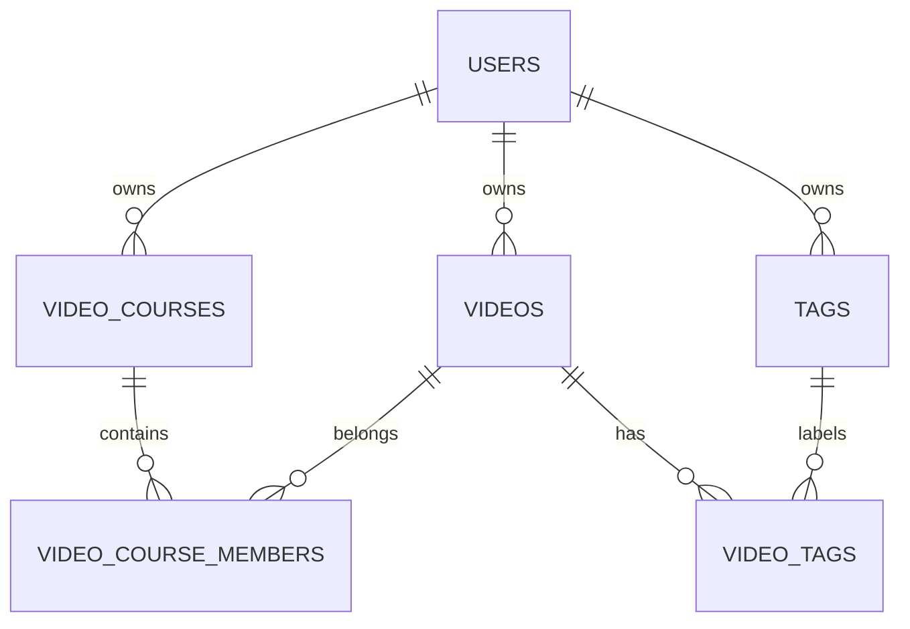
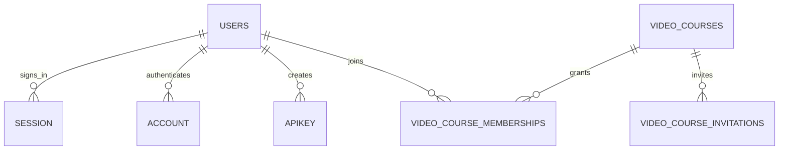
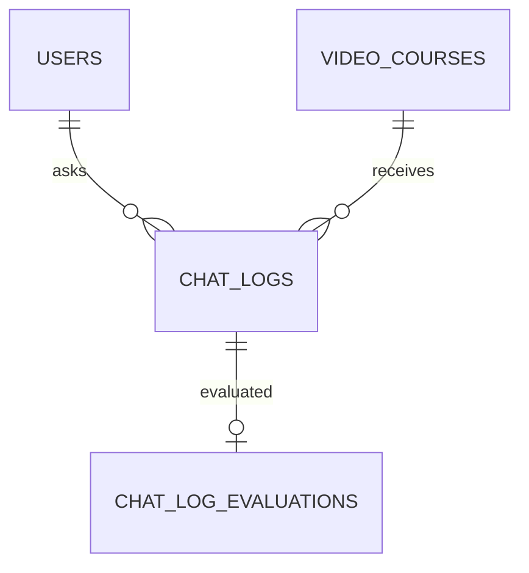
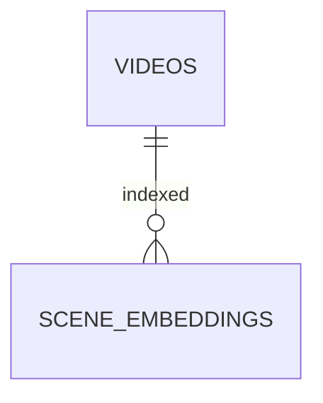

# ER図の読み方

テーブル同士がどうつながるかを調べるページです。まず[動画・講座・シーン](../concepts/domain-model.md)の意味を確認すると読みやすくなります。

## 記号の意味

`||` は1つ、`o{` は0個以上、`o|` は0個または1つを表します。例えば `USERS ||--o{ VIDEOS` は、1人の利用者が複数の動画を持てる関係です。

以下は主要な関係を目的別に分けた図です。全列・全制約の一覧ではありません。列の詳細は[データ辞書](data-dictionary.md)からスキーマ定義へ進んで確認してください。

## 動画と講座

`VIDEO_COURSE_MEMBERS` は講座と動画を結びます。タグも `VIDEO_TAGS` を介して動画と結びます。同じ関係の重複は一意制約で防ぎます。

## 人の参加と認証

`VIDEO_COURSE_MEMBERSHIPS` は人の参加情報です。上の図の `VIDEO_COURSE_MEMBERS`（動画の所属）とは別のテーブルです。認証関連の完全な定義は [better-auth.ts](https://github.com/yukiharada1228/videoq/blob/main/apps/api/src/db/schema/better-auth.ts)で確認します。

## 質問と評価

質問・回答・引用はチャットログ、品質評価は別の記録です。回答が返った時点で評価が完了しているとは限りません。

## 動画の検索データ

## 変更する前に

業務データの定義は [modern.ts](https://github.com/yukiharada1228/videoq/blob/main/apps/api/src/db/schema/modern.ts)が基準です。利用者や動画を削除した場合の関連行の扱い、重複を防ぐ制約、検索のindexを合わせて確認します。

**関連:** [DBを変更する](../guides/database.md)、[データが保存される場所](data-flow-diagram.md)。
