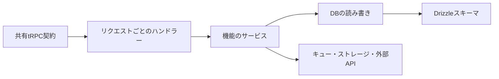

# モジュールの責任と依存方向

APIの変更場所を判断するための図です。VideoQでは、機能ごとの関数やモジュールを組み合わせます。下の箱は責任の区分で、同名のクラスがすべて存在するという意味ではありません。

## どこに何を書くか

| 区分 | 責任 | 例 |
|---|---|---|
| 共有契約 | 操作名・入力・出力・認証要件 | タグ作成で必要な名前と色 |
| ハンドラー | Honoのリクエストとサービスをつなぐ | 認証した利用者IDを渡す |
| サービス | 業務上の手順を組み立てる | 動画を登録し、処理を依頼する |
| repository | データを許可された範囲で読む・書く | 所有者のタグ一覧を取得する |
| スキーマ | テーブル、型、制約、indexを定義する | 同じ関係の重複を防ぐ |

共有契約にHono固有の値やDB接続を持ち込まず、API側のコンテキストで処理を接続します。詳しくは[tRPC API設計](../architecture/trpc-api.md)を参照してください。

## 認証と業務データ

認証のアカウント・セッション・確認トークンはBetter Authのスキーマを使います。動画・講座・タグの所有者は `users` と関連付けます。独自の `AuthSession` クラスや古い `auth_sessions` テーブルを追加する構成ではありません。

現在のテーブルと関係は[データ辞書](../database/data-dictionary.md)と[ER図](../database/er-diagram.md)を参照します。

## 実装を読む練習

[タグ一覧の呼び出しを追う](../getting-started/codebase.md)では、実際のファイルをこの順に読めます。新しい処理を追加するときも、近い既存機能を1つ選んで同じ責任の分け方を確認してください。
