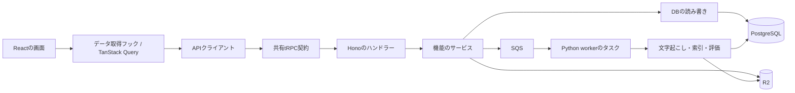
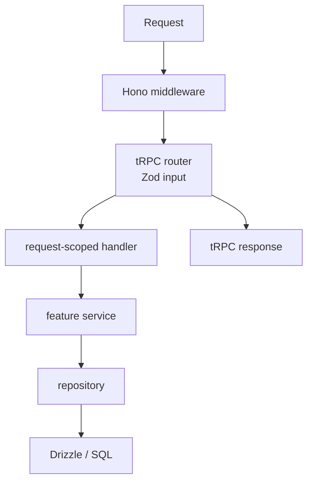
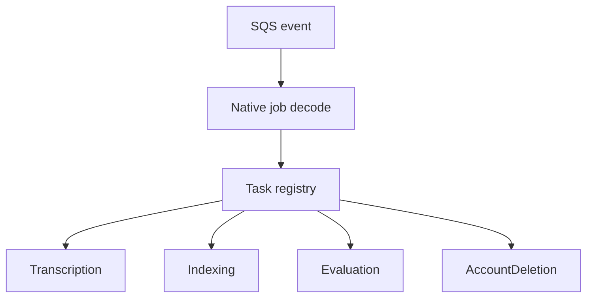

# コンポーネント図

画面の操作からDB・動画処理まで、どの部品が呼び出されるかを示します。
各箱の実装場所を探すときは[コードの場所](../getting-started/codebase.md)、
責任の分け方を判断するときは[モジュールの責任](class-diagram.md)を参照してください。

図の矢印は主な処理の依存方向です。HTTP通信・共有する型・関数呼び出しをまとめて表しています。

## 全体

## API feature

通常の JSON API は共有 tRPC router と API adapter を通ります。

主な feature:

- auth
- videos / courses / tags
- chat / evaluation
- oauth / mcp
- membership / media
- health

OAuth、webhook、SSE、multipart、CSV、media binary は
HTTP protocol 固有のため Hono route として分離します。

## Worker

HTTP の責務は API、CPU・時間を要する処理は worker に分離します。

**関連:** [APIを変更する](../guides/api.md)、[動画の非同期処理を変更する](../guides/worker.md)。
