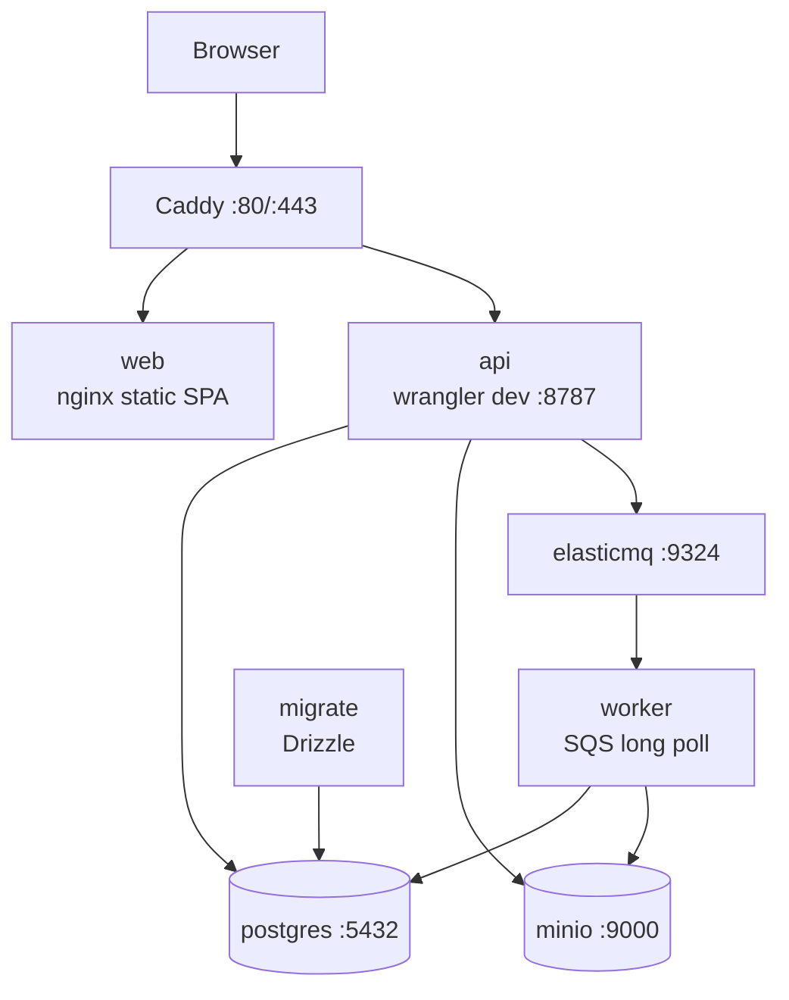
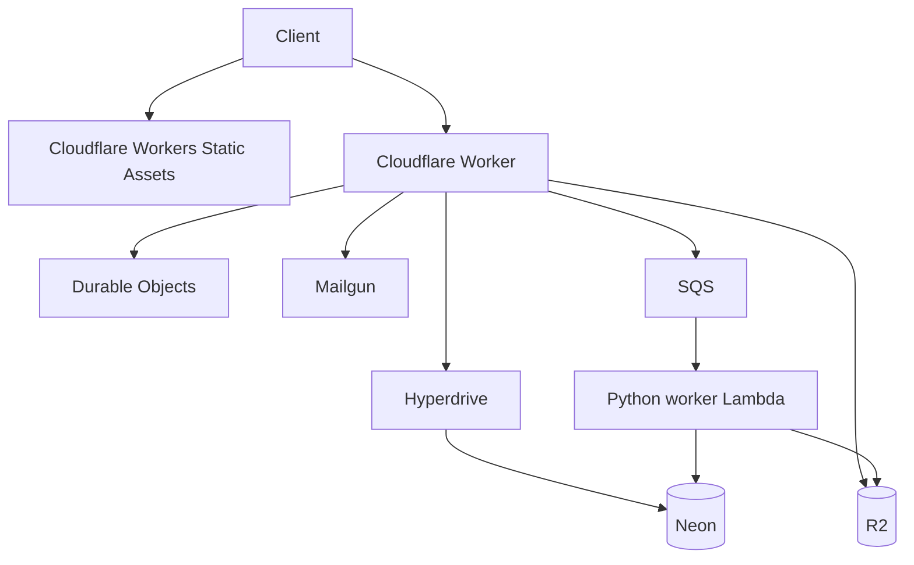

# 実行環境とデプロイの単位

「ローカルで動くものが、本番ではどこで動くか」を確認する資料です。
初参加時は[開発環境を動かす](../getting-started/local-setup.md)を使ってください。
本番へ反映する作業では、この配置図に加えて末尾の運用手順を確認します。

## ローカル Docker Compose

`migrate` が完了してから API と worker が起動します。`web-dev` profile は
Vite HMR を追加しますが、API・DB・queue の構成は変わりません。

## 本番

## デプロイ単位

| 対象 | 方法 |
|---|---|
| frontend | Cloudflare Workers Static Assets + GitHub Actions CD |
| API | `cd apps/api && npm run deploy` |
| DB | `DATABASE_URL=... npm run db:migrate` |
| worker | container image を ECR へ push し Lambda image を更新 |
| Cloudflare binding | Wrangler (`wrangler.jsonc`) |
| Hyperdrive cache / R2 CORS | 手動承認付き `cloudflare-resources.yml` |
| AWS worker infrastructure | Terraform |
| ドキュメント | 関連する変更が`main`へ入り、CIが成功すると、GitHub Actions CDが両言語をCloudflare Worker `videoq-docs`へ公開 |

上のコマンドは各作業の入口です。本番のAPI・worker・DBは `.github/workflows/cd.yml` の手順と順序も確認します。
新しい列を使うコードを先に公開すると、古いDBに対して動かなくなる場合があります。

API・frontend・Python workerを同時に変更した場合、CDは必要なDB移行の後、API → frontend → workerの順に反映します。workerは、更新対象となったAPI・frontendの成功を待ってから、新しい形式の共有データを生成します。対象のデプロイが失敗・キャンセルされた場合、workerも反映しません。workerだけの変更では、変更のないAPI・frontendがスキップされてもデプロイできます。

詳細は [`infra/DEPLOY.md`](https://github.com/yukiharada1228/videoq/blob/main/infra/DEPLOY.md) を参照してください。
文書サイトは専用のWorkerから [docs.videoq.jp](https://docs.videoq.jp/) で公開し、日本語は [/ja/](https://docs.videoq.jp/ja/) です。本文・翻訳・サイト設定の変更は、`main`のCI成功後に自動公開します。`npm run deploy:docs`で現在の作業ツリーを手動公開することもできます。[文書サイトのデプロイ手順](https://github.com/yukiharada1228/videoq/blob/main/apps/docs/README.md)を参照してください。

## 学習機能の撤去を反映する際の順序

2回に分けて反映します。最初はDBスキーマを維持したまま、学習用のUI・API・workerタスクを削除します。APIのDurable Object移行で保存済み学習セッションを削除し、更新後のworkerは旧 `build_plog` メッセージを処理せず受領完了にします。API・web・workerすべてのデプロイ成功後に、DB削除のリリースへ進みます。

DB削除前に旧処理の終了を待ちます。worker更新完了から、設定されたLambdaのタイムアウト以上（現在は900秒）が経過し、旧API・workerの公開版が稼働していないことを確認します。次のリリースで学習専用テーブルと内部の埋め込みベクトル、旧形式の学習テーブル、廃止ジョブの記録を削除します。通常の動画検索・Q&Aで共有する `scene_embeddings` は維持します。この順序ならサービスを継続したまま削除でき、保守用の環境変数も不要です。

DB移行のエントリーポイントは、生成済みの `0023_remove_study_mode` を適用した後、`purge-retired-study-data.mjs` を実行します。後者は旧Django形式の学習用6テーブル（`legacy_` 接頭辞のバックアップを含む）と、`build_plog` の実行記録・送信記録だけをトランザクション内で削除し、失敗後も再実行できます。共有の `chat_logs` にはモードを区別する項目がないため保持します。動画検索用の `scene_embeddings` と旧形式の `videoq_scenes` も保持します。
