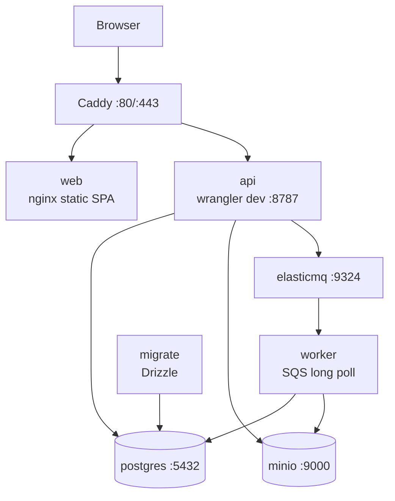
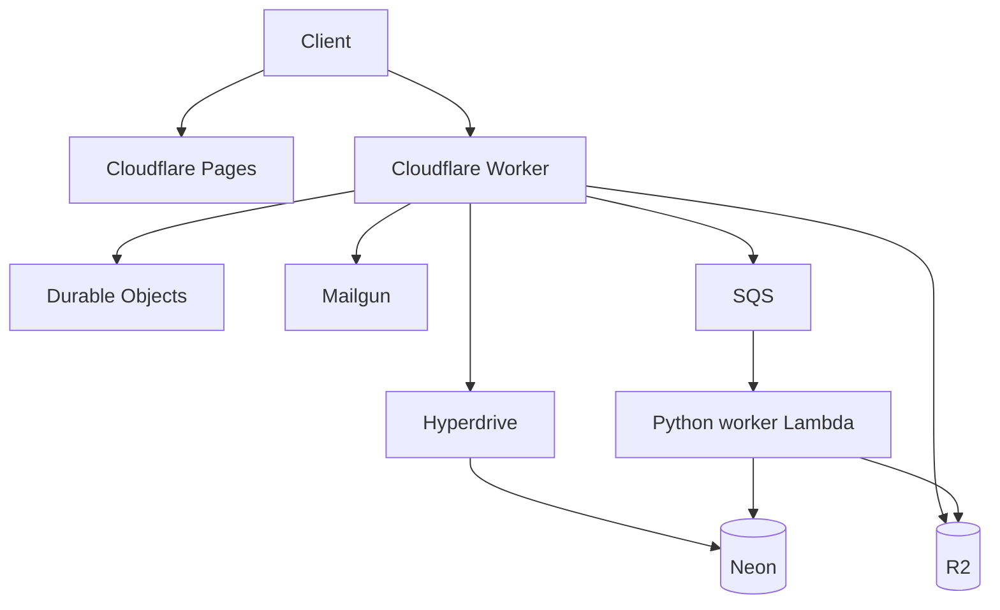

# 実行環境とデプロイの単位

「ローカルで動くものが、本番ではどこで動くか」を確認する資料です。
初参加時は[開発環境を動かす](../getting-started/local-setup.md)を使ってください。
本番へ反映する作業では、この配置図に加えて末尾の運用手順を確認します。

## ローカル Docker Compose

`migrate` が完了してから API と worker が起動します。`web-dev` profile は
Vite HMR を追加しますが、API・DB・queue の構成は変わりません。

## 本番

## デプロイ単位

| 対象 | 方法 |
|---|---|
| frontend | Cloudflare Pages の Git 連携 |
| API | `cd apps/api && npm run deploy` |
| DB | `DATABASE_URL=... npm run db:migrate` |
| worker | container image を ECR へ push し Lambda image を更新 |
| Cloudflare binding | Wrangler (`wrangler.jsonc`) |
| Hyperdrive cache / R2 CORS | 手動承認付き `cloudflare-resources.yml` |
| AWS worker infrastructure | Terraform |
| ドキュメント | `npm run deploy:docs` で両言語をビルドし、Cloudflare Worker `videoq-docs` へ静的アセットをアップロード |

上のコマンドは各作業の入口です。本番のAPI・worker・DBは `.github/workflows/cd.yml` の手順と順序も確認します。
新しい列を使うコードを先に公開すると、古いDBに対して動かなくなる場合があります。

詳細は [`infra/DEPLOY.md`](https://github.com/yukiharada1228/videoq/blob/main/infra/DEPLOY.md) を参照してください。
文書サイトは専用のWorkerから [docs.videoq.jp](https://docs.videoq.jp/) で公開し、日本語は [/ja/](https://docs.videoq.jp/ja/) です。現在の作業ツリーから静的アセットをデプロイする構成で、Gitへのpushでは自動公開しません。[文書サイトのデプロイ手順](https://github.com/yukiharada1228/videoq/blob/main/apps/docs/README.md)を参照してください。
