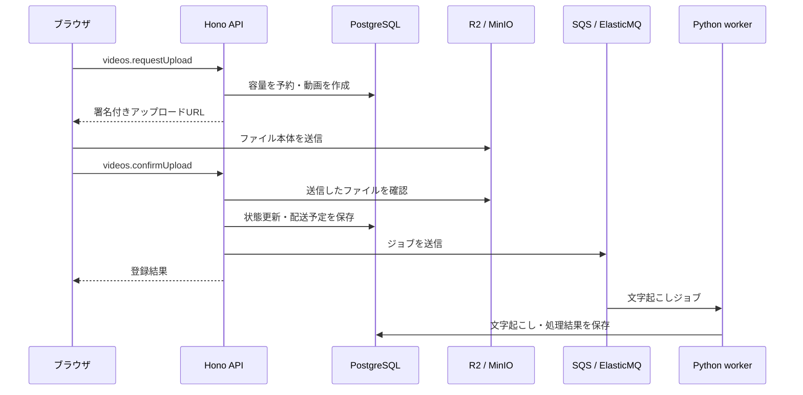
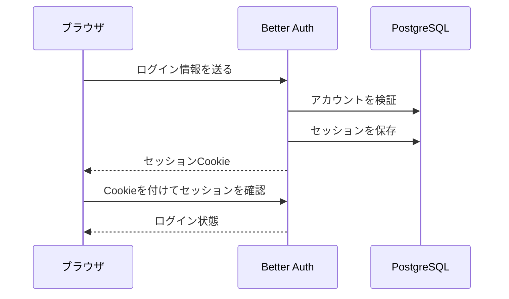
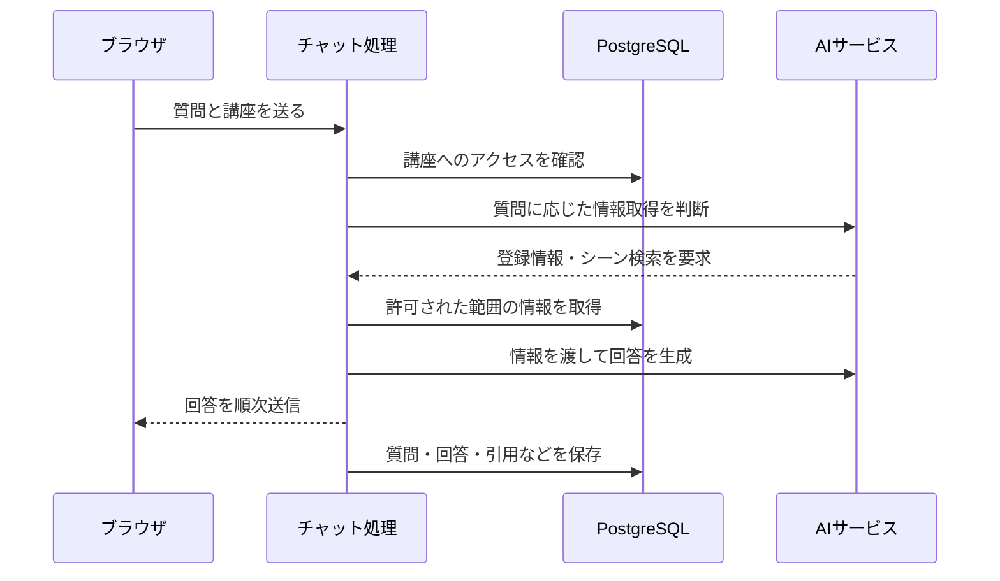

# 主要な通信の順序

図は上から下へ時間が進みます。縦線は処理の担当、矢印は呼び出しや応答です。ネットワークログやAPIのコードを追うときに使います。

## ファイルのアップロード

APIが返す登録結果と、動画の処理完了は別です。後続の索引作成は[状態遷移](state-diagram.md)を参照してください。

## ブラウザのログイン

Better AuthはAPIの `/api/auth/*` で動きます。MCP向けOAuthトークンの発行・更新とは別の経路です。

## 講座への質問

情報取得は必要に応じて繰り返されます。図はQ&Aの概略で、登録情報だけで回答する経路や非ストリーミングの応答もあります。

**関連:** [認証とアクセス権](../concepts/auth.md)、[プロンプト設計](../architecture/prompt-engineering.md)。
