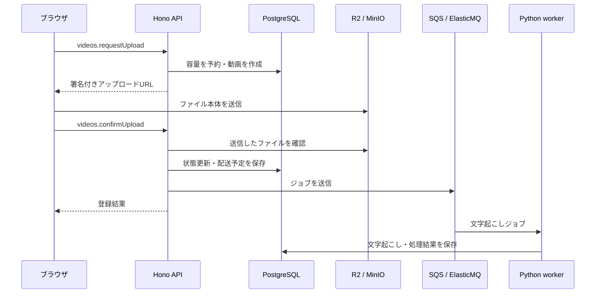
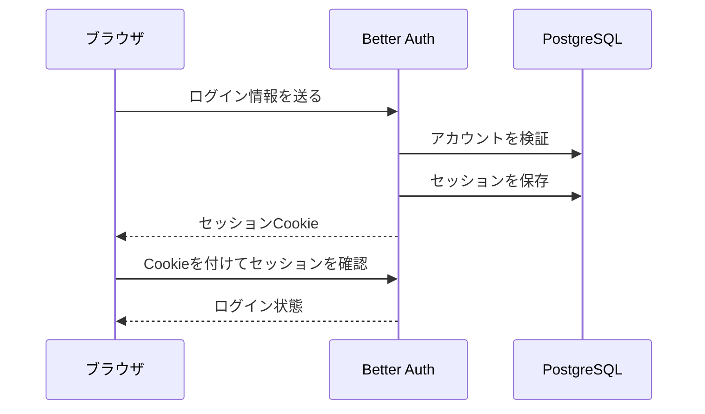
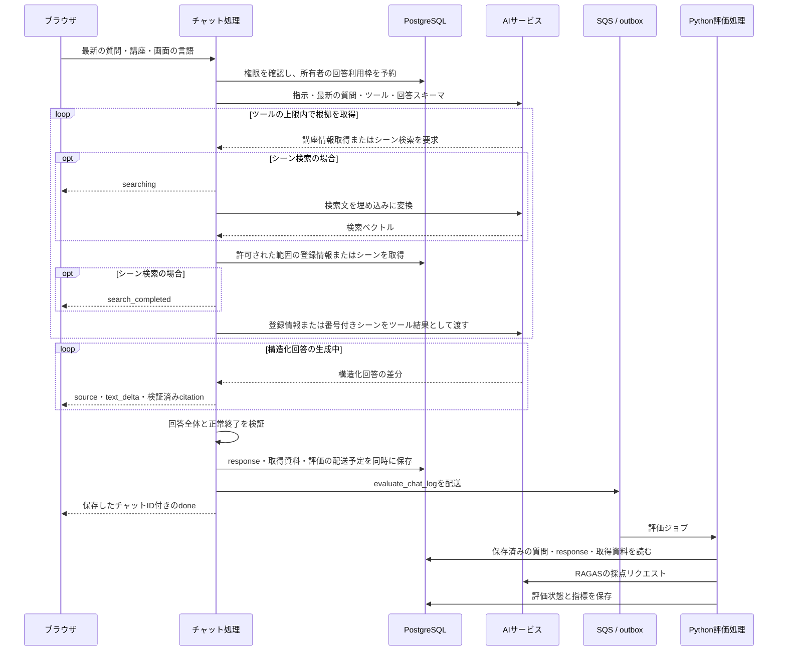

# 主要な通信の順序

図は上から下へ時間が進みます。縦線は処理の担当、矢印は呼び出しや応答です。ネットワークログやAPIのコードを追うときに使います。

## ファイルのアップロード

```mermaid
sequenceDiagram
    participant User as ブラウザ
    participant API as Hono API
    participant DB as PostgreSQL
    participant Store as R2 / MinIO
    participant Queue as SQS / ElasticMQ
    participant Worker as Python worker
    User->>API: videos.requestUpload
    API->>DB: 容量を予約・動画を作成
    API-->>User: 署名付きアップロードURL
    User->>Store: ファイル本体を送信
    User->>API: videos.confirmUpload
    API->>Store: 送信したファイルを確認
    API->>DB: 状態更新・配送予定を保存
    API->>Queue: ジョブを送信
    API-->>User: 登録結果
    Queue->>Worker: 文字起こしジョブ
    Worker->>DB: 文字起こし・処理結果を保存
```

APIが返す登録結果と、動画の処理完了は別です。後続の索引作成は[状態遷移](state-diagram.md)を参照してください。

## ブラウザのログイン

```mermaid
sequenceDiagram
    participant User as ブラウザ
    participant Auth as Better Auth
    participant DB as PostgreSQL
    User->>Auth: ログイン情報を送る
    Auth->>DB: アカウントを検証
    Auth->>DB: セッションを保存
    Auth-->>User: セッションCookie
    User->>Auth: Cookieを付けてセッションを確認
    Auth-->>User: ログイン状態
```

Better AuthはAPIの `/api/auth/*` で動きます。MCP向けOAuthトークンの発行・更新とは別の経路です。

## 講座への質問

```mermaid
sequenceDiagram
    participant User as ブラウザ
    participant API as チャット処理
    participant DB as PostgreSQL
    participant AI as AIサービス
    participant Queue as SQS / outbox
    participant Worker as Python評価処理
    User->>API: 最新の質問・講座・画面の言語
    API->>DB: 権限を確認し、所有者の回答利用枠を予約
    API->>AI: 指示・最新の質問・ツール・回答スキーマ
    loop ツールの上限内で根拠を取得
        AI-->>API: 講座情報取得またはシーン検索を要求
        opt シーン検索の場合
            API-->>User: searching
            API->>AI: 検索文を埋め込みに変換
            AI-->>API: 検索ベクトル
        end
        API->>DB: 許可された範囲の登録情報またはシーンを取得
        opt シーン検索の場合
            API-->>User: search_completed
        end
        API->>AI: 登録情報または番号付きシーンをツール結果として渡す
    end
    loop 構造化回答の生成中
        AI-->>API: 構造化回答の差分
        API-->>User: source・text_delta・検証済みcitation
    end
    API->>API: 回答全体と正常終了を検証
    API->>DB: response・取得資料・評価の配送予定を同時に保存
    API->>Queue: evaluate_chat_logを配送
    API-->>User: 保存したチャットID付きのdone
    Queue->>Worker: 評価ジョブ
    Worker->>DB: 保存済みの質問・response・取得資料を読む
    Worker->>AI: RAGASの採点リクエスト
    Worker->>DB: 評価状態と指標を保存
```

本文と引用は生成完了前から届きます。`done` は回答保存後であり、RAGAS評価の完了を待ちません。ブラウザーは描画フレームで待機中の内容を反映し、完了後にフィードバック操作を有効にします。登録情報だけの回答はシーンの埋め込みを使わず、場面の引用もありません。非ストリーミングの `chat.send` は保存後に同じ構造化回答を返します。講座未選択の応答にはツール・講座の履歴保存・評価ジョブがありません。

**関連:** [認証とアクセス権](../concepts/auth.md)、[プロンプト設計](../architecture/prompt-engineering.md)。
