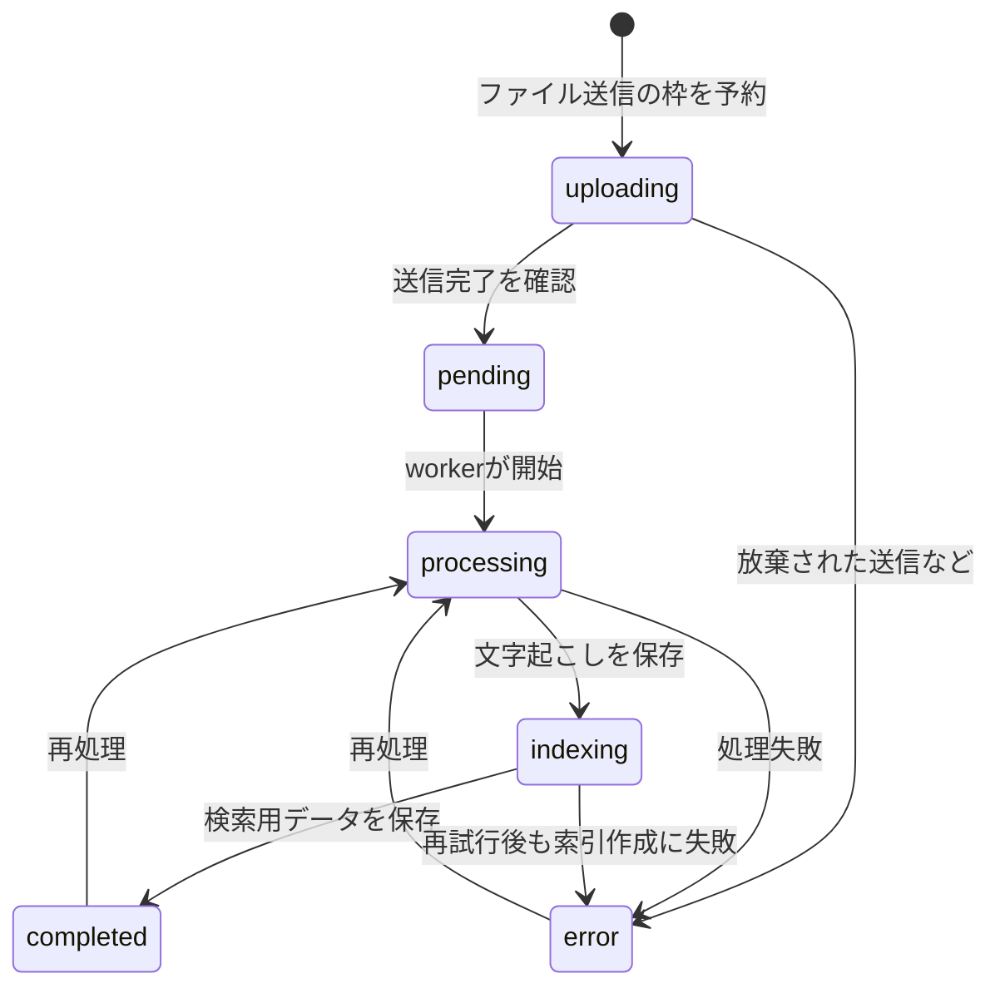

# 動画の状態と処理完了

動画の `status` は、ファイル送信・文字起こし・検索準備のどこまで進んだかを表します。画面の待ち状態を実装したり、処理停止を調べたりするときに参照します。

## 通常の流れ

これは処理状態の図です。すべての矢印が利用者向けのボタンとして提供されるという意味ではありません。YouTube取り込みなど、登録経路によってはファイル送信段階を通りません。

| 値 | 何を待っているか | 確認する場所 |
|---|---|---|
| `uploading` | ファイル送信と完了通知 | ブラウザ・ストレージ・API |
| `pending` | 文字起こし処理の開始 | キュー配送・worker |
| `processing` | 音声から文字への変換など | worker・Whisper |
| `indexing` | 字幕の検索用データ作成 | worker・埋め込みAPI・DB |
| `completed` | 動画の検索準備は完了 | 講座に追加して質問できる |
| `error` | いずれかの段階で失敗 | エラー内容と該当ログ |

再索引などの経路は処理ごとの実装も確認します。通常遷移の定義は [video_status.py](https://github.com/yukiharada1228/videoq/blob/main/apps/worker/worker_python/video_status.py)、索引完了の扱いは [tasks/indexing.py](https://github.com/yukiharada1228/videoq/blob/main/apps/worker/worker_python/tasks/indexing.py)にあります。

## PLOGの準備完了は別に確認する

検索用データの作成後に、`build_plog` ジョブで学習用の概念とヒントを作ります。そのため `completed` でも、学習モードを開始できない場合があります。

`plog_build_jobs` で生成状態を管理し、生成が完了していても、概念が空・順序を作れない場合は学習に使えません。動画の状態だけを見てStudyボタンを有効化しないでください。

**関連:** [PLOGと学習モード](../plog/README.md)、[処理が進まないとき](../guides/troubleshooting.md)。
