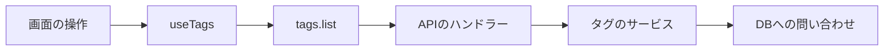

# コードの場所を知る

VideoQ の中心は、画面を表示する `web`、リクエストに応答する `api`、時間のかかる処理を実行する `worker` の3つです。

## 最初に覚えるディレクトリ

| 場所 | 担当すること | ここを変更する例 |
|---|---|---|
| `apps/web/` | Reactの画面と利用者の操作 | 動画一覧の表示、フォーム、チャットUI |
| `apps/api/` | 認証、権限、業務処理、DBアクセス | 動画取得、講座編集、利用量の確認 |
| `packages/trpc/` | 画面とAPIが共有する呼び出し名・入力・出力の型 | APIに項目や操作を追加する |
| `apps/worker/` | Pythonの非同期処理 | 文字起こし、索引、PLOG生成 |
| `docs/` | このサイトの英語の本文 | 操作や設計の説明を直す |
| `apps/docs/` | 文書サイトの設定と日本語訳 | メニュー、検索、スタイル、翻訳 |
| `infra/` | 本番基盤・デプロイの資料と設定 | 運用構成を確認する |

Node.jsの依存関係はルートの `package-lock.json`、Python workerは `apps/worker/pyproject.toml` と `uv.lock` で管理します。

## 1つの操作を端から追う

最初は、動画処理より小さい「タグ一覧の取得」を読むと役割が分かります。

| 順番 | ファイル | 見るポイント |
|---|---|---|
| 1 | [useTags.ts](https://github.com/yukiharada1228/videoq/blob/main/apps/web/src/hooks/useTags.ts) | 画面がデータを取得・更新する入口 |
| 2 | [routers/tags.ts](https://github.com/yukiharada1228/videoq/blob/main/packages/trpc/src/routers/tags.ts) | `tags.list` の入力、出力、ログイン要件 |
| 3 | [media-library.ts](https://github.com/yukiharada1228/videoq/blob/main/apps/api/src/trpc/handlers/media-library.ts) | 利用者IDを使ってサービスを呼ぶ部分 |
| 4 | [tags/service.ts](https://github.com/yukiharada1228/videoq/blob/main/apps/api/src/features/tags/service.ts) | タグの操作を組み立てる部分 |
| 5 | [tag-repository.ts](https://github.com/yukiharada1228/videoq/blob/main/apps/api/src/repositories/tag-repository.ts) | 利用者の範囲に絞ってDBを読む部分 |

ここでいう「契約」は、呼び出し側とAPIが守る入力・出力の約束です。共有契約から型が伝わるので、変更すると影響先を型チェックで確認できます。

## 次に読む入口

- **画面:** [App.tsx](https://github.com/yukiharada1228/videoq/blob/main/apps/web/src/App.tsx) → `pages/` → `hooks/`。
- **API:** [app.ts](https://github.com/yukiharada1228/videoq/blob/main/apps/api/src/app.ts) → `trpc/context.ts` → `trpc/handlers/`。
- **動画処理:** [tasks/registry.py](https://github.com/yukiharada1228/videoq/blob/main/apps/worker/worker_python/tasks/registry.py) → `tasks/transcription.py` → `tasks/indexing.py`。
- **DB:** [schema/index.ts](https://github.com/yukiharada1228/videoq/blob/main/apps/api/src/db/schema/index.ts) → `modern.ts` と `better-auth.ts`。

Cloudflare **Workers** はAPIの実行基盤、`apps/worker` は **Pythonの動画処理** です。名前は似ていますが、別のプログラムです。

**次に読む:** [最初の変更を進める](first-change.md)。全体の配置を確認したい場合は[システムの全体像](../architecture/system-configuration-diagram.md)へ進みます。
