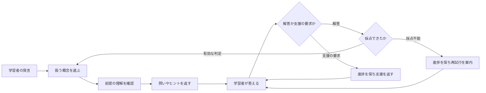

# PLOGと学習モード

進捗の12時間の保存期限、再読み込み・モード切り替え後の挙動、**最初からやり直す**の操作は、[Studyの再開・期限・やり直し](study-sessions.md)を参照してください。

PLOG（Prerequisite-aware Learning-Object Graph）は、**概念・提示順序の案・明示的に設定した前提関係を保存するデータ**です。VideoQは、概念を扱う順番と「次を理解するために前の理解が必要」という意味を区別します。学習モードは、このデータと問い・ヒントを使います。

質問へ回答する処理と、問いを出して学習を進める処理の違いは、[AIが回答を作るまで](../concepts/how-ai-works.md)から確認できます。

例えば、独立した話題A・Bをその順に提示しても、AがBの前提とは限りません。「ベクトル → 内積」の前提関係は、講義を確認して別途設定するものです。抽出順だけでは判断しません。

## 何が保存されるか

| データ | 意味 | 保存先 |
|---|---|---|
| 概念 | 動画で学ぶ内容の単位 | `plog_concepts` |
| 関係 | 概念同士の提示順序・前提関係など | `plog_edges` |
| 学習オブジェクト | 最初の問い、段階的なヒント、誤解の例など | `plog_learning_objects` |
| 生成ジョブ | 生成中・完了・失敗などの記録 | `plog_build_jobs` |

## 現在の生成処理

初回の検索索引作成後、Python workerが `build_plog` を実行します。字幕編集や検索再索引では、この後続処理を呼びません。[更新範囲の表](../architecture/transcription-and-search.md#update-scope)を参照してください。

構築の手順は次のとおりです。

1. 文字起こしからLLMで概念・問い・ヒントなどを抽出します。
2. 概念の埋め込みを作り、概念と学習オブジェクトを保存します。
3. モデルが返した概念の順番をつなぐ `presentation_order` を作り、由来を `generated` として保存します。これは提示順序の案であり、前提関係の主張ではありません。

現在の実装は概念を鎖状につなぐ簡略化された生成器です。論文のすべての検証処理や階層要約を実装しているわけではありません。`plog_summary_nodes` などのテーブルがあっても、それだけで現行処理がデータを生成しているとは判断しないでください。

### 生成モデルへ実際に何を頼むか

入力するのは、先頭40場面から各200文字までの文章と、文字起こし全体の先頭6,000文字です。プロンプトでは、**最大12個の概念**について、ラベル・登場時刻・根拠の文章・最初の問い・ヒント・想定される誤解を返すように求めます。12個という上限は指示であり、結果のパーサーが強制する制限ではありません。

モデルはJSONを返します。workerは概念の配列があることと、各概念のラベルが空でないことを検証します。明示的な空配列は正常な結果として扱い、古いデータを置き換えますが、学習対象となる概念は残りません。不正なJSONや必須構造の不備は生成失敗になります。

workerは概念ラベルの埋め込みを作って保存し、返された順番で隣り合う概念をつなぎます。前提関係を別途推論・検証する処理ではありません。入力を切り詰めているため、長い動画の後半の内容が抜ける場合があります。

実装は [pipeline/plog_build.py](https://github.com/yukiharada1228/videoq/blob/main/apps/worker/worker_python/pipeline/plog_build.py)が基準です。

## 関係の意味と期待する学習経路

矢印はすべて始点から終点へ向かいます。学習順序に使うのは3種、そのうち前提の確認を行うのは2種です。

| 関係 | 意味 | 学習モードの動き |
|---|---|---|
| 提示順序 (`presentation_order`) | Aの後にBを提示する案 | 次の未修得概念を選ぶ順番に使う。Bの質問をAへ戻さず、Aの支援文でBを伏せる理由にもしない |
| 前提 (`prerequisite_of`) | Bの理解にはAの理解が必要 | 直接の前提Aが未修得ならBの質問をAへ誘導し、依存する後続概念を支援文で伏せる |
| 発展 (`builds_on`) | BはAを土台にする | 単なる提示の好みではなく、前提と同じく未修得の前提へ誘導する |
| 類推・例・対比 | 説明用の関係 | 学習順序・前提への誘導・後続概念を伏せる判断には使わない |

**独立した話題A・B:** 自動生成したA → Bの提示順序は、通常のAからBへ進む経路を作ります。Bから始めたいと質問すれば、Aの修得を要求せずBの開始の問いを返せます。Bの修得後に、残っているAを扱う場合はありますが、学習範囲を一通り扱うためであり、前提と判定したからではありません。

**ベクトルと内積:** ベクトルの理解が必要だと講義で確認できたら、「ベクトル → 内積」を前提に設定し、根拠の箇所を記録します。ベクトルが未修得の間、内積の質問はベクトルへ誘導します。ベクトルの修得後は内積へ進みます。自動生成した提示順序だけでは、この誘導は起きません。

### 自動生成・編集済み・検証済みは別のもの

| 画面の由来表示 | 分かること | 保証しないこと |
|---|---|---|
| 自動生成 | 現行の生成器が保存した関係 | 意味上の依存、正しさ、人による確認 |
| 手入力／編集 | 所有者が保存した関係、または概念統合で接続先を変えた関係 | 独立した検証や教育上の妥当性 |
| 由来不明（旧データ等） | 現行形式で由来が記録されていない | 自動生成・編集・確認のどれを経たか |

**独立した検証・承認の操作や「検証済み」の表示はありません。** 根拠の入力や編集の保存は、検証済みを意味しません。APIでは `provenance` として由来を返しますが、学習モードで使うかどうかは由来ではなく関係種別で決めます。

既存のDB項目 `validation_status` に、新しい書き込みでは `generated` または `edited` を保存します。旧値の `accepted` と `validated` は由来不明として表示します。`accepted` は生成した鎖の保存、`validated` は手動作成に使われていましたが、どちらにも確認者の記録や関係の意味を保証する情報はありません。自動生成した関係を編集すると「手入力／編集」になり、すべての編集・確認の履歴を残す仕組みではありません。

### 自動生成直後に使える条件

生成が完了し、概念の埋め込みと利用可能な学習経路があれば、人の承認なしで使えます。提示順序・前提・発展を**合わせた全体が循環しない（DAG）こと**が必要です。概念が一つなら辺は不要です。複数なら、これらの順序に関わる辺につながる概念が学習経路に入り、類推・例・対比だけでは経路になりません。空のグラフや利用できない経路は `PLOG_NOT_READY` になります。「利用可能」は生成の完了を表し、人が内容を確認した印ではありません。

新しい関係種別は既存の文字列項目を使うため、DBスキーマの移行は不要です。更新したPython生成器を有効にする前に、APIと画面の対応を反映してください。旧ランタイムは `presentation_order` を認識しません。旧データは生成と編集の経緯を確実に分けられないため、自動で関係種別を書き換えません。

### 関係を確認・修正する手順

1. 動画の「学習グラフ」を開き、「概念間の関係」で始点・終点・関係種別・由来・根拠を見ます。該当する文字起こしや動画の箇所と照合してください。
2. 独立した話題なら「提示順序」に編集します。本当の前提なら「前提」または「発展」を選び、根拠を記録します。どちらも始点が終点の前提です。
3. 接続先の誤りを直すか、不要な関係を削除します。独立した概念も提示経路に残す場合は提示順序を保ちます。逆向きへの変更で循環する場合は、先に矛盾する辺を削除・変更してください。循環を追加する保存は拒否されます。
4. 保存後に関係種別・由来・根拠が更新されたことを確認します。上のBから始める例は、新しい学習セッションで確認してください。既存の進捗は誘導先に影響します。
5. 旧データの `prerequisite_of` の鎖は、編集・削除・置き換えをするまで前提として扱います。独立したA → Bを提示順序に変更すれば、その前提による誘導を解除できます。再構築は手編集の概念・関係・ヒントも捨てるため、全体を置き換える場合に行ってください。

## 学習モードでの使い方

最初の問いには保存済みの文面を使います。その後の回答評価や支援文ではLLMを利用する場合と、固定の規則や保存済みヒントを使う場合があります。一時的な進行状態は `STUDY_SESSION` Durable Objectに保存し、TTLで期限を管理します。同一セッションの並行リクエストはleaseとrevisionで競合を制御します。

これは学習者の全履歴を永続的な成績として保存することとは別です。テーブル定義にある `learner_concept_states` と、現行の学習セッションの保存先を混同しないでください。

## 学習の1ターンを追う

説明用の例として「ベクトル → 内積」というグラフを考えます。内積について尋ねても、前提のベクトルが未修得なら、先にベクトルについて保存された問いを出すことがあります。具体的な文面は、生成または編集した学習オブジェクトに依存します。

1. **グラフとセッションを読む。** 概念・順序の辺・保存済みの問いとヒント・現在の進行状態を取得します。
2. **取り組み中の概念があれば発言を分類する。** 解答提出は採点モデルへ渡し、認識した質問・ヒント要求は採点を省略します。まだ取り組み中の概念がなければ、この段階を省略して保存済みの開始の問いから始めます。
3. **対象概念を決める。** 発言と概念ラベルの埋め込みを比較し、短い返答や困惑した返答では話題を保つ規則も適用します。未修得の直接の前提概念があれば、そちらへ誘導する場合があります。
4. **応答の経路を選ぶ。** 新しい概念では保存済みの最初の問いを使います。答えを直接求める発言には保存済みヒントと定型文を使います。それ以外の支援では概念・ヒント・判定・近くの資料をモデルへ渡します。
5. **進行状態を保存する。** 有効な判定で修得状態・直前の判定・ヒント位置を更新し、概念の選択で取り組み中の概念を変更します。支援の要求や採点不能では、これらをすべて保ちます。AIが文章で「できました」と言っただけで更新されるわけではありません。

概念候補を探す最低コサイン類似度は0.25です。通常の返答で取り組み中の概念から切り替えるには、候補が0.55以上、かつ現在の概念より0.12以上高いことが必要です。12文字未満の返答や、規則が認識した困惑・答えの要求では現在の概念を保ちます。これらはコード上の閾値で、確信度の確率ではありません。修得直後に次の概念を選んだターンは、その概念を維持します。

## 採点結果で次の動きがどう変わるか

取り組み中の概念がある場合、次の区分で採点するかを決めます。

| 発言の区分 | 例 | 応答と進捗 |
|---|---|---|
| 解答提出 | 「0」「答えは0です」 | 文字数ではなく意味でモデルに評価させる。有効な判定だけが進捗を変える |
| 説明・ヒント要求 | 「なんで出力が変わるの？」「用語の意味を教えて」「ヒントを教えて」 | 採点も概念の選び直しもせず、説明または現在の保存済みヒントを返す。ヒント位置を進めない |
| 答えの直接要求 | 「答えをそのまま教えて」 | 採点しない。答えの開示を断り、現在の保存済みヒントを返す。進捗は保つ |
| 採点不能 | API障害、不正なJSON、判定の欠落・未知の値、理由の欠落・空文字、モデルの `ungradable` | 進捗を保ち、「今回は採点できませんでした」と表示して解答の再送を案内する |

支援の要求は定型句や疑問符で識別しており、意味を確実に理解する処理ではありません。単に「教えて」は支援の要求であり、答えの直接要求とは区別します。認識できる困惑も採点対象外です。解答と質問を混ぜた文や未知の表現は誤分類される場合があるため、ヒント・説明の依頼と明記するか、解答を分けて送ってください。モデル側も、分類をすり抜けた質問や文脈不足に `ungradable` を返せます。文字数から判定を推測するフォールバックはありません。

採点モデルへ渡すのは、概念ラベル、保存済みの開始の問い、直前のAIの発言、学習者の返答です。直前の発言はヒントや説明の場合もあります。再試行の案内は飛ばして、再送した解答が答える問いを保ちます。文字起こし全体や支援文生成用の場面資料は渡しません。認識できる `grade` と空でない `reason` を含むJSONが必要です。

| 判定 | 意味 | プログラムの動き |
|---|---|---|
| `mastery` | 問いに十分に答えており、次へ進める | 対象と重複に近い概念を修得済みにし、次の未修得概念へ進む。残りがなければ完了 |
| `partial` | 関連し、一部正しいが不完全な解答 | ヒント位置を一段進め、最後の段で止める。不足点に合わせて励ます支援をモデルへ求める |
| `miss` | 解答を試みたが、誤りまたは的外れ | 同じ上限でヒント位置を進める。誤りに合わせて、より簡単な支援をモデルへ求める |

有効な判定と短い理由は、次へ進むときや完了時も応答本文に表示します。支援の要求には「採点対象外」、採点不能には不正解扱いしていないことを明記します。これらの本文は通常のチャット履歴と同じ扱いです。一時的な進捗レコードには直近の有効な判定だけを保存し、`ungradable` や判定理由は保存しません。

有効な採点の後には概念を選びます。話題が十分に変わったと判断すれば、`partial` / `miss` の後でも上記の切り替え規則に従って別の概念へ移る場合があります。支援の要求と採点不能では、この選択自体を省略します。再試行は同じ学習セッションに解答を新しく送る操作です。失敗時の本文は残り、採点が成功した場合だけ進捗が変わります。

これは学習の進行に使うAIの推定であり、検証済みの成績や理解度の完全な測定ではありません。`partial` と `miss` はどちらも概念を未修得のままヒントを進めますが、意味と求める支援が異なります。[生成した回答を評価するRAGASの指標](../architecture/prompt-engineering.md)とも別です。

## 支援文を作るモデルは何を読むか

通常の支援文では、学習方針、対象概念、最初の問い、想定される誤解、関連資料、まだ明かさない後続概念のラベル、現在のヒント、採点が成功していれば今回の判定と理由、最新の返答をモデルへ渡します。説明の要求には代わりに「採点対象外」の指示を渡し、過去の判定で新しい質問を評価しません。

関連資料には、概念の登場時刻から開始時刻が前後90秒以内にある字幕を最大4場面と、保存されていれば周辺の要約を使います。現在の生成器はこの階層要約を作りません。また、初期生成では再生地点の `waypoints` が空なので、学習モードに必ず再生可能な引用が付くわけではありません。引用する経路では、学習オブジェクトに設定された最初の再生地点を使います。

この字幕は、Studyが支援用の資料を読み込む際に、動画の保存字幕を直接解析して取り出します。Q&Aの場面検索索引は使いません。字幕の保存後は、検索再索引が未完了・失敗でも、次の読み込みで修正済みの周辺文章を利用できます。一方、PLOGに保存された問い・ヒントは編集または再構築まで変わらないため、新しい字幕と古い教材が混在する可能性があります。すでに生成中の応答は、読み込み済みの古い字幕を使う場合があります。

ヒントの要求や「答えを教えて」の場合は、新しい支援文を生成せず、答えを明かさず支援する定型文と保存済みヒントを返します。モデルが生成した支援文にも、特定の語句を使った答えの露出チェックを行い、該当すれば定型文へ置き換えます。これはヒューリスティックな判定で、意味を理解して完全に答えを隠せたと証明する処理ではありません。

学習モードは応答を生成し終えてから、全文を一つのストリーム断片として送ります。通常Q&Aのように生成中のトークンを逐次送る実装ではありません。

## 生成後に確認すること

動画詳細で概念・関係・問いを確認し、必要に応じて編集・統合・削除します。再生成は既存の概念・関係・学習オブジェクトなどを置き換えるため、手編集がある動画では結果への影響を確認してください。

学習モードには提示順序・前提・発展を合わせた利用可能な学習順序が必要です。概念が空、複数の概念に順序の経路がない、循環があるなどの場合は `PLOG_NOT_READY` になり得ます。概念が一つなら辺がなくても利用できる経路になります。Q&AはPLOGの準備とは独立して利用できます。

### 再構築と進行中の学習 {#rebuild-and-active-study}

再構築では、その動画の概念とIDを置き換えます。古い概念に紐づくDBの `learner_concept_states` を削除しますが、現行Studyの `STUDY_SESSION` Durable Objectを消す処理ではありません。Studyは準備完了のグラフを読み、概念IDで進捗を対応させるため、置換後の動画では古いIDが一致せず、修得状態・取り組み中の概念・ヒント位置は新しい概念へ引き継がれません。講座内の変更していない動画の進捗は残る場合があります。

最新の構築状態が `pending`・`running`・`failed` の間、その動画のグラフは新しいStudyの処理対象から外れます。他に使えるグラフがない講座ではStudyを開始できず、他に準備完了のグラフがあればそちらを利用できます。すでに生成中の回答は、再構築前に読み込んだグラフを使って返る場合があります。再構築は画面の会話や保存済み履歴を書き換えません。

可能なら学習の区切りで再構築してください。`ready` の後に新しい問い・ヒントを点検し、[新しいセッションで動作を確認](#verify-in-fresh-session)します。Q&A → Studyの切り替えで消えるのは会話表示であり、セッションIDと残っている進捗は引き継ぎます。再構築前の経路から、そのまま続けられるとは案内しないでください。

小さな字幕修正なら、影響する学習オブジェクトを確認して手修正することで、残りの手編集を保持できます。[鮮度の扱いと確認手順](../architecture/transcription-and-search.md#update-scope)も参照してください。`ready` だけでは、最新字幕との一致は分かりません。

### 新しいStudyセッションで修正を確認する {#verify-in-fresh-session}

手修正では概念IDとセッション内の進捗が残ります。手修正・再構築後の最初の問いとヒントを確認するには、独立した確認用セッションを使います。

1. 講座のURL、または確認に使う共有URLをコピーします。元のタブは開いたままにします。
2. ブラウザーの**新しいタブ**（`Ctrl+T`／`Cmd+T`）を開き、アドレス欄へURLを貼り付けます。元のタブの複製・復元や、開いた元のページとの関連（opener）を残すリンクからの移動は使いません。これらでは、アプリがStudyのセッションIDを保存する `sessionStorage` が残るか、コピーされる場合があります。独立した新しいタブでは別のIDを使います。元のタブの再読み込みやモード切り替えではIDは変わりません。[ブラウザーのセッションストレージの動作](https://developer.mozilla.org/en-US/docs/Web/API/Window/sessionStorage)も参照してください。
3. **Study（学習）** を選び、対象の概念について尋ねます。前提概念が先に出た場合は順に取り組んでから、対象概念の最初の問いと続くヒントを、編集した学習グラフと照合します。

確認用セッションを作っても元のタブの進捗は変わらず、保存済みの会話履歴も削除しません。元のセッションを使うと、以前の会話が画面に見えなくても、最初の問いを飛ばしたり、確認用の発言を以前の問いへの返答として採点したりする場合があります。

## 調べる場所

- [tasks/build_plog.py](https://github.com/yukiharada1228/videoq/blob/main/apps/worker/worker_python/tasks/build_plog.py): ジョブの取得と生成状態。
- [plog-study.ts](https://github.com/yukiharada1228/videoq/blob/main/apps/api/src/lib/plog-study.ts): 学習モードの処理。
- [plog-runtime.ts](https://github.com/yukiharada1228/videoq/blob/main/apps/api/src/lib/plog-runtime.ts): グラフや学習順序の計算。
- [study-session.ts](https://github.com/yukiharada1228/videoq/blob/main/apps/api/src/durable-objects/study-session.ts): 一時状態と競合制御。

**関連:** [動画の状態](../design/state-diagram.md)、[プロンプト設計](../architecture/prompt-engineering.md)。
