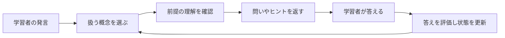

# PLOGと学習モード

進捗の12時間の保存期限、再読み込み・モード切り替え後の挙動、**最初からやり直す**の操作は、[Studyの再開・期限・やり直し](study-sessions.md)を参照してください。

PLOG（Prerequisite-aware Learning-Object Graph）は、**学ぶ概念と、その前提となる概念をつないだデータ**です。VideoQの学習モードは、このデータと問い・ヒントを使って学習を進めます。

質問へ回答する処理と、問いを出して学習を進める処理の違いは、[AIが回答を作るまで](../concepts/how-ai-works.md)から確認できます。

例えば「ベクトル → 内積 → 類似度」のような順序を持ち、次の概念に進む前に理解が必要な内容を扱います。これは仕組みを説明する例で、生成した順序が必ず正しいことを保証するものではありません。

## 何が保存されるか

| データ | 意味 | 保存先 |
|---|---|---|
| 概念 | 動画で学ぶ内容の単位 | `plog_concepts` |
| 関係 | 概念同士のつながり。前提関係など | `plog_edges` |
| 学習オブジェクト | 最初の問い、段階的なヒント、誤解の例など | `plog_learning_objects` |
| 生成ジョブ | 生成中・完了・失敗などの記録 | `plog_build_jobs` |

## 現在の生成処理

初回の検索索引作成後、Python workerが `build_plog` を実行します。字幕編集や検索再索引では、この後続処理を呼びません。[更新範囲の表](../architecture/transcription-and-search.md#update-scope)を参照してください。

構築の手順は次のとおりです。

1. 文字起こしからLLMで概念・問い・ヒントなどを抽出します。
2. 概念の埋め込みを作り、概念と学習オブジェクトを保存します。
3. 抽出した概念を順につなぐ `prerequisite_of` の関係を作ります。

現在の実装は概念を鎖状につなぐ簡略化された生成器です。論文のすべての検証処理や階層要約を実装しているわけではありません。`plog_summary_nodes` などのテーブルがあっても、それだけで現行処理がデータを生成しているとは判断しないでください。

### 生成モデルへ実際に何を頼むか

入力するのは、先頭40場面から各200文字までの文章と、文字起こし全体の先頭6,000文字です。プロンプトでは、**最大12個の概念**について、ラベル・登場時刻・根拠の文章・最初の問い・ヒント・想定される誤解を返すように求めます。12個という上限は指示であり、結果のパーサーが強制する制限ではありません。

モデルはJSONを返します。workerは概念の配列があることと、各概念のラベルが空でないことを検証します。明示的な空配列は正常な結果として扱い、古いデータを置き換えますが、学習対象となる概念は残りません。不正なJSONや必須構造の不備は生成失敗になります。

workerは概念ラベルの埋め込みを作って保存し、返された順番で隣り合う概念をつなぎます。モデルがすべての前提関係を別途検証する処理ではなく、辺の `accepted` は人が確認した証拠でもありません。入力を切り詰めているため、長い動画の後半の内容が抜ける場合があります。

実装は [pipeline/plog_build.py](https://github.com/yukiharada1228/videoq/blob/main/apps/worker/worker_python/pipeline/plog_build.py)が基準です。

## 学習モードでの使い方

最初の問いには保存済みの文面を使います。その後の回答評価や支援文ではLLMを利用する場合と、固定の規則や保存済みヒントを使う場合があります。一時的な進行状態は `STUDY_SESSION` Durable Objectに保存し、TTLで期限を管理します。同一セッションの並行リクエストはleaseとrevisionで競合を制御します。

これは学習者の全履歴を永続的な成績として保存することとは別です。テーブル定義にある `learner_concept_states` と、現行の学習セッションの保存先を混同しないでください。

## 学習の1ターンを追う

説明用の例として「ベクトル → 内積」というグラフを考えます。内積について尋ねても、前提のベクトルが未修得なら、先にベクトルについて保存された問いを出すことがあります。具体的な文面は、生成または編集した学習オブジェクトに依存します。

1. **グラフとセッションを読む。** 概念・順序の辺・保存済みの問いとヒント・現在の進行状態を取得します。
2. **取り組み中の概念があれば採点する。** 最新の返答と直前のAIの問いを読みます。まだ取り組み中の概念がなければ、この段階は省略します。
3. **対象概念を決める。** 発言と概念ラベルの埋め込みを比較し、短い返答や困惑した返答では話題を保つ規則も適用します。未修得の直接の前提概念があれば、そちらへ誘導する場合があります。
4. **応答の経路を選ぶ。** 新しい概念では保存済みの最初の問いを使います。答えを直接求める発言には保存済みヒントと定型文を使います。それ以外の支援では概念・ヒント・判定・近くの資料をモデルへ渡します。
5. **進行状態を保存する。** 取り組み中の概念、修得状態、直前の判定、ヒントの位置をプログラムが更新します。AIが文章で「できました」と言っただけで更新されるわけではありません。

概念候補を探す最低コサイン類似度は0.25です。通常の返答で取り組み中の概念から切り替えるには、候補が0.55以上、かつ現在の概念より0.12以上高いことが必要です。12文字未満の返答や、規則が認識した困惑・答えの要求では現在の概念を保ちます。これらはコード上の閾値で、確信度の確率ではありません。修得直後に次の概念を選んだターンは、その概念を維持します。

## 採点結果で次の動きがどう変わるか

採点モデルへ渡すのは、概念のラベル、直前の問い（なければ保存済みの最初の問い）、学習者の返答です。`grade` と `reason` を持つJSONを返すよう指示します。この採点呼び出しには、文字起こし全体や支援文生成用の場面資料は渡していません。

| 判定 | プログラムの動き |
|---|---|
| `mastery` | 対象と、重複に近いと判定した概念を修得済みにし、学習順序の次の未修得概念へ進む。残りがなければ完了 |
| `partial` | 概念に取り組み続け、ヒントの位置を一段進める。最後のヒントを超えない |
| `miss` | 同じくヒントの位置を進める。支援用プロンプトでは、より簡単な助言を求める |

採点の後に対象概念の選択を行います。そのため、発言の話題が十分に変わったと判定すれば、`partial` や `miss` の後でも、上記の切り替え規則に従って別の概念へ移る場合があります。

採点モデルを呼ぶ前に、空の返答、規則が認識する困惑、答えの要求を `miss` にします。採点の失敗や使えない判定が返った場合は、8文字未満なら `miss`、それ以外なら `partial` にフォールバックします。会話を継続するための処理であり、本当に理解したかを証明するものではありません。

この判定は学習の進行に使います。[生成した回答を評価するRAGASの指標](../architecture/prompt-engineering.md)とは別です。

## 支援文を作るモデルは何を読むか

通常の支援文では、学習方針、対象概念、最初の問い、想定される誤解、関連資料、まだ明かさない後続概念のラベル、現在のヒント、直前の判定があればその判定、最新の返答をモデルへ渡します。

関連資料には、概念の登場時刻から開始時刻が前後90秒以内にある字幕を最大4場面と、保存されていれば周辺の要約を使います。現在の生成器はこの階層要約を作りません。また、初期生成では再生地点の `waypoints` が空なので、学習モードに必ず再生可能な引用が付くわけではありません。引用する経路では、学習オブジェクトに設定された最初の再生地点を使います。

この字幕は、Studyが支援用の資料を読み込む際に、動画の保存字幕を直接解析して取り出します。Q&Aの場面検索索引は使いません。字幕の保存後は、検索再索引が未完了・失敗でも、次の読み込みで修正済みの周辺文章を利用できます。一方、PLOGに保存された問い・ヒントは編集または再構築まで変わらないため、新しい字幕と古い教材が混在する可能性があります。すでに生成中の応答は、読み込み済みの古い字幕を使う場合があります。

「答えを教えて」の場合は、新しい支援文を生成せず、答えを明かさず支援する定型文と保存済みヒントを返します。モデルが生成した支援文にも、特定の語句を使った答えの露出チェックを行い、該当すれば定型文へ置き換えます。これはヒューリスティックな判定で、意味を理解して完全に答えを隠せたと証明する処理ではありません。

学習モードは応答を生成し終えてから、全文を一つのストリーム断片として送ります。通常Q&Aのように生成中のトークンを逐次送る実装ではありません。

## 生成後に確認すること

動画詳細で概念・関係・問いを確認し、必要に応じて編集・統合・削除します。再生成は既存の概念・関係・学習オブジェクトなどを置き換えるため、手編集がある動画では結果への影響を確認してください。

学習モードには利用可能な学習順序が必要です。概念が空、複数の概念に順序の経路がない、循環があるなどの場合は `PLOG_NOT_READY` になり得ます。概念が一つなら辺がなくても利用できる経路になります。Q&AはPLOGの準備とは独立して利用できます。

### 再構築と進行中の学習 {#rebuild-and-active-study}

再構築では、その動画の概念とIDを置き換えます。古い概念に紐づくDBの `learner_concept_states` を削除しますが、現行Studyの `STUDY_SESSION` Durable Objectを消す処理ではありません。Studyは準備完了のグラフを読み、概念IDで進捗を対応させるため、置換後の動画では古いIDが一致せず、修得状態・取り組み中の概念・ヒント位置は新しい概念へ引き継がれません。講座内の変更していない動画の進捗は残る場合があります。

最新の構築状態が `pending`・`running`・`failed` の間、その動画のグラフは新しいStudyの処理対象から外れます。他に使えるグラフがない講座ではStudyを開始できず、他に準備完了のグラフがあればそちらを利用できます。すでに生成中の回答は、再構築前に読み込んだグラフを使って返る場合があります。再構築は画面の会話や保存済み履歴を書き換えません。

可能なら学習の区切りで再構築してください。`ready` の後に新しい問い・ヒントを点検し、[新しいセッションで動作を確認](#verify-in-fresh-session)します。Q&A → Studyの切り替えで消えるのは会話表示であり、セッションIDと残っている進捗は引き継ぎます。再構築前の経路から、そのまま続けられるとは案内しないでください。

小さな字幕修正なら、影響する学習オブジェクトを確認して手修正することで、残りの手編集を保持できます。[鮮度の扱いと確認手順](../architecture/transcription-and-search.md#update-scope)も参照してください。`ready` だけでは、最新字幕との一致は分かりません。

### 新しいStudyセッションで修正を確認する {#verify-in-fresh-session}

手修正では概念IDとセッション内の進捗が残ります。手修正・再構築後の最初の問いとヒントを確認するには、独立した確認用セッションを使います。

1. 講座のURL、または確認に使う共有URLをコピーします。元のタブは開いたままにします。
2. ブラウザーの**新しいタブ**（`Ctrl+T`／`Cmd+T`）を開き、アドレス欄へURLを貼り付けます。元のタブの複製・復元や、開いた元のページとの関連（opener）を残すリンクからの移動は使いません。これらでは、アプリがStudyのセッションIDを保存する `sessionStorage` が残るか、コピーされる場合があります。独立した新しいタブでは別のIDを使います。元のタブの再読み込みやモード切り替えではIDは変わりません。[ブラウザーのセッションストレージの動作](https://developer.mozilla.org/en-US/docs/Web/API/Window/sessionStorage)も参照してください。
3. **Study（学習）** を選び、対象の概念について尋ねます。前提概念が先に出た場合は順に取り組んでから、対象概念の最初の問いと続くヒントを、編集した学習グラフと照合します。

確認用セッションを作っても元のタブの進捗は変わらず、保存済みの会話履歴も削除しません。元のセッションを使うと、以前の会話が画面に見えなくても、最初の問いを飛ばしたり、確認用の発言を以前の問いへの返答として採点したりする場合があります。

## 調べる場所

- [tasks/build_plog.py](https://github.com/yukiharada1228/videoq/blob/main/apps/worker/worker_python/tasks/build_plog.py): ジョブの取得と生成状態。
- [plog-study.ts](https://github.com/yukiharada1228/videoq/blob/main/apps/api/src/lib/plog-study.ts): 学習モードの処理。
- [plog-runtime.ts](https://github.com/yukiharada1228/videoq/blob/main/apps/api/src/lib/plog-runtime.ts): グラフや学習順序の計算。
- [study-session.ts](https://github.com/yukiharada1228/videoq/blob/main/apps/api/src/durable-objects/study-session.ts): 一時状態と競合制御。

**関連:** [動画の状態](../design/state-diagram.md)、[プロンプト設計](../architecture/prompt-engineering.md)。
