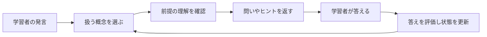

# PLOGと学習モード

PLOG（Prerequisite-aware Learning-Object Graph）は、**概念・提示順序の案・明示的に設定した前提関係を保存するデータ**です。VideoQは、概念を扱う順番と「次を理解するために前の理解が必要」という意味を区別します。学習モードは、このデータと問い・ヒントを使います。

質問へ回答する処理と、問いを出して学習を進める処理の違いは、[AIが回答を作るまで](../concepts/how-ai-works.md)から確認できます。

例えば、独立した話題A・Bをその順に提示しても、AがBの前提とは限りません。「ベクトル → 内積」の前提関係は、講義を確認して別途設定するものです。抽出順だけでは判断しません。

## 何が保存されるか

| データ | 意味 | 保存先 |
|---|---|---|
| 概念 | 動画で学ぶ内容の単位 | `plog_concepts` |
| 関係 | 概念同士の提示順序・前提関係など | `plog_edges` |
| 学習オブジェクト | 最初の問い、段階的なヒント、誤解の例など | `plog_learning_objects` |
| 生成ジョブ | 生成中・完了・失敗などの記録 | `plog_build_jobs` |

## 現在の生成処理

検索用の索引を作った後、Python workerが `build_plog` を実行します。

1. 文字起こしからLLMで概念・問い・ヒントなどを抽出します。
2. 概念の埋め込みを作り、概念と学習オブジェクトを保存します。
3. モデルが返した概念の順番をつなぐ `presentation_order` を作り、由来を `generated` として保存します。これは提示順序の案であり、前提関係の主張ではありません。

現在の実装は概念を鎖状につなぐ簡略化された生成器です。論文のすべての検証処理や階層要約を実装しているわけではありません。`plog_summary_nodes` などのテーブルがあっても、それだけで現行処理がデータを生成しているとは判断しないでください。

### 生成モデルへ実際に何を頼むか

入力するのは、先頭40場面から各200文字までの文章と、文字起こし全体の先頭6,000文字です。プロンプトでは、**最大12個の概念**について、ラベル・登場時刻・根拠の文章・最初の問い・ヒント・想定される誤解を返すように求めます。12個という上限は指示であり、結果のパーサーが強制する制限ではありません。

モデルはJSONを返します。workerは概念の配列があることと、各概念のラベルが空でないことを検証します。明示的な空配列は正常な結果として扱い、古いデータを置き換えますが、学習対象となる概念は残りません。不正なJSONや必須構造の不備は生成失敗になります。

workerは概念ラベルの埋め込みを作って保存し、返された順番で隣り合う概念をつなぎます。前提関係を別途推論・検証する処理ではありません。入力を切り詰めているため、長い動画の後半の内容が抜ける場合があります。

実装は [pipeline/plog_build.py](https://github.com/yukiharada1228/videoq/blob/main/apps/worker/worker_python/pipeline/plog_build.py)が基準です。

## 関係の意味と期待する学習経路

矢印はすべて始点から終点へ向かいます。学習順序に使うのは3種、そのうち前提の確認を行うのは2種です。

| 関係 | 意味 | 学習モードの動き |
|---|---|---|
| 提示順序 (`presentation_order`) | Aの後にBを提示する案 | 次の未修得概念を選ぶ順番に使う。Bの質問をAへ戻さず、Aの支援文でBを伏せる理由にもしない |
| 前提 (`prerequisite_of`) | Bの理解にはAの理解が必要 | 直接の前提Aが未修得ならBの質問をAへ誘導し、依存する後続概念を支援文で伏せる |
| 発展 (`builds_on`) | BはAを土台にする | 単なる提示の好みではなく、前提と同じく未修得の前提へ誘導する |
| 類推・例・対比 | 説明用の関係 | 学習順序・前提への誘導・後続概念を伏せる判断には使わない |

**独立した話題A・B:** 自動生成したA → Bの提示順序は、通常のAからBへ進む経路を作ります。Bから始めたいと質問すれば、Aの修得を要求せずBの開始の問いを返せます。Bの修得後に、残っているAを扱う場合はありますが、学習範囲を一通り扱うためであり、前提と判定したからではありません。

**ベクトルと内積:** ベクトルの理解が必要だと講義で確認できたら、「ベクトル → 内積」を前提に設定し、根拠の箇所を記録します。ベクトルが未修得の間、内積の質問はベクトルへ誘導します。ベクトルの修得後は内積へ進みます。自動生成した提示順序だけでは、この誘導は起きません。

### 自動生成・編集済み・検証済みは別のもの

| 画面の由来表示 | 分かること | 保証しないこと |
|---|---|---|
| 自動生成 | 現行の生成器が保存した関係 | 意味上の依存、正しさ、人による確認 |
| 手入力／編集 | 所有者が保存した関係、または概念統合で接続先を変えた関係 | 独立した検証や教育上の妥当性 |
| 由来不明（旧データ等） | 現行形式で由来が記録されていない | 自動生成・編集・確認のどれを経たか |

**独立した検証・承認の操作や「検証済み」の表示はありません。** 根拠の入力や編集の保存は、検証済みを意味しません。APIでは `provenance` として由来を返しますが、学習モードで使うかどうかは由来ではなく関係種別で決めます。

既存のDB項目 `validation_status` に、新しい書き込みでは `generated` または `edited` を保存します。旧値の `accepted` と `validated` は由来不明として表示します。`accepted` は生成した鎖の保存、`validated` は手動作成に使われていましたが、どちらにも確認者の記録や関係の意味を保証する情報はありません。自動生成した関係を編集すると「手入力／編集」になり、すべての編集・確認の履歴を残す仕組みではありません。

### 自動生成直後に使える条件

生成が完了し、概念の埋め込みと利用可能な学習経路があれば、人の承認なしで使えます。提示順序・前提・発展を**合わせた全体が循環しない（DAG）こと**が必要です。概念が一つなら辺は不要です。複数なら、これらの順序に関わる辺につながる概念が学習経路に入り、類推・例・対比だけでは経路になりません。空のグラフや利用できない経路は `PLOG_NOT_READY` になります。「利用可能」は生成の完了を表し、人が内容を確認した印ではありません。

新しい関係種別は既存の文字列項目を使うため、DBスキーマの移行は不要です。更新したPython生成器を有効にする前に、APIと画面の対応を反映してください。旧ランタイムは `presentation_order` を認識しません。旧データは生成と編集の経緯を確実に分けられないため、自動で関係種別を書き換えません。

### 関係を確認・修正する手順

1. 動画の「学習グラフ」を開き、「概念間の関係」で始点・終点・関係種別・由来・根拠を見ます。該当する文字起こしや動画の箇所と照合してください。
2. 独立した話題なら「提示順序」に編集します。本当の前提なら「前提」または「発展」を選び、根拠を記録します。どちらも始点が終点の前提です。
3. 接続先の誤りを直すか、不要な関係を削除します。独立した概念も提示経路に残す場合は提示順序を保ちます。逆向きへの変更で循環する場合は、先に矛盾する辺を削除・変更してください。循環を追加する保存は拒否されます。
4. 保存後に関係種別・由来・根拠が更新されたことを確認します。上のBから始める例は、新しい学習セッションで確認してください。既存の進捗は誘導先に影響します。
5. 旧データの `prerequisite_of` の鎖は、編集・削除・置き換えをするまで前提として扱います。独立したA → Bを提示順序に変更すれば、その前提による誘導を解除できます。再構築は手編集の概念・関係・ヒントも捨てるため、全体を置き換える場合に行ってください。

## 学習モードでの使い方

最初の問いには保存済みの文面を使います。その後の回答評価や支援文ではLLMを利用する場合と、固定の規則や保存済みヒントを使う場合があります。一時的な進行状態は `STUDY_SESSION` Durable Objectに保存し、TTLで期限を管理します。同一セッションの並行リクエストはleaseとrevisionで競合を制御します。

これは学習者の全履歴を永続的な成績として保存することとは別です。テーブル定義にある `learner_concept_states` と、現行の学習セッションの保存先を混同しないでください。

## 学習の1ターンを追う

説明用の例として「ベクトル → 内積」というグラフを考えます。内積について尋ねても、前提のベクトルが未修得なら、先にベクトルについて保存された問いを出すことがあります。具体的な文面は、生成または編集した学習オブジェクトに依存します。

1. **グラフとセッションを読む。** 概念・順序の辺・保存済みの問いとヒント・現在の進行状態を取得します。
2. **取り組み中の概念があれば採点する。** 最新の返答と直前のAIの問いを読みます。まだ取り組み中の概念がなければ、この段階は省略します。
3. **対象概念を決める。** 発言と概念ラベルの埋め込みを比較し、短い返答や困惑した返答では話題を保つ規則も適用します。未修得の直接の前提概念があれば、そちらへ誘導する場合があります。
4. **応答の経路を選ぶ。** 新しい概念では保存済みの最初の問いを使います。答えを直接求める発言には保存済みヒントと定型文を使います。それ以外の支援では概念・ヒント・判定・近くの資料をモデルへ渡します。
5. **進行状態を保存する。** 取り組み中の概念、修得状態、直前の判定、ヒントの位置をプログラムが更新します。AIが文章で「できました」と言っただけで更新されるわけではありません。

概念候補を探す最低コサイン類似度は0.25です。通常の返答で取り組み中の概念から切り替えるには、候補が0.55以上、かつ現在の概念より0.12以上高いことが必要です。12文字未満の返答や、規則が認識した困惑・答えの要求では現在の概念を保ちます。これらはコード上の閾値で、確信度の確率ではありません。修得直後に次の概念を選んだターンは、その概念を維持します。

## 採点結果で次の動きがどう変わるか

採点モデルへ渡すのは、概念のラベル、直前の問い（なければ保存済みの最初の問い）、学習者の返答です。`grade` と `reason` を持つJSONを返すよう指示します。この採点呼び出しには、文字起こし全体や支援文生成用の場面資料は渡していません。

| 判定 | プログラムの動き |
|---|---|
| `mastery` | 対象と、重複に近いと判定した概念を修得済みにし、学習順序の次の未修得概念へ進む。残りがなければ完了 |
| `partial` | 概念に取り組み続け、ヒントの位置を一段進める。最後のヒントを超えない |
| `miss` | 同じくヒントの位置を進める。支援用プロンプトでは、より簡単な助言を求める |

採点の後に対象概念の選択を行います。そのため、発言の話題が十分に変わったと判定すれば、`partial` や `miss` の後でも、上記の切り替え規則に従って別の概念へ移る場合があります。

採点モデルを呼ぶ前に、空の返答、規則が認識する困惑、答えの要求を `miss` にします。採点の失敗や使えない判定が返った場合は、8文字未満なら `miss`、それ以外なら `partial` にフォールバックします。会話を継続するための処理であり、本当に理解したかを証明するものではありません。

この判定は学習の進行に使います。[生成した回答を評価するRAGASの指標](../architecture/prompt-engineering.md)とは別です。

## 支援文を作るモデルは何を読むか

通常の支援文では、学習方針、対象概念、最初の問い、想定される誤解、関連資料、まだ明かさない後続概念のラベル、現在のヒント、直前の判定があればその判定、最新の返答をモデルへ渡します。

関連資料には、概念の登場時刻から開始時刻が前後90秒以内にある字幕を最大4場面と、保存されていれば周辺の要約を使います。現在の生成器はこの階層要約を作りません。また、初期生成では再生地点の `waypoints` が空なので、学習モードに必ず再生可能な引用が付くわけではありません。引用する経路では、学習オブジェクトに設定された最初の再生地点を使います。

「答えを教えて」の場合は、新しい支援文を生成せず、答えを明かさず支援する定型文と保存済みヒントを返します。モデルが生成した支援文にも、特定の語句を使った答えの露出チェックを行い、該当すれば定型文へ置き換えます。これはヒューリスティックな判定で、意味を理解して完全に答えを隠せたと証明する処理ではありません。

学習モードは応答を生成し終えてから、全文を一つのストリーム断片として送ります。通常Q&Aのように生成中のトークンを逐次送る実装ではありません。

## 生成後に確認すること

動画詳細で概念・関係・問いを確認し、必要に応じて編集・統合・削除します。再生成は既存の概念・関係・学習オブジェクトなどを置き換えるため、手編集がある動画では結果への影響を確認してください。

学習モードには提示順序・前提・発展を合わせた利用可能な学習順序が必要です。概念が空、複数の概念に順序の経路がない、循環があるなどの場合は `PLOG_NOT_READY` になり得ます。概念が一つなら辺がなくても利用できる経路になります。Q&AはPLOGの準備とは独立して利用できます。

## 調べる場所

- [tasks/build_plog.py](https://github.com/yukiharada1228/videoq/blob/main/apps/worker/worker_python/tasks/build_plog.py): ジョブの取得と生成状態。
- [plog-study.ts](https://github.com/yukiharada1228/videoq/blob/main/apps/api/src/lib/plog-study.ts): 学習モードの処理。
- [plog-runtime.ts](https://github.com/yukiharada1228/videoq/blob/main/apps/api/src/lib/plog-runtime.ts): グラフや学習順序の計算。
- [study-session.ts](https://github.com/yukiharada1228/videoq/blob/main/apps/api/src/durable-objects/study-session.ts): 一時状態と競合制御。

**関連:** [動画の状態](../design/state-diagram.md)、[プロンプト設計](../architecture/prompt-engineering.md)。
