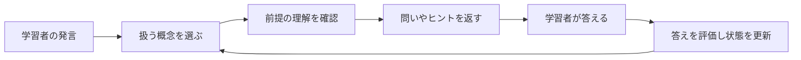

# PLOGと学習モード

PLOG（Prerequisite-aware Learning-Object Graph）は、**学ぶ概念と、その前提となる概念をつないだデータ**です。VideoQの学習モードは、このデータと問い・ヒントを使って学習を進めます。

例えば「ベクトル → 内積 → 類似度」のような順序を持ち、次の概念に進む前に理解が必要な内容を扱います。これは仕組みを説明する例で、生成した順序が必ず正しいことを保証するものではありません。

## 何が保存されるか

| データ | 意味 | 保存先 |
|---|---|---|
| 概念 | 動画で学ぶ内容の単位 | `plog_concepts` |
| 関係 | 概念同士のつながり。前提関係など | `plog_edges` |
| 学習オブジェクト | 最初の問い、段階的なヒント、誤解の例など | `plog_learning_objects` |
| 生成ジョブ | 生成中・完了・失敗などの記録 | `plog_build_jobs` |

## 現在の生成処理

検索用の索引を作った後、Python workerが `build_plog` を実行します。

1. 文字起こしからLLMで概念・問い・ヒントなどを抽出します。
2. 概念の埋め込みを作り、概念と学習オブジェクトを保存します。
3. 抽出した概念を順につなぐ `prerequisite_of` の関係を作ります。

現在の実装は概念を鎖状につなぐ簡略化された生成器です。論文のすべての検証処理や階層要約を実装しているわけではありません。`plog_summary_nodes` などのテーブルがあっても、それだけで現行処理がデータを生成しているとは判断しないでください。

実装は [pipeline/plog_build.py](https://github.com/yukiharada1228/videoq/blob/main/apps/worker/worker_python/pipeline/plog_build.py)が基準です。

## 学習モードでの使い方

最初の問いには保存済みの文面を使い、その後の回答評価や支援文の生成ではLLMを利用します。一時的な進行状態は `STUDY_SESSION` Durable Objectに保存し、TTLで期限を管理します。同一セッションの並行リクエストはleaseとrevisionで競合を制御します。

これは学習者の全履歴を永続的な成績として保存することとは別です。テーブル定義にある `learner_concept_states` と、現行の学習セッションの保存先を混同しないでください。

## 生成後に確認すること

動画詳細で概念・関係・問いを確認し、必要に応じて編集・統合・削除します。再生成は既存の概念・関係・学習オブジェクトなどを置き換えるため、手編集がある動画では結果への影響を確認してください。

学習モードには利用可能な学習順序が必要です。概念が空、順序の辺がない、循環があるなどの場合は `PLOG_NOT_READY` になり得ます。Q&AはPLOGの準備とは独立して利用できます。

## 調べる場所

- [tasks/build_plog.py](https://github.com/yukiharada1228/videoq/blob/main/apps/worker/worker_python/tasks/build_plog.py): ジョブの取得と生成状態。
- [plog-study.ts](https://github.com/yukiharada1228/videoq/blob/main/apps/api/src/lib/plog-study.ts): 学習モードの処理。
- [plog-runtime.ts](https://github.com/yukiharada1228/videoq/blob/main/apps/api/src/lib/plog-runtime.ts): グラフや学習順序の計算。
- [study-session.ts](https://github.com/yukiharada1228/videoq/blob/main/apps/api/src/durable-objects/study-session.ts): 一時状態と競合制御。

**関連:** [動画の状態](../design/state-diagram.md)、[プロンプト設計](../architecture/prompt-engineering.md)。
