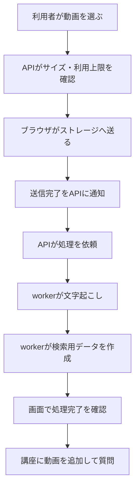
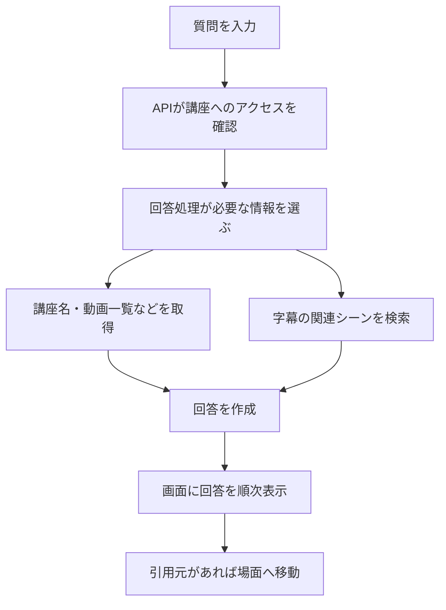

# 利用者の操作とシステムの動き

画面での操作と、システム内部で起こる処理を対応させます。実装を読む前に、利用者がどこで待ち、何を見て次へ進むかを確認するための図です。

## 動画を質問に使えるようにする

ファイル送信後も、文字起こしと検索準備が終わるまでは待ち時間があります。エラーが起きたときに、送信失敗と処理失敗を同じ表示にしないことが重要です。

## 質問に答える

登録情報だけで答えられる質問もあります。授業内容に関する質問では字幕を参照します。具体的なツールと制限は[プロンプト設計](../architecture/prompt-engineering.md)にまとめています。

## 学習モードとの違い

学習モードでは、自由な質問への回答に加えて、PLOGの概念・前提関係・問い・ヒントを使います。動画の処理完了と学習用グラフの準備完了は別です。

**関連:** [動画の状態](../design/state-diagram.md)、[PLOGと学習モード](../plog/README.md)、[担当別のフロー](../architecture/bpmn.md)。
