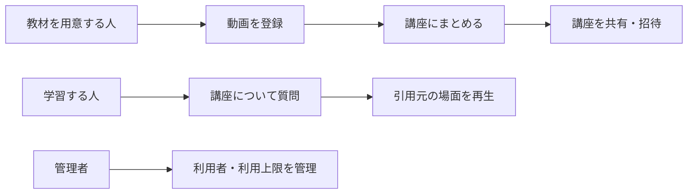

# 利用者とできること

VideoQの機能を、利用者が達成したいことから整理したページです。個々の画面やAPIの詳細を調べる前に、誰のための変更なのかを確認するために使います。

## 基本の使い方

同じ人が教材を登録し、自分で学ぶこともできます。図の役割は、必ず別々のアカウントを用意するという意味ではありません。

## 主な操作

| 目的 | 操作 | 確認したい結果 |
|---|---|---|
| 教材を準備する | ファイルをアップロード、YouTubeから取り込む | 文字起こしと検索準備ができる |
| 教材を整理する | 講座への追加・並べ替え、タグ付け | 探したい動画と質問する範囲が明確になる |
| 内容を調べる | 講座のチャットで質問する | 回答と根拠の場面を確認できる |
| 他の人と使う | 共有リンク、講座への招待 | 許可された講座を他の人が利用できる |
| 回答の質を確認する | 履歴、フィードバック、分析、評価を見る | 改善すべき回答や教材を見つけられる |
| 利用状況を管理する | 利用者・クォータ・再索引を管理する | 上限や処理状態を運用できる |
| 外部ツールとつなぐ | APIキーまたはOAuthでMCPへ接続する | 許可された操作をクライアントから実行できる |

## アクセス権との関係

登録・編集する対象には所有者がいます。共有リンクや招待による閲覧と、所有者による編集は同じ権限ではありません。管理者の操作も通常利用とは分けます。

機能を変更するときは、対象の利用者とデータへのアクセス権をセットで確認します。[認証とアクセス権](../concepts/auth.md)を参照してください。

**関連:** [初回の操作](../getting-started/first-walkthrough.md)、[画面一覧](screen-transition-diagram.md)。
