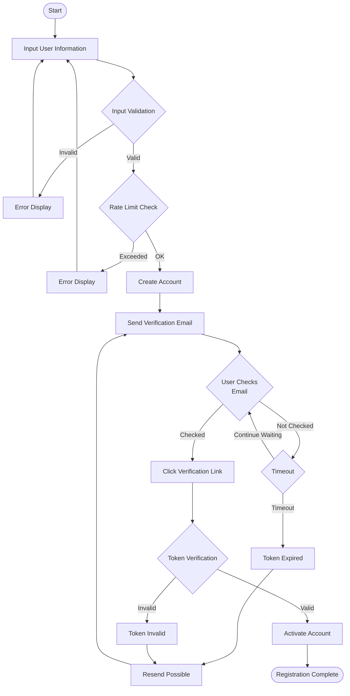
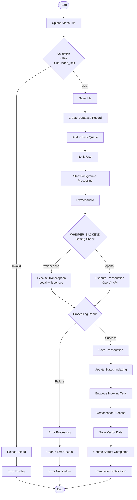
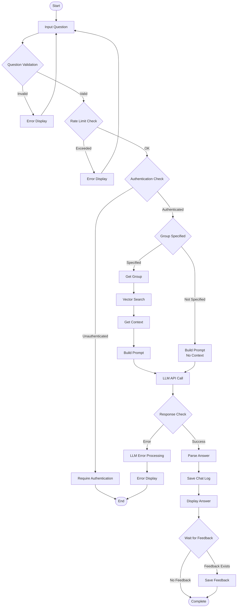
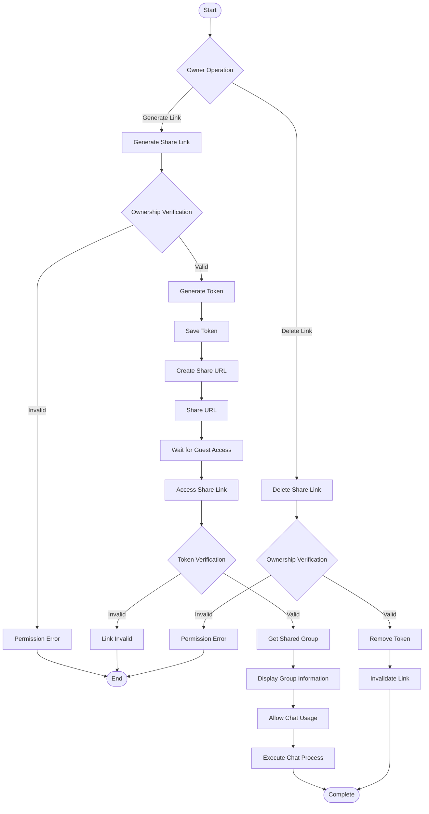
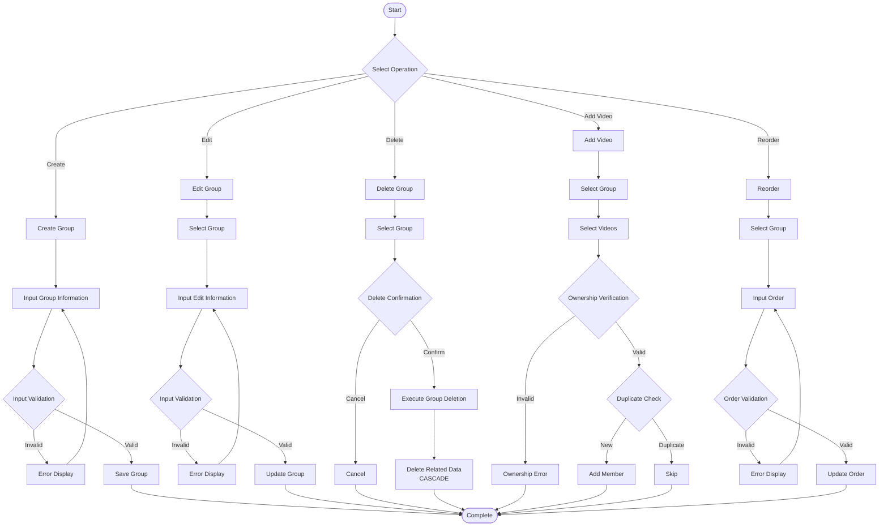
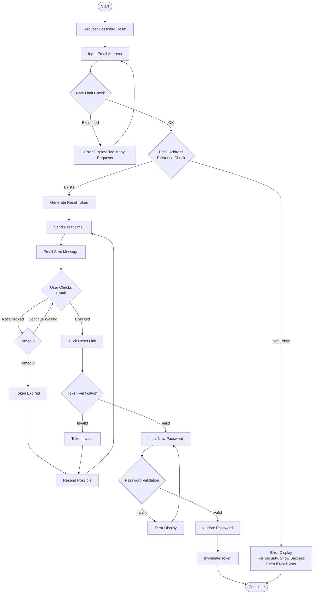
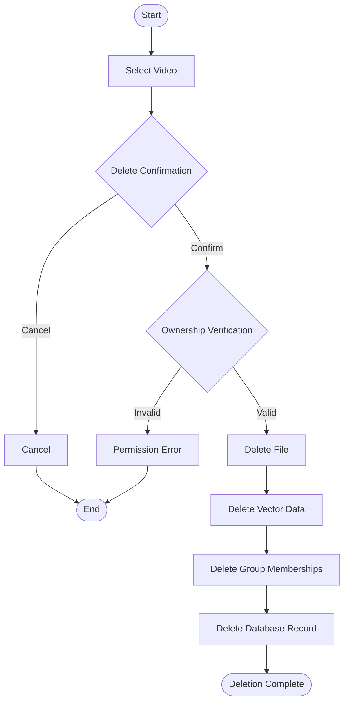
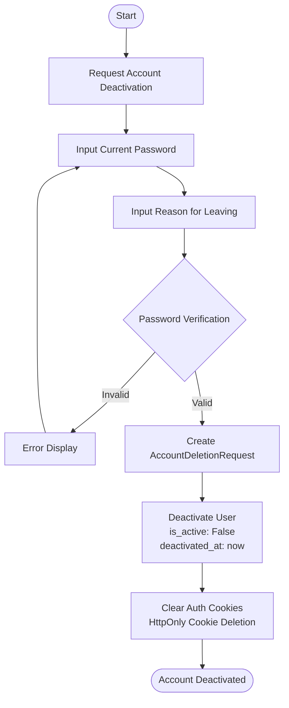
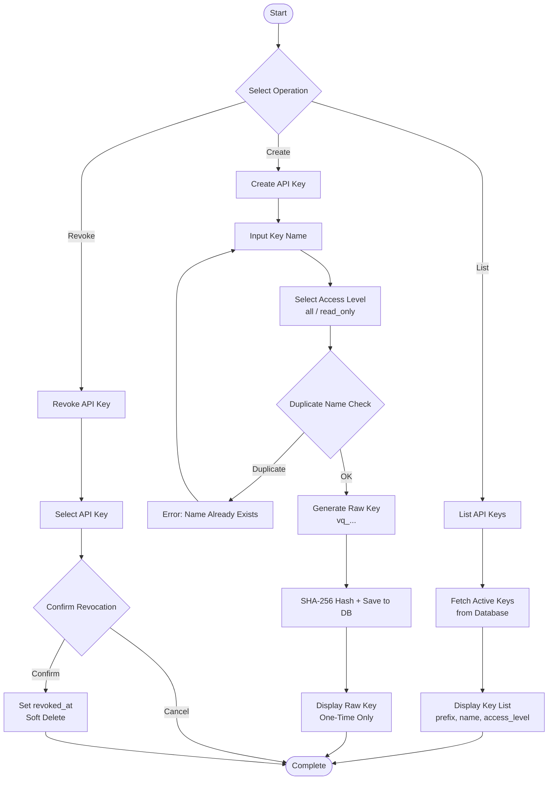
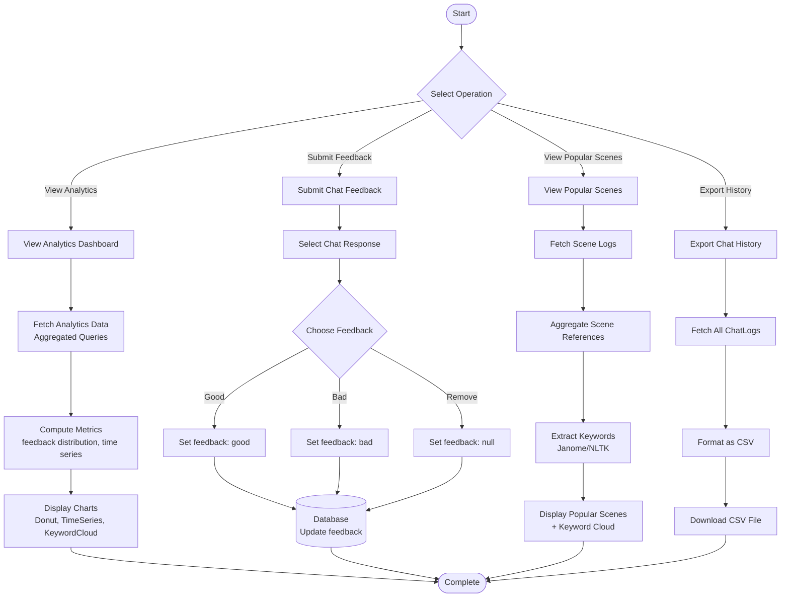

# BPMN図

## 概要

BPMN（Business Process Model and Notation）を使用したVideoQシステムのビジネスプロセスを示す図です。

## 1. ユーザー登録プロセス

```mermaid
flowchart TD
    Start([Start]) --> UserInput[Input User Information]
    UserInput --> Validate{Input Validation}
    Validate -->|Invalid| ShowError[Error Display]
    ShowError --> UserInput
    Validate -->|Valid| RateLimit{"Rate Limit Check"}
    RateLimit -->|Exceeded| ErrorRateLimit[Error Display]
    ErrorRateLimit --> UserInput
    RateLimit -->|OK| CreateAccount[Create Account]
    CreateAccount --> SendEmail[Send Verification Email]
    SendEmail --> WaitEmail{"User Checks<br>Email"}
    WaitEmail -->|Not Checked| Timeout{Timeout}
    Timeout -->|Timeout| Expire[Token Expired]
    Expire --> Resend[Resend Possible]
    Resend --> SendEmail
    Timeout -->|Continue Waiting| WaitEmail
    WaitEmail -->|Checked| ClickLink[Click Verification Link]
    ClickLink --> VerifyToken{Token Verification}
    VerifyToken -->|Invalid| InvalidToken[Token Invalid]
    InvalidToken --> Resend
    VerifyToken -->|Valid| ActivateAccount[Activate Account]
    ActivateAccount --> Complete([Registration Complete])
```

## 2. 動画アップロード・文字起こしプロセス

```mermaid
flowchart TD
    Start([Start]) --> Upload[Upload Video File]
    Upload --> ValidateFile{"Validation<br>- File<br>- User.video_limit"}
    ValidateFile -->|Invalid| Reject[Reject Upload]
    Reject --> ShowError[Error Display]
    ShowError --> End([End])
    ValidateFile -->|Valid| SaveFile[Save File]
    SaveFile --> CreateRecord[Create Database Record]
    CreateRecord --> QueueTask[Add to Task Queue]
    QueueTask --> NotifyUser[Notify User]
    NotifyUser --> ProcessTask[Start Background Processing]
    
    ProcessTask --> ExtractAudio[Extract Audio]
    ExtractAudio --> CheckBackend{"WHISPER_BACKEND<br>Setting Check"}
    CheckBackend -->|whisper.cpp| Transcribe[Execute Transcription<br>Local whisper.cpp]
    CheckBackend -->|openai| TranscribeAPI[Execute Transcription<br>OpenAI API]
    Transcribe --> CheckResult{Processing Result}
    TranscribeAPI --> CheckResult
    CheckResult -->|Success| CreateTranscript[Save Transcription]
    CheckResult -->|Failure| HandleError[Error Processing]
    HandleError --> UpdateErrorStatus[Update Error Status]
    UpdateErrorStatus --> NotifyError[Error Notification]
    NotifyError --> End
    
    CreateTranscript --> MarkIndexing[Update Status: Indexing]
    MarkIndexing --> QueueIndexTask[Enqueue Indexing Task]
    QueueIndexTask --> Vectorize[Vectorization Process]
    Vectorize --> SaveVector[Save Vector Data]
    SaveVector --> UpdateStatus[Update Status: Completed]
    UpdateStatus --> NotifyComplete[Completion Notification]
    NotifyComplete --> End
```

## 3. チャット質問応答プロセス

```mermaid
flowchart TD
    Start([Start]) --> InputQuestion[Input Question]
    InputQuestion --> ValidateQuestion{Question Validation}
    ValidateQuestion -->|Invalid| ShowError[Error Display]
    ShowError --> InputQuestion
    ValidateQuestion -->|Valid| RateLimit{"Rate Limit Check"}
    RateLimit -->|Exceeded| ErrorRateLimit[Error Display]
    ErrorRateLimit --> InputQuestion
    RateLimit -->|OK| CheckAuth{Authentication Check}
    CheckAuth -->|Unauthenticated| RequireAuth[Require Authentication]
    RequireAuth --> End([End])
    CheckAuth -->|Authenticated| CheckGroup{Group Specified}
    
    CheckGroup -->|Specified| GetGroup[Get Group]
    GetGroup --> SearchVector[Vector Search]
    SearchVector --> GetContext[Get Context]
    GetContext --> BuildPrompt[Build Prompt]
    
    CheckGroup -->|Not Specified| BuildPrompt2[Build Prompt<br>No Context]
    
    BuildPrompt --> CallLLM[LLM API Call]
    BuildPrompt2 --> CallLLM
    CallLLM --> CheckResponse{Response Check}
    CheckResponse -->|Error| HandleLLMError[LLM Error Processing]
    HandleLLMError --> ShowError2[Error Display]
    ShowError2 --> End
    CheckResponse -->|Success| ParseAnswer[Parse Answer]
    ParseAnswer --> SaveLog[Save Chat Log]
    SaveLog --> DisplayAnswer[Display Answer]
    DisplayAnswer --> WaitFeedback{Wait for Feedback}
    WaitFeedback -->|Feedback Exists| SaveFeedback[Save Feedback]
    WaitFeedback -->|No Feedback| Complete
    SaveFeedback --> Complete([Complete])
```

## 4. グループ共有プロセス

```mermaid
flowchart TD
    Start([Start]) --> OwnerAction{Owner Operation}
    OwnerAction -->|Generate Link| GenerateLink[Generate Share Link]
    OwnerAction -->|Delete Link| DeleteLink[Delete Share Link]
    
    GenerateLink --> ValidateOwner{Ownership Verification}
    ValidateOwner -->|Invalid| RejectOwner[Permission Error]
    RejectOwner --> End([End])
    ValidateOwner -->|Valid| CreateToken[Generate Token]
    CreateToken --> SaveToken[Save Token]
    SaveToken --> CreateURL[Create Share URL]
    CreateURL --> ShareURL[Share URL]
    ShareURL --> GuestAccess[Wait for Guest Access]
    
    GuestAccess --> AccessLink[Access Share Link]
    AccessLink --> ValidateToken{Token Verification}
    ValidateToken -->|Invalid| InvalidLink[Link Invalid]
    InvalidLink --> End
    ValidateToken -->|Valid| GetSharedGroup[Get Shared Group]
    GetSharedGroup --> DisplayGroup[Display Group Information]
    DisplayGroup --> AllowChat[Allow Chat Usage]
    AllowChat --> ChatProcess[Execute Chat Process]
    ChatProcess --> Complete([Complete])
    
    DeleteLink --> ValidateOwner2{Ownership Verification}
    ValidateOwner2 -->|Invalid| RejectOwner2[Permission Error]
    RejectOwner2 --> End
    ValidateOwner2 -->|Valid| RemoveToken[Remove Token]
    RemoveToken --> InvalidateLink[Invalidate Link]
    InvalidateLink --> Complete
```

## 5. 動画グループ管理プロセス

```mermaid
flowchart TD
    Start([Start]) --> SelectAction{Select Operation}
    SelectAction -->|Create| CreateGroup[Create Group]
    SelectAction -->|Edit| EditGroup[Edit Group]
    SelectAction -->|Delete| DeleteGroup[Delete Group]
    SelectAction -->|Add Video| AddVideo[Add Video]
    SelectAction -->|Reorder| ReorderVideo[Reorder]
    
    CreateGroup --> InputInfo[Input Group Information]
    InputInfo --> ValidateInfo{Input Validation}
    ValidateInfo -->|Invalid| ShowError[Error Display]
    ShowError --> InputInfo
    ValidateInfo -->|Valid| SaveGroup[Save Group]
    SaveGroup --> Complete([Complete])
    
    EditGroup --> SelectGroup[Select Group]
    SelectGroup --> InputEdit[Input Edit Information]
    InputEdit --> ValidateEdit{Input Validation}
    ValidateEdit -->|Invalid| ShowError2[Error Display]
    ShowError2 --> InputEdit
    ValidateEdit -->|Valid| UpdateGroup[Update Group]
    UpdateGroup --> Complete
    
    DeleteGroup --> SelectGroup2[Select Group]
    SelectGroup2 --> ConfirmDelete{Delete Confirmation}
    ConfirmDelete -->|Cancel| Cancel[Cancel]
    Cancel --> Complete
    ConfirmDelete -->|Confirm| ExecuteDelete[Execute Group Deletion]
    ExecuteDelete --> CascadeDelete[Delete Related Data<br/>CASCADE]
    CascadeDelete --> Complete
    
    AddVideo --> SelectGroup3[Select Group]
    SelectGroup3 --> SelectVideos[Select Videos]
    SelectVideos --> ValidateOwnership{Ownership Verification}
    ValidateOwnership -->|Invalid| RejectVideo[Ownership Error]
    RejectVideo --> Complete
    ValidateOwnership -->|Valid| CheckDuplicate{Duplicate Check}
    CheckDuplicate -->|Duplicate| SkipVideo[Skip]
    CheckDuplicate -->|New| AddMember[Add Member]
    AddMember --> Complete
    SkipVideo --> Complete
    
    ReorderVideo --> SelectGroup4[Select Group]
    SelectGroup4 --> InputOrder[Input Order]
    InputOrder --> ValidateOrder{Order Validation}
    ValidateOrder -->|Invalid| ShowError3[Error Display]
    ShowError3 --> InputOrder
    ValidateOrder -->|Valid| UpdateOrder[Update Order]
    UpdateOrder --> Complete
```

## 6. パスワードリセットプロセス

```mermaid
flowchart TD
    Start([Start]) --> RequestReset[Request Password Reset]
    RequestReset --> InputEmail[Input Email Address]
    InputEmail --> RateLimit{"Rate Limit Check"}
    RateLimit -->|Exceeded| ErrorRateLimit[Error Display: Too Many Requests]
    ErrorRateLimit --> InputEmail
    RateLimit -->|OK| ValidateEmail{"Email Address<br>Existence Check"}
    ValidateEmail -->|Not Exists| ShowError[Error Display<br/>For Security, Show Success<br/>Even if Not Exists]
    ValidateEmail -->|Exists| GenerateToken[Generate Reset Token]
    GenerateToken --> SendEmail[Send Reset Email]
    SendEmail --> ShowMessage[Email Sent Message]
    ShowMessage --> WaitEmail{"User Checks<br>Email"}
    WaitEmail -->|Not Checked| Timeout{Timeout}
    Timeout -->|Timeout| Expire[Token Expired]
    Expire --> Resend[Resend Possible]
    Resend --> SendEmail
    Timeout -->|Continue Waiting| WaitEmail
    WaitEmail -->|Checked| ClickLink[Click Reset Link]
    ClickLink --> VerifyToken{Token Verification}
    VerifyToken -->|Invalid| InvalidToken[Token Invalid]
    InvalidToken --> Resend
    VerifyToken -->|Valid| InputPassword[Input New Password]
    InputPassword --> ValidatePassword{Password Validation}
    ValidatePassword -->|Invalid| ShowError2[Error Display]
    ShowError2 --> InputPassword
    ValidatePassword -->|Valid| UpdatePassword[Update Password]
    UpdatePassword --> InvalidateToken[Invalidate Token]
    InvalidateToken --> Complete([Complete])
    ShowError --> Complete
```

## 7. 動画削除プロセス

```mermaid
flowchart TD
    Start([Start]) --> SelectVideo[Select Video]
    SelectVideo --> ConfirmDelete{Delete Confirmation}
    ConfirmDelete -->|Cancel| Cancel[Cancel]
    Cancel --> End([End])
    ConfirmDelete -->|Confirm| ValidateOwnership{Ownership Verification}
    ValidateOwnership -->|Invalid| Reject[Permission Error]
    Reject --> End
    ValidateOwnership -->|Valid| DeleteFile[Delete File]
    DeleteFile --> DeleteVectors[Delete Vector Data]
    DeleteVectors --> DeleteMemberships[Delete Group Memberships]
    DeleteMemberships --> DeleteRecord[Delete Database Record]
    DeleteRecord --> Complete([Deletion Complete])
```

## プロセス特性

### 非同期処理
- 動画の文字起こしはバックグラウンドで非同期に処理されます
- Celery Workerによるタスクキュー管理

### エラーハンドリング
- 各プロセスで適切なエラーハンドリングを実施
- ユーザーフレンドリーなエラーメッセージ

### セキュリティ
- 各プロセスで認証・認可チェックを実施
- 安全なトークンベースの認証

### データ整合性
- `transaction.atomic` によるトランザクション管理でデータの整合性を保証
- CASCADE削除による参照整合性の保証

## 8. アカウント無効化プロセス

```mermaid
flowchart TD
    Start([Start]) --> RequestDelete[Request Account Deactivation]
    RequestDelete --> InputPassword[Input Current Password]
    InputPassword --> InputReason[Input Reason for Leaving]
    InputReason --> Validate{Password Verification}
    Validate -->|Invalid| ShowError[Error Display]
    ShowError --> InputPassword
    Validate -->|Valid| CreateRequest[Create AccountDeletionRequest]
    CreateRequest --> DeactivateUser[Deactivate User<br/>is_active: False<br/>deactivated_at: now]
    DeactivateUser --> ClearCookies[Clear Auth Cookies<br/>HttpOnly Cookie Deletion]
    ClearCookies --> Complete([Account Deactivated])
```

## 9. APIキー管理プロセス

```mermaid
flowchart TD
    Start([Start]) --> SelectAction{Select Operation}
    SelectAction -->|List| ListKeys[List API Keys]
    SelectAction -->|Create| CreateKey[Create API Key]
    SelectAction -->|Revoke| RevokeKey[Revoke API Key]

    ListKeys --> FetchKeys[Fetch Active Keys<br/>from Database]
    FetchKeys --> DisplayKeys[Display Key List<br/>prefix, name, access_level]
    DisplayKeys --> Complete([Complete])

    CreateKey --> InputName[Input Key Name]
    InputName --> SelectAccess[Select Access Level<br/>all / read_only]
    SelectAccess --> CheckDup{Duplicate Name Check}
    CheckDup -->|Duplicate| ShowError[Error: Name Already Exists]
    ShowError --> InputName
    CheckDup -->|OK| GenerateKey[Generate Raw Key<br/>vq_...]
    GenerateKey --> HashAndSave[SHA-256 Hash + Save to DB]
    HashAndSave --> ShowRawKey[Display Raw Key<br/>One-Time Only]
    ShowRawKey --> Complete

    RevokeKey --> SelectKey[Select API Key]
    SelectKey --> ConfirmRevoke{Confirm Revocation}
    ConfirmRevoke -->|Cancel| Complete
    ConfirmRevoke -->|Confirm| SetRevoked[Set revoked_at<br/>Soft Delete]
    SetRevoked --> Complete
```

## 10. チャット分析プロセス

```mermaid
flowchart TD
    Start([Start]) --> SelectAction{Select Operation}
    SelectAction -->|View Analytics| ViewAnalytics[View Analytics Dashboard]
    SelectAction -->|Submit Feedback| SubmitFeedback[Submit Chat Feedback]
    SelectAction -->|View Popular Scenes| ViewScenes[View Popular Scenes]
    SelectAction -->|Export History| ExportHistory[Export Chat History]

    ViewAnalytics --> FetchAnalytics[Fetch Analytics Data<br/>Aggregated Queries]
    FetchAnalytics --> ComputeMetrics[Compute Metrics<br/>feedback distribution, time series]
    ComputeMetrics --> DisplayCharts[Display Charts<br/>Donut, TimeSeries, KeywordCloud]
    DisplayCharts --> Complete([Complete])

    SubmitFeedback --> SelectLog[Select Chat Response]
    SelectLog --> ChooseFeedback{Choose Feedback}
    ChooseFeedback -->|Good| SetGood[Set feedback: good]
    ChooseFeedback -->|Bad| SetBad[Set feedback: bad]
    ChooseFeedback -->|Remove| ClearFeedback[Set feedback: null]
    SetGood --> SaveFeedback[(Database<br/>Update feedback)]
    SetBad --> SaveFeedback
    ClearFeedback --> SaveFeedback
    SaveFeedback --> Complete

    ViewScenes --> FetchSceneLogs[Fetch Scene Logs]
    FetchSceneLogs --> AggregateScenes[Aggregate Scene References]
    AggregateScenes --> ExtractKeywords[Extract Keywords<br/>Janome/NLTK]
    ExtractKeywords --> DisplayScenes[Display Popular Scenes<br/>+ Keyword Cloud]
    DisplayScenes --> Complete

    ExportHistory --> FetchAllLogs[Fetch All ChatLogs]
    FetchAllLogs --> FormatCSV[Format as CSV]
    FormatCSV --> DownloadFile[Download CSV File]
    DownloadFile --> Complete
```

---

## Related Documentation

- [📖 ドキュメント一覧](../README.md)
- [フローチャート](flowchart.md) — 処理フローの詳細
- [アクティビティ図](../requirements/activity-diagram.md) — 業務フロー概要
- [シーケンス図](../design/sequence-diagram.md) — 処理シーケンスの詳細
- [ユースケース図](../requirements/use-case-diagram.md) — ユーザー操作一覧
