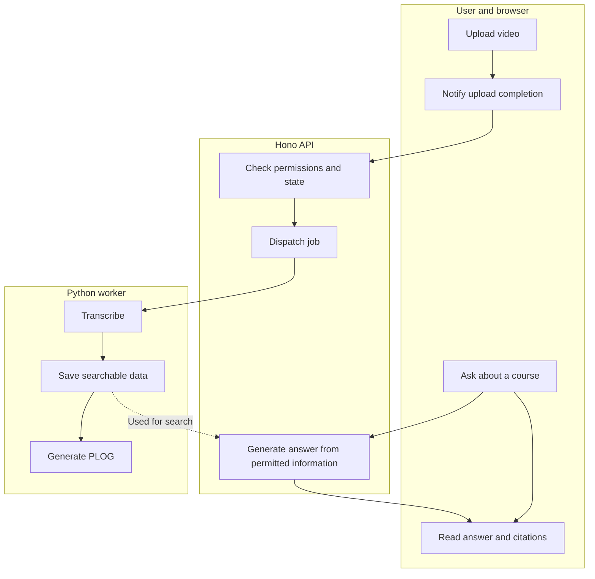

# Processing flow by responsibility

This flow shows where responsibility passes between components. It uses Mermaid for readability rather than strict BPMN notation.

## From video to answer

```mermaid
flowchart TB
    subgraph User[User and browser]
      Upload[Upload video] --> Confirm[Notify upload completion]
      Ask[Ask about a course] --> Read[Read answer and citations]
    end
    subgraph API[Hono API]
      Accept[Check permissions and state]
      Dispatch[Dispatch job]
      Answer[Generate answer from permitted information]
    end
    subgraph Worker[Python worker]
      Transcribe[Transcribe]
      Index[Save searchable data]
      Plog[Generate PLOG]
    end
    Confirm --> Accept --> Dispatch
    Dispatch --> Transcribe --> Index --> Plog
    Index -. Used for search .-> Answer
    Ask --> Answer --> Read
```

The API answers questions. The worker does not send answers directly to the browser after processing. Study mode requires PLOG as well as the search index.

## Where to investigate problems

| Problem | Check first | Next reference |
|---|---|---|
| Cannot upload a file | Browser, storage, API | [Troubleshooting](../guides/troubleshooting.md) |
| Video is not processed | Job delivery, queue, worker | [Job delivery and recovery](flowchart.md) |
| Answers are unrelated to the content | Search scope, subtitles, prompts | [Prompt design](prompt-engineering.md) |
| Only Study is unavailable | PLOG generation status and ordering | [PLOG and study mode](../plog/README.md) |

**Related:** Follow calls over time in the [sequence diagrams](../design/sequence-diagram.md), or start from user actions in the [activity flow](../requirements/activity-diagram.md).
