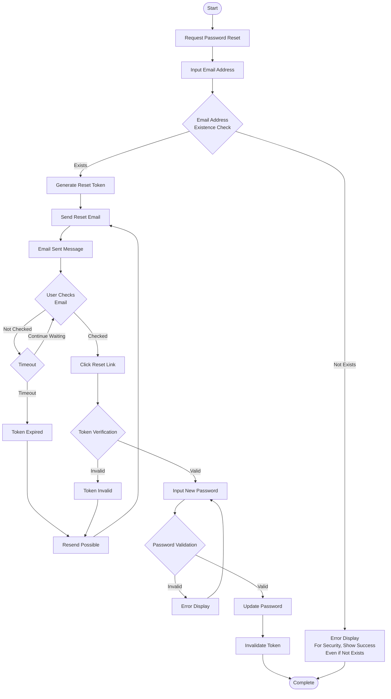

# BPMN Diagram

## Overview

This diagram represents the business processes of the Ask Video system using BPMN (Business Process Model and Notation).

## 1. User Registration Process

## 2. Video Upload & Transcription Process

## 3. Chat Question & Answer Process

## 4. Group Sharing Process

## 5. Video Group Management Process

## 6. Password Reset Process

## 7. Video Deletion Process

## Process Characteristics

### Asynchronous Processing
- Video transcription is processed asynchronously in the background
- Task queue management by Celery Worker

### Error Handling
- Appropriate error handling in each process
- User-friendly error messages

### Security
- Authentication and authorization checks in each process
- Secure token-based authentication

### Data Integrity
- Transaction management
- Referential integrity guarantee through CASCADE deletion
