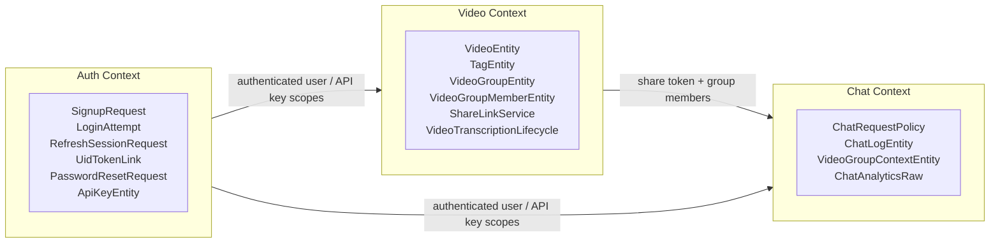
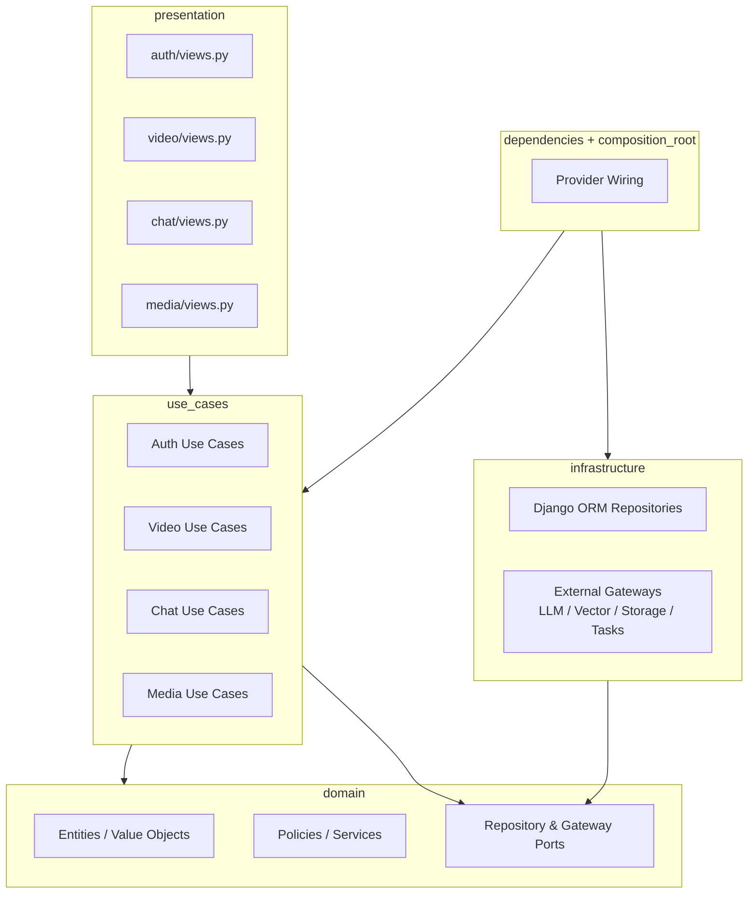
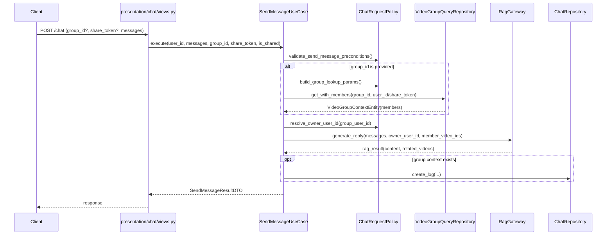

# Domain Model Map

## Overview

This document provides a single-view domain map for VideoQ across:

- Bounded contexts (`Auth`, `Video`, `Chat`)
- Clean Architecture dependency direction
- Core interaction path between `Video group` and Chat RAG flows

## 1. Context Map (DDD)

## 2. Layer and Dependency Map (Clean Architecture)

## 3. `Video group` and Chat RAG Interaction

## 4. Aggregate and Invariant Focus

### 4.1 `VideoGroupEntity` (Video aggregate root)

- Owns membership consistency inside a video group
- Owns reorder consistency (ID set and count must match existing members)
- Owns share-link state consistency (`activate` / `deactivate`)

### 4.2 `ChatRequestPolicy` (Chat policy)

- Validates chat execution preconditions
- Resolves effective owner user in shared and authenticated flows
- Builds group-lookup parameters without leaking transport concerns

### 4.3 `VideoTranscriptionLifecycle` (Video lifecycle policy)

Canonical states:

- `pending`
- `processing`
- `indexing`
- `completed`
- `error`

Transition source of truth: `app/domain/video/status.py`.

## 5. Boundary Notes

- `Video group` is a Video-context concept; Chat consumes it as `VideoGroupContextEntity` for retrieval scope only.
- `share token` is cross-context input, but ownership and mutation live in Video context.
- `messages` are external/use-case inputs and are mapped to domain DTOs before gateway calls.
- Infrastructure implements ports only; domain and use cases must not import infrastructure directly.
