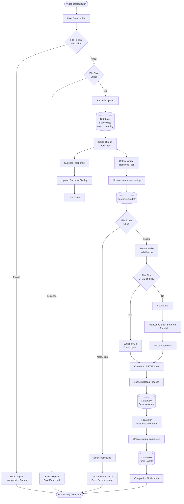
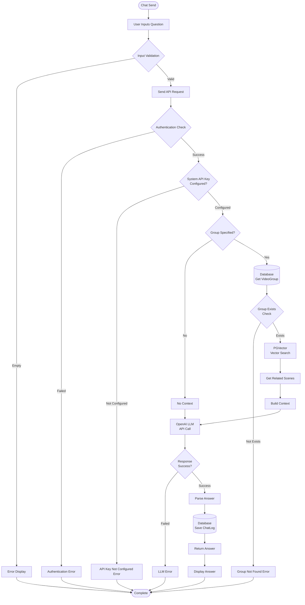
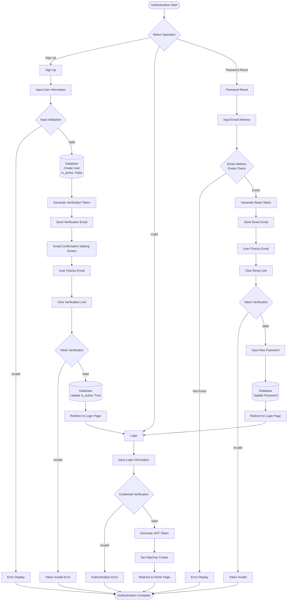
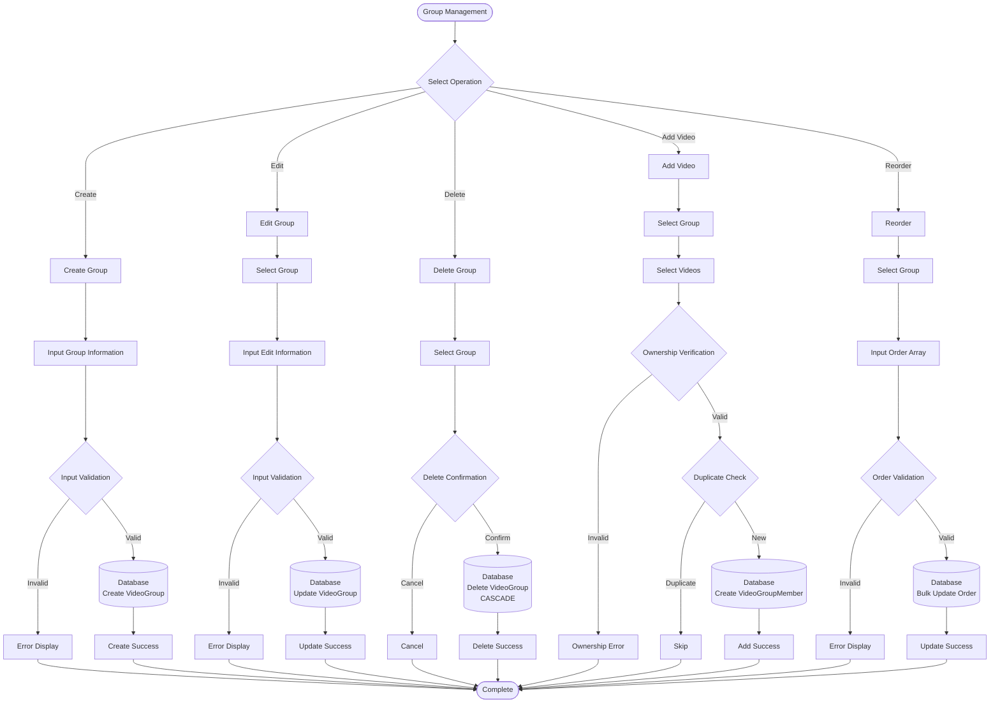
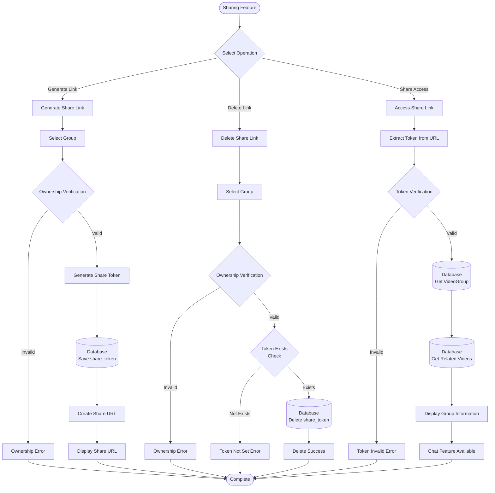
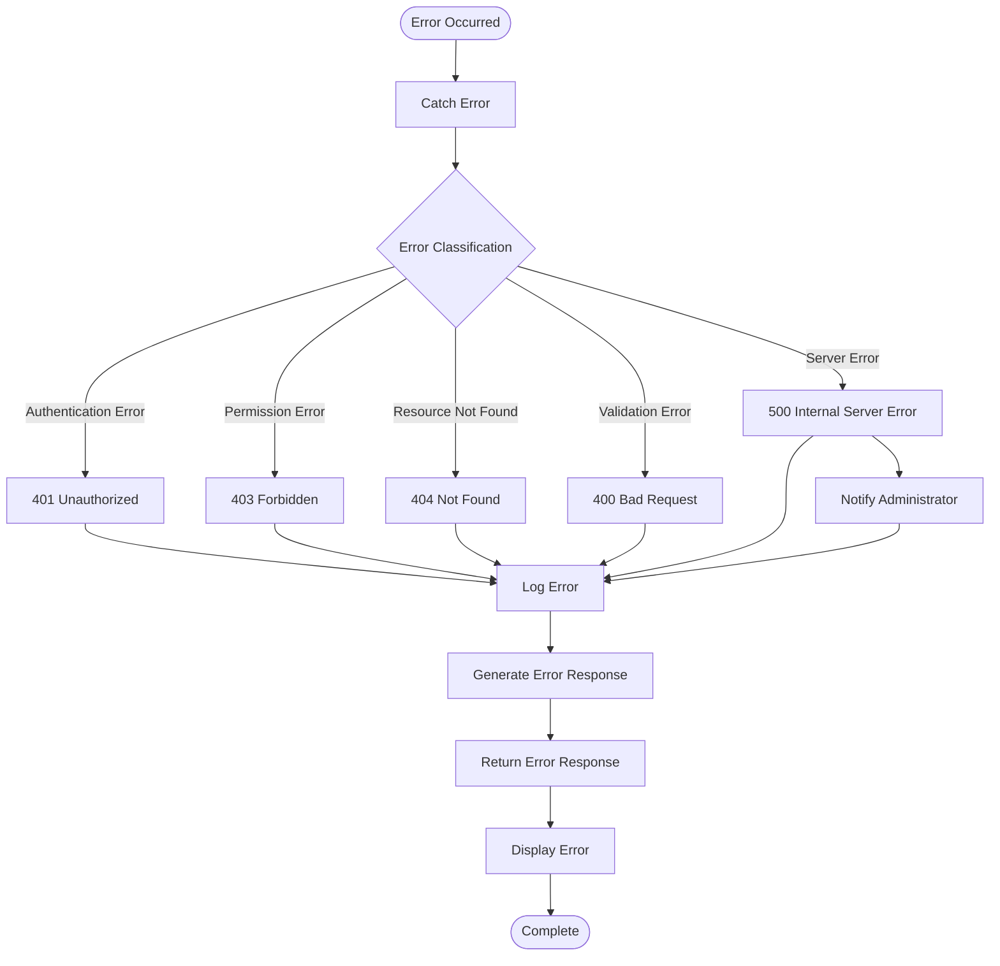

# Flowchart

## Overview

This flowchart represents the main processing flows of the Ask Video system.

## 1. Video Upload Processing Flow

## 2. Chat Processing Flow (RAG)

## 3. User Authentication Flow

## 4. Group Management Flow

## 5. Sharing Feature Flow

## 6. Error Handling Flow

