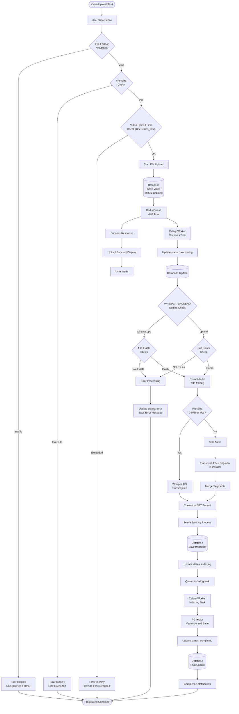
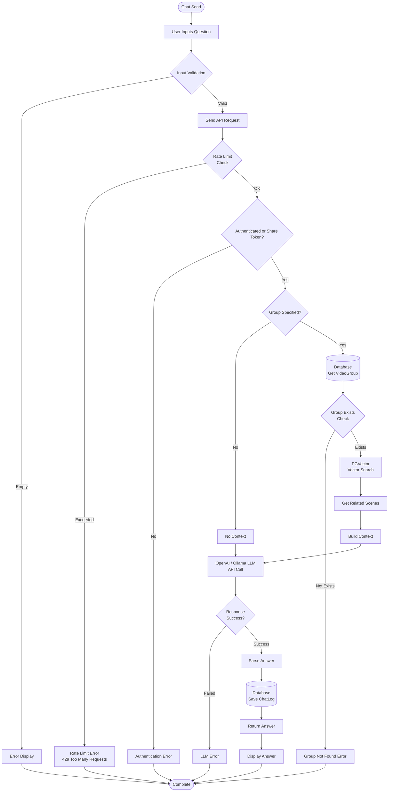
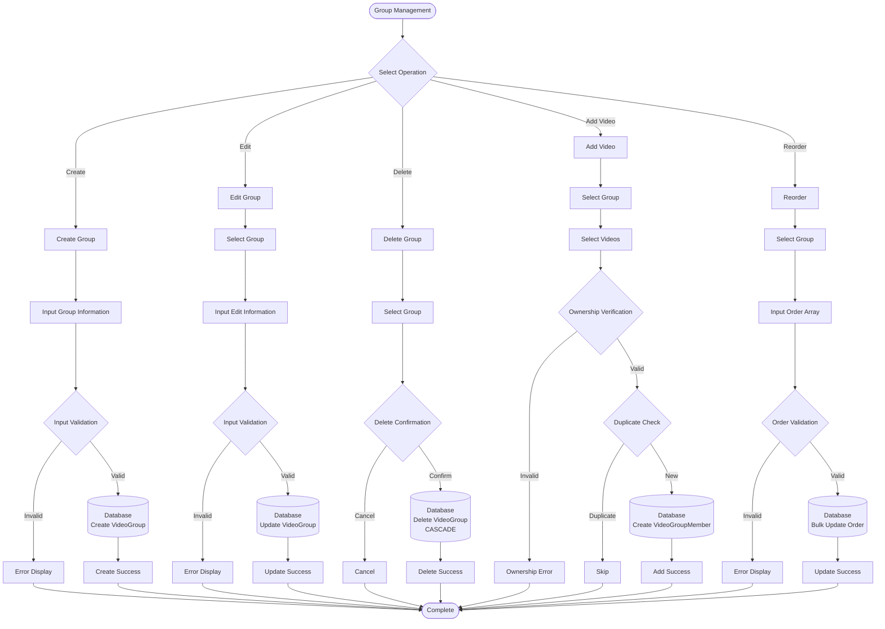
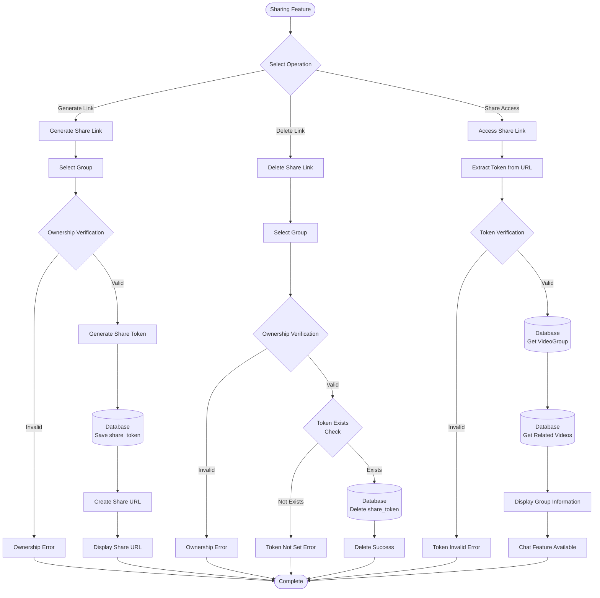
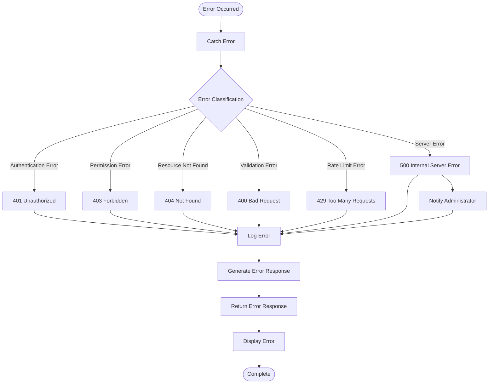
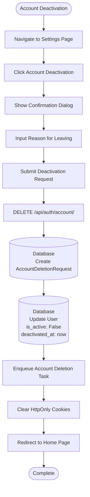
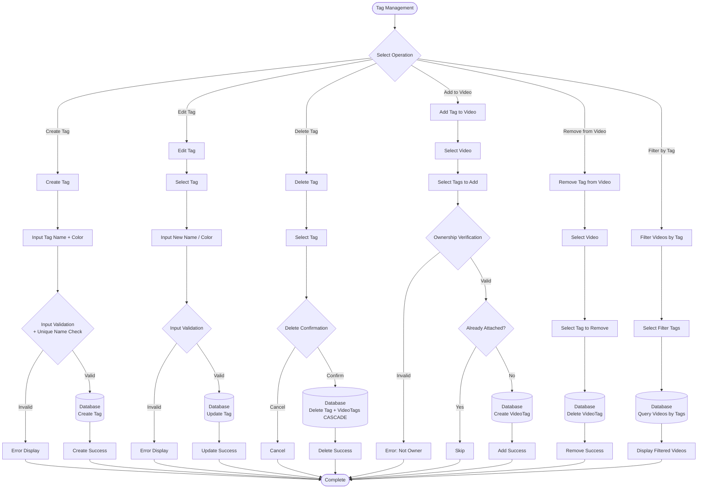
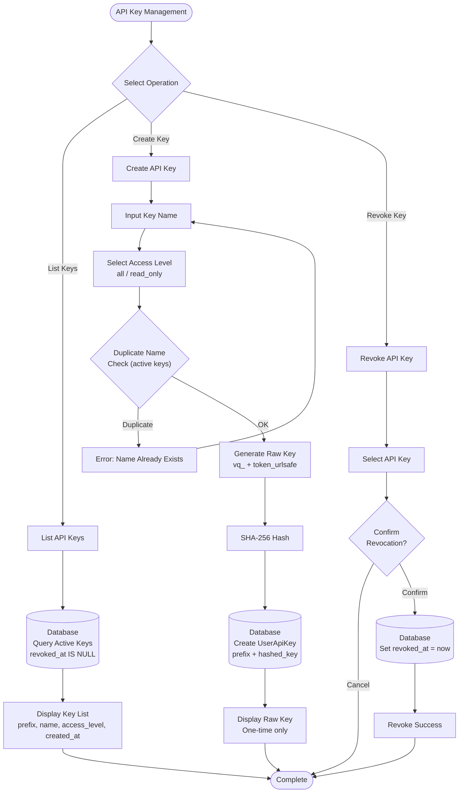
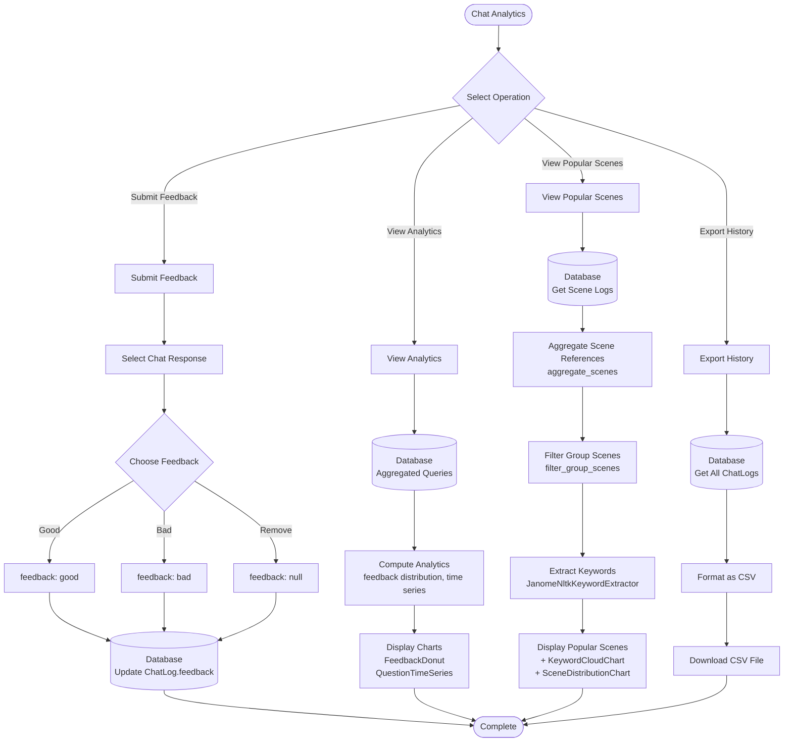

# フローチャート

## 概要

VideoQシステムの主要な処理フローを示す図です。

## 1. 動画アップロード処理フロー

```mermaid
flowchart TD
    Start([Video Upload Start]) --> Input[User Selects File]
    Input --> Validate1{"File Format<br>Validation"}
    Validate1 -->|Invalid| Error1[Error Display<br/>Unsupported Format]
    Validate1 -->|Valid| Validate2{"File Size<br>Check"}
    Validate2 -->|Exceeds| Error2[Error Display<br/>Size Exceeded]
    Validate2 -->|OK| Validate3{"Video Upload Limit<br>Check (User.video_limit)"}
    Validate3 -->|Exceeded| Error4[Error Display<br/>Upload Limit Reached]
    Validate3 -->|OK| Upload[Start File Upload]
    Upload --> SaveDB[(Database<br/>Save Video<br/>status: pending)]
    SaveDB --> Queue[Redis Queue<br/>Add Task]
    Queue --> Response[Success Response]
    Response --> Display[Upload Success Display]
    Display --> Wait[User Waits]
    
    Queue --> Worker[Celery Worker<br/>Receives Task]
    Worker --> UpdateStatus[Update status: processing]
    UpdateStatus --> SaveDB2[(Database Update)]
    SaveDB2 --> CheckBackend{"WHISPER_BACKEND<br>Setting Check"}
    CheckBackend -->|whisper.cpp| CheckFile2{"File Exists<br>Check"}
    CheckBackend -->|openai| CheckFile{"File Exists<br>Check"}
    CheckFile -->|Not Exists| Error3[Error Processing]
    CheckFile -->|Exists| Extract[Extract Audio<br/>with ffmpeg]
    CheckFile2 -->|Not Exists| Error3
    CheckFile2 -->|Exists| Extract
    Extract --> CheckSize{"File Size<br>24MB or less?"}
    CheckSize -->|Yes| Transcribe1[Whisper API<br/>Transcription]
    CheckSize -->|No| Split[Split Audio]
    Split --> Transcribe2[Transcribe Each Segment<br/>in Parallel]
    Transcribe2 --> Merge[Merge Segments]
    Merge --> CreateSRT[Convert to SRT Format]
    Transcribe1 --> CreateSRT
    CreateSRT --> SceneSplit[Scene Splitting Process]
    SceneSplit --> SaveTranscript[(Database<br/>Save transcript)]
    SaveTranscript --> UpdateIndexing[Update status: indexing]
    UpdateIndexing --> QueueIndexing[Queue indexing task]
    QueueIndexing --> IndexWorker[Celery Worker<br/>Indexing Task]
    IndexWorker --> Vectorize[PGVector<br/>Vectorize and Save]
    Vectorize --> UpdateComplete[Update status: completed]
    UpdateComplete --> SaveDB3[(Database<br/>Final Update)]
    SaveDB3 --> Notify[Completion Notification]
    Notify --> End([Processing Complete])
    
    Error1 --> End
    Error2 --> End
    Error4 --> End
    Error3 --> ErrorHandle[Update status: error<br/>Save Error Message]
    ErrorHandle --> End
```

## 2. チャット処理フロー（RAG）

```mermaid
flowchart TD
    Start([Chat Send]) --> Input[User Inputs Question]
    Input --> Validate1{Input Validation}
    Validate1 -->|Empty| Error1[Error Display]
    Validate1 -->|Valid| Send[Send API Request]
    Send --> RateLimit{"Rate Limit<br>Check"}
    RateLimit -->|Exceeded| Error6[Rate Limit Error<br/>429 Too Many Requests]
    RateLimit -->|OK| Auth{Authenticated or Share Token?}
    Auth -->|No| Error2[Authentication Error]
    Auth -->|Yes| CheckGroup{Group Specified?}
    CheckGroup -->|No| NoContext[No Context]
    CheckGroup -->|Yes| GetGroup[(Database<br/>Get VideoGroup)]
    GetGroup --> ValidateGroup{"Group Exists<br>Check"}
    ValidateGroup -->|Not Exists| Error4[Group Not Found Error]
    ValidateGroup -->|Exists| VectorSearch[PGVector<br/>Vector Search]
    VectorSearch --> GetScenes[Get Related Scenes]
    GetScenes --> BuildContext[Build Context]
    BuildContext --> CallLLM[OpenAI / Ollama LLM<br/>API Call]
    NoContext --> CallLLM
    CallLLM --> CheckResponse{"Response<br>Success?"}
    CheckResponse -->|Failed| Error5[LLM Error]
    CheckResponse -->|Success| ParseAnswer[Parse Answer]
    ParseAnswer --> SaveLog[(Database<br/>Save ChatLog)]
    SaveLog --> ReturnAnswer[Return Answer]
    ReturnAnswer --> Display[Display Answer]
    Display --> End([Complete])
    
    Error1 --> End
    Error2 --> End
    Error4 --> End
    Error5 --> End
    Error6 --> End
```

## 3. ユーザー認証フロー

```mermaid
flowchart TD
    Start([Authentication Start]) --> Select{Select Operation}
    Select -->|Sign Up| Signup[Sign Up]
    Select -->|Login| Login[Login]
    Select -->|Password Reset| Reset[Password Reset]
    
    Signup --> InputSignup[Input User Information]
    InputSignup --> ValidateSignup{Input Validation}
    ValidateSignup -->|Invalid| ErrorSignup[Error Display]
    ValidateSignup -->|Valid| RateLimitSignup{"Rate Limit<br>Check"}
    RateLimitSignup -->|Exceeded| ErrorRateLimit[Rate Limit Error<br/>429 Too Many Requests]
    RateLimitSignup -->|OK| CreateUser[(Database<br/>Create User<br/>is_active: False)]
    CreateUser --> GenerateToken[Generate Verification Token]
    GenerateToken --> SendEmail[Send Verification Email]
    SendEmail --> ShowMessage[Email Confirmation Waiting Screen]
    ShowMessage --> WaitEmail[User Checks Email]
    WaitEmail --> ClickLink[Click Verification Link]
    ClickLink --> VerifyToken{Token Verification}
    VerifyToken -->|Invalid| ErrorToken[Token Invalid Error]
    VerifyToken -->|Valid| ActivateUser[(Database<br/>Update is_active: True)]
    ActivateUser --> RedirectLogin[Redirect to Login Page]
    RedirectLogin --> Login
    
    Login --> InputLogin[Input Login Information]
    InputLogin --> RateLimitLogin{"Rate Limit<br>Check"}
    RateLimitLogin -->|Exceeded| ErrorRateLimit[Rate Limit Error<br/>429 Too Many Requests]
    RateLimitLogin -->|OK| ValidateLogin{Credential Verification}
    ValidateLogin -->|Invalid| ErrorLogin[Authentication Error]
    ValidateLogin -->|Valid| GenerateJWT[Generate JWT Tokens<br/>Access & Refresh]
    GenerateJWT --> SetCookie[Set HttpOnly Cookies<br/>Access & Refresh Tokens]
    SetCookie --> RedirectHome[Redirect to Home Page]
    RedirectHome --> End([Authentication Complete])
    
    Reset --> InputEmail[Input Email Address]
    InputEmail --> RateLimitReset{"Rate Limit<br>Check"}
    RateLimitReset -->|Exceeded| ErrorRateLimit[Rate Limit Error<br/>429 Too Many Requests]
    RateLimitReset -->|OK| ReceiveResetRequest[Receive Password Reset Request]
    ReceiveResetRequest --> TryGenerateResetToken[Generate Reset Token<br/>(only if account exists)]
    TryGenerateResetToken --> SendResetEmail[Send Reset Email<br/>(if applicable)]
    SendResetEmail --> ShowResetMessage[Always return success message]
    ShowResetMessage --> WaitReset[User Checks Email]
    WaitReset --> ClickResetLink[Click Reset Link]
    ClickResetLink --> VerifyResetToken{Token Verification}
    VerifyResetToken -->|Invalid| ErrorResetToken[Token Invalid]
    VerifyResetToken -->|Valid| InputNewPassword[Input New Password]
    InputNewPassword --> UpdatePassword[(Database<br/>Update Password)]
    UpdatePassword --> RedirectLogin2[Redirect to Login Page]
    RedirectLogin2 --> Login
    
    ErrorSignup --> End
    ErrorToken --> End
    ErrorLogin --> End
    ErrorResetToken --> End
    ErrorRateLimit --> End
```

## 4. グループ管理フロー

```mermaid
flowchart TD
    Start([Group Management]) --> Action{Select Operation}
    Action -->|Create| Create[Create Group]
    Action -->|Edit| Edit[Edit Group]
    Action -->|Delete| Delete[Delete Group]
    Action -->|Add Video| AddVideo[Add Video]
    Action -->|Reorder| Reorder[Reorder]
    
    Create --> InputCreate[Input Group Information]
    InputCreate --> ValidateCreate{Input Validation}
    ValidateCreate -->|Invalid| ErrorCreate[Error Display]
    ValidateCreate -->|Valid| SaveGroup[(Database<br/>Create VideoGroup)]
    SaveGroup --> SuccessCreate[Create Success]
    SuccessCreate --> End([Complete])
    
    Edit --> SelectGroup[Select Group]
    SelectGroup --> InputEdit[Input Edit Information]
    InputEdit --> ValidateEdit{Input Validation}
    ValidateEdit -->|Invalid| ErrorEdit[Error Display]
    ValidateEdit -->|Valid| UpdateGroup[(Database<br/>Update VideoGroup)]
    UpdateGroup --> SuccessEdit[Update Success]
    SuccessEdit --> End
    
    Delete --> SelectGroup2[Select Group]
    SelectGroup2 --> Confirm{Delete Confirmation}
    Confirm -->|Cancel| Cancel[Cancel]
    Confirm -->|Confirm| DeleteGroup[(Database<br/>Delete VideoGroup<br/>CASCADE)]
    DeleteGroup --> SuccessDelete[Delete Success]
    SuccessDelete --> End
    Cancel --> End
    
    AddVideo --> SelectGroup3[Select Group]
    SelectGroup3 --> SelectVideos[Select Videos]
    SelectVideos --> ValidateOwnership{Ownership Verification}
    ValidateOwnership -->|Invalid| ErrorOwnership[Ownership Error]
    ValidateOwnership -->|Valid| CheckDuplicate{Duplicate Check}
    CheckDuplicate -->|Duplicate| Skip[Skip]
    CheckDuplicate -->|New| CreateMember[(Database<br/>Create VideoGroupMember)]
    CreateMember --> SuccessAdd[Add Success]
    SuccessAdd --> End
    Skip --> End
    ErrorOwnership --> End
    
    Reorder --> SelectGroup4[Select Group]
    SelectGroup4 --> InputOrder[Input Order Array]
    InputOrder --> ValidateOrder{Order Validation}
    ValidateOrder -->|Invalid| ErrorOrder[Error Display]
    ValidateOrder -->|Valid| UpdateOrder[(Database<br/>Bulk Update Order)]
    UpdateOrder --> SuccessReorder[Update Success]
    SuccessReorder --> End
    
    ErrorCreate --> End
    ErrorEdit --> End
    ErrorOrder --> End
```

## 5. 共有機能フロー

```mermaid
flowchart TD
    Start([Sharing Feature]) --> Action{Select Operation}
    Action -->|Generate Link| Generate[Generate Share Link]
    Action -->|Delete Link| Delete[Delete Share Link]
    Action -->|Share Access| Access[Access Share Link]
    
    Generate --> SelectGroup[Select Group]
    SelectGroup --> ValidateOwner{Ownership Verification}
    ValidateOwner -->|Invalid| ErrorOwner[Ownership Error]
    ValidateOwner -->|Valid| GenerateToken[Generate Share Token]
    GenerateToken --> SaveToken[(Database<br/>Save share_token)]
    SaveToken --> CreateURL[Create Share URL]
    CreateURL --> DisplayURL[Display Share URL]
    DisplayURL --> End([Complete])
    
    Delete --> SelectGroup2[Select Group]
    SelectGroup2 --> ValidateOwner2{Ownership Verification}
    ValidateOwner2 -->|Invalid| ErrorOwner2[Ownership Error]
    ValidateOwner2 -->|Valid| CheckToken{"Token Exists<br>Check"}
    CheckToken -->|Not Exists| ErrorNoToken[Token Not Set Error]
    CheckToken -->|Exists| DeleteToken[(Database<br/>Delete share_token)]
    DeleteToken --> SuccessDelete[Delete Success]
    SuccessDelete --> End
    
    Access --> ExtractToken[Extract Token from URL]
    ExtractToken --> ValidateToken{Token Verification}
    ValidateToken -->|Invalid| ErrorToken[Token Invalid Error]
    ValidateToken -->|Valid| GetGroup[(Database<br/>Get VideoGroup)]
    GetGroup --> GetVideos[(Database<br/>Get Related Videos)]
    GetVideos --> DisplayGroup[Display Group Information]
    DisplayGroup --> AllowChat[Chat Feature Available]
    AllowChat --> End
    
    ErrorOwner --> End
    ErrorOwner2 --> End
    ErrorNoToken --> End
    ErrorToken --> End
```

## 6. エラーハンドリングフロー

```mermaid
flowchart TD
    Start([Error Occurred]) --> Catch[Catch Error]
    Catch --> Classify{Error Classification}
    
    Classify -->|Authentication Error| AuthError[401 Unauthorized]
    Classify -->|Permission Error| PermissionError[403 Forbidden]
    Classify -->|Resource Not Found| NotFoundError[404 Not Found]
    Classify -->|Validation Error| ValidationError[400 Bad Request]
    Classify -->|Rate Limit Error| RateLimitError[429 Too Many Requests]
    Classify -->|Server Error| ServerError[500 Internal Server Error]
    
    AuthError --> LogError[Log Error]
    PermissionError --> LogError
    NotFoundError --> LogError
    ValidationError --> LogError
    RateLimitError --> LogError
    ServerError --> LogError
    
    LogError --> CreateResponse[Generate Error Response]
    CreateResponse --> ReturnError[Return Error Response]
    ReturnError --> DisplayError[Display Error]
    DisplayError --> End([Complete])
    
    ServerError --> NotifyAdmin[Notify Administrator]
    NotifyAdmin --> LogError
```

## 7. アカウント無効化処理フロー

```mermaid
flowchart TD
    Start([Account Deactivation]) --> Navigate[Navigate to Settings Page]
    Navigate --> ClickDelete[Click Account Deactivation]
    ClickDelete --> ShowDialog[Show Confirmation Dialog]
    ShowDialog --> InputReason[Input Reason for Leaving]
    InputReason --> Submit[Submit Deactivation Request]
    Submit --> API[DELETE /api/auth/account/]
    API --> CreateRequest[(Database<br/>Create AccountDeletionRequest)]
    CreateRequest --> DeactivateUser[(Database<br/>Update User<br/>is_active: False<br/>deactivated_at: now)]
    DeactivateUser --> EnqueueTask[Enqueue Account Deletion Task]
    EnqueueTask --> ClearCookies[Clear HttpOnly Cookies]
    ClearCookies --> Redirect[Redirect to Home Page]
    Redirect --> End([Complete])
```

## 8. タグ管理フロー

```mermaid
flowchart TD
    Start([Tag Management]) --> Action{Select Operation}
    Action -->|Create Tag| CreateTag[Create Tag]
    Action -->|Edit Tag| EditTag[Edit Tag]
    Action -->|Delete Tag| DeleteTag[Delete Tag]
    Action -->|Add to Video| AddToVideo[Add Tag to Video]
    Action -->|Remove from Video| RemoveFromVideo[Remove Tag from Video]
    Action -->|Filter by Tag| FilterByTag[Filter Videos by Tag]

    CreateTag --> InputTag[Input Tag Name + Color]
    InputTag --> ValidateTag{"Input Validation<br>+ Unique Name Check"}
    ValidateTag -->|Invalid| ErrorTag[Error Display]
    ValidateTag -->|Valid| SaveTag[(Database<br/>Create Tag)]
    SaveTag --> SuccessCreate[Create Success]
    SuccessCreate --> End([Complete])

    EditTag --> SelectTag[Select Tag]
    SelectTag --> InputEdit[Input New Name / Color]
    InputEdit --> ValidateEdit{Input Validation}
    ValidateEdit -->|Invalid| ErrorEdit[Error Display]
    ValidateEdit -->|Valid| UpdateTag[(Database<br/>Update Tag)]
    UpdateTag --> SuccessEdit[Update Success]
    SuccessEdit --> End

    DeleteTag --> SelectTag2[Select Tag]
    SelectTag2 --> ConfirmDelete{Delete Confirmation}
    ConfirmDelete -->|Cancel| Cancel[Cancel]
    ConfirmDelete -->|Confirm| ExecuteDelete[(Database<br/>Delete Tag + VideoTags CASCADE)]
    ExecuteDelete --> SuccessDelete[Delete Success]
    SuccessDelete --> End
    Cancel --> End

    AddToVideo --> SelectVideo[Select Video]
    SelectVideo --> SelectTags[Select Tags to Add]
    SelectTags --> ValidateOwnership{Ownership Verification}
    ValidateOwnership -->|Invalid| ErrorOwnership[Error: Not Owner]
    ValidateOwnership -->|Valid| CheckDup{Already Attached?}
    CheckDup -->|Yes| SkipTag[Skip]
    CheckDup -->|No| CreateVideoTag[(Database<br/>Create VideoTag)]
    CreateVideoTag --> SuccessAdd[Add Success]
    SuccessAdd --> End
    SkipTag --> End
    ErrorOwnership --> End

    RemoveFromVideo --> SelectVideo2[Select Video]
    SelectVideo2 --> SelectTagRemove[Select Tag to Remove]
    SelectTagRemove --> DeleteVideoTag[(Database<br/>Delete VideoTag)]
    DeleteVideoTag --> SuccessRemove[Remove Success]
    SuccessRemove --> End

    FilterByTag --> SelectFilterTags[Select Filter Tags]
    SelectFilterTags --> QueryVideos[(Database<br/>Query Videos by Tags)]
    QueryVideos --> DisplayFiltered[Display Filtered Videos]
    DisplayFiltered --> End

    ErrorTag --> End
    ErrorEdit --> End
```

## 9. APIキー管理フロー

```mermaid
flowchart TD
    Start([API Key Management]) --> Action{Select Operation}
    Action -->|List Keys| ListKeys[List API Keys]
    Action -->|Create Key| CreateKey[Create API Key]
    Action -->|Revoke Key| RevokeKey[Revoke API Key]

    ListKeys --> FetchKeys[(Database<br/>Query Active Keys<br/>revoked_at IS NULL)]
    FetchKeys --> DisplayKeys[Display Key List<br/>prefix, name, access_level, created_at]
    DisplayKeys --> End([Complete])

    CreateKey --> InputName[Input Key Name]
    InputName --> SelectAccess[Select Access Level<br/>all / read_only]
    SelectAccess --> ValidateName{"Duplicate Name<br>Check (active keys)"}
    ValidateName -->|Duplicate| ErrorDup[Error: Name Already Exists]
    ValidateName -->|OK| GenerateKey[Generate Raw Key<br/>vq_ + token_urlsafe]
    GenerateKey --> HashKey[SHA-256 Hash]
    HashKey --> SaveKey[(Database<br/>Create UserApiKey<br/>prefix + hashed_key)]
    SaveKey --> ShowRawKey[Display Raw Key<br/>One-time only]
    ShowRawKey --> End

    RevokeKey --> SelectKey[Select API Key]
    SelectKey --> ConfirmRevoke{"Confirm<br>Revocation?"}
    ConfirmRevoke -->|Cancel| End
    ConfirmRevoke -->|Confirm| SetRevoked[(Database<br/>Set revoked_at = now)]
    SetRevoked --> SuccessRevoke[Revoke Success]
    SuccessRevoke --> End

    ErrorDup --> InputName
```

## 10. APIキー認証フロー

```mermaid
flowchart TD
    Start([API Request with X-API-Key]) --> ExtractKey[Extract API Key from Header]
    ExtractKey --> HashKey[SHA-256 Hash Key]
    HashKey --> LookupKey[(Database<br/>Lookup by hashed_key<br/>+ revoked_at IS NULL)]
    LookupKey --> CheckFound{"Key Found?"}
    CheckFound -->|Not Found| Error401[401 Unauthorized]
    CheckFound -->|Found| MarkUsed[Update last_used_at]
    MarkUsed --> CheckAccess{"access_level vs<br>required_scope?"}
    CheckAccess -->|read_only + write<br>(except chat_write)| Error403[403 Forbidden]
    CheckAccess -->|Allowed| ProcessRequest[Process Request as User]
    ProcessRequest --> Response[Success Response]
    Response --> End([Complete])
    
    Error401 --> End
    Error403 --> End
```

## 11. チャット分析・フィードバックフロー

```mermaid
flowchart TD
    Start([Chat Analytics]) --> Action{Select Operation}
    Action -->|Submit Feedback| SubmitFeedback[Submit Feedback]
    Action -->|View Analytics| ViewAnalytics[View Analytics]
    Action -->|View Popular Scenes| ViewScenes[View Popular Scenes]
    Action -->|Export History| ExportHistory[Export History]

    SubmitFeedback --> SelectResponse[Select Chat Response]
    SelectResponse --> ChooseFeedback{Choose Feedback}
    ChooseFeedback -->|Good| SetGood[feedback: good]
    ChooseFeedback -->|Bad| SetBad[feedback: bad]
    ChooseFeedback -->|Remove| ClearFeedback[feedback: null]
    SetGood --> SaveFeedback[(Database<br/>Update ChatLog.feedback)]
    SetBad --> SaveFeedback
    ClearFeedback --> SaveFeedback
    SaveFeedback --> End([Complete])

    ViewAnalytics --> FetchRawData[(Database<br/>Aggregated Queries)]
    FetchRawData --> ComputeMetrics[Compute Analytics<br/>feedback distribution, time series]
    ComputeMetrics --> DisplayCharts[Display Charts<br/>FeedbackDonut<br/>QuestionTimeSeries]
    DisplayCharts --> End

    ViewScenes --> FetchSceneLogs[(Database<br/>Get Scene Logs)]
    FetchSceneLogs --> AggregateScenes[Aggregate Scene References<br/>aggregate_scenes]
    AggregateScenes --> FilterScenes[Filter Group Scenes<br/>filter_group_scenes]
    FilterScenes --> ExtractKeywords[Extract Keywords<br/>JanomeNltkKeywordExtractor]
    ExtractKeywords --> DisplayScenes[Display Popular Scenes<br/>+ KeywordCloudChart<br/>+ SceneDistributionChart]
    DisplayScenes --> End

    ExportHistory --> FetchAllLogs[(Database<br/>Get All ChatLogs)]
    FetchAllLogs --> FormatCSV[Format as CSV]
    FormatCSV --> DownloadCSV[Download CSV File]
    DownloadCSV --> End
```

---

## Related Documentation

- [📖 ドキュメント一覧](../README.md)
- [アクティビティ図](../requirements/activity-diagram.md) — 業務フロー概要
- [BPMN](bpmn.md) — ビジネスプロセスモデル
- [シーケンス図](../design/sequence-diagram.md) — 処理シーケンスの詳細
- [データフロー図](../database/data-flow-diagram.md) — データの流れ
