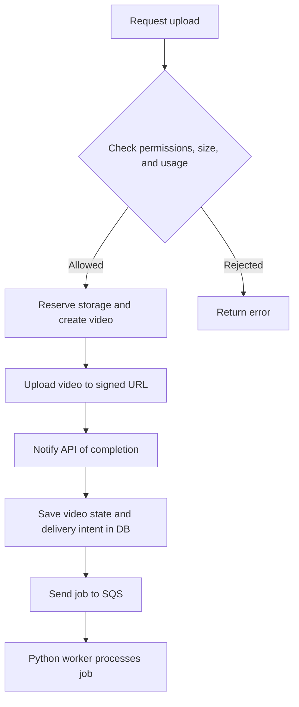
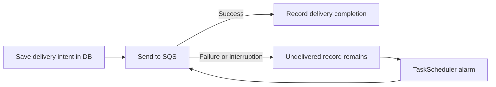

# Job delivery and recovery

Processing a video requires both saving it in the database and delivering work to the worker. Delivery intentions are also recorded in the DB so an API or network interruption does not lose the job.

## From upload to job

```mermaid
flowchart TD
    Request[Request upload] --> Check{Check permissions, size, and usage}
    Check -->|Allowed| Reserve[Reserve storage and create video]
    Check -->|Rejected| Error[Return error]
    Reserve --> Upload[Upload video to signed URL]
    Upload --> Confirm[Notify API of completion]
    Confirm --> Commit[Save video state and delivery intent in DB]
    Commit --> Send[Send job to SQS]
    Send --> Worker[Python worker processes job]
```

A signed URL is a time-limited URL for uploading the target file. The file goes to storage while the API manages permissions and state.

## If delivery fails

`external_tasks` is an **outbox** that stores delivery intentions. Writing it in the same transaction as business data makes it possible to recover when the DB update succeeds but dispatch does not.

```mermaid
flowchart LR
    Saved[Save delivery intent in DB] --> Send[Send to SQS]
    Send -->|Success| Done[Record delivery completion]
    Send -->|Failure or interruption| Pending[Undelivered record remains]
    Pending --> Alarm[TaskScheduler alarm]
    Alarm --> Send
```

Delivery normally happens during API processing. `TASK_SCHEDULER` alarms handle failures and interruptions. Daily maintenance also performs recovery. Successful delivery is distinct from successful worker execution.

## If the worker stops midway

SQS may redeliver the same job. The worker keeps an execution record for each `job_id` in `job_executions`.

- Completed jobs are not processed again.
- Running jobs acquire a time-limited execution lease.
- If processing stops, the job can run again after the lease expires.
- Follow-up job IDs are derived from the parent job so retries do not create distinct jobs.

This mechanism does not automatically make arbitrary external API operations execute exactly once. Each processing step must also define how it behaves on retry.

## Where to look

| Area | Implementation |
|---|---|
| API delivery intentions and dispatch | [external-tasks.ts](https://github.com/yukiharada1228/videoq/blob/main/apps/api/src/lib/external-tasks.ts) |
| Scheduling recovery | [task-scheduler.ts](https://github.com/yukiharada1228/videoq/blob/main/apps/api/src/durable-objects/task-scheduler.ts) |
| Worker leases and duplicate protection | [job_execution.py](https://github.com/yukiharada1228/videoq/blob/main/apps/worker/worker_python/job_execution.py) |
| Dispatching follow-up jobs | [sqs_enqueue.py](https://github.com/yukiharada1228/videoq/blob/main/apps/worker/worker_python/sqs_enqueue.py) |

**Related:** [State transitions](../design/state-diagram.md), [Change asynchronous processing](../guides/worker.md), [Troubleshooting](../guides/troubleshooting.md).
