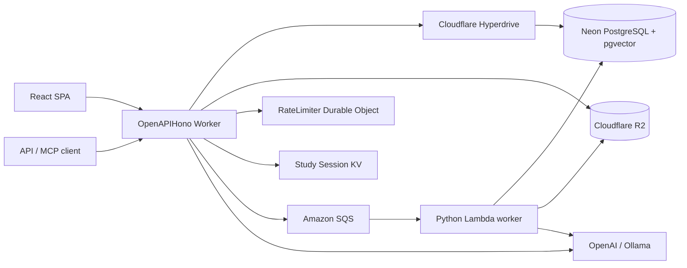

# Hono ネイティブ設計

> ステータス: **Phase 19 native cutover 完了**

## Phase 19 の到達点

VideoQ の Web API は Hono / Cloudflare Workers の単一 runtime です。

- `OpenAPIHono` + Zod を HTTP 契約の正本とする
- feature 単位の `routes → service → repository` 構成
- Drizzle modern schema のみを runtime で参照する
- 認証、OAuth、MCP、管理 API、media 配信を Hono 内で提供する
- 非同期処理は native JSON job を SQS 経由で Python worker へ渡す
- 未定義 path は API の統一 404 とし、別 Web API への委譲経路を持たない

## システム構成



## API レイヤー

```text
features/<domain>/routes.ts
  ├─ createRoute / Zod / middleware
  └─ service.ts
       └─ repositories/*.ts
            └─ Drizzle / parameterized SQL
```

- routes は transport と認証・認可だけを担当
- service はユースケースと外部副作用の順序を担当
- repository は DB query と transaction boundary を担当
- shared は error、pagination、UTC、CSV、OpenAPI 等の横断契約を担当

## API 契約

| 項目 | 標準 |
|---|---|
| 一覧 | `{ data: T[], meta: { total, limit, offset } }` |
| 単体 | `{ data: T }` |
| エラー | `{ error: { code, message, details? } }` |
| 日時 | UTC ISO-8601 |
| URL | trailing slash なし |
| OpenAPI | `/api/openapi.json` |
| API UI | `/api/docs`, `/api/redoc` |
| Job | `{ type, job_id, payload }` |

規格固有の OAuth、OpenAI compatible、SSE、MCP response は各規格の形を優先します。

## 認証と秘密管理

### Session

1. login 成功時に `auth_sessions` row と opaque refresh token を作成
2. access JWT は user id と session id を短期間だけ保持
3. refresh token は DB に SHA-256 hash のみ保存
4. refresh ごとに token を rotation し、前 token を revoke
5. logout は refresh session を revoke

### Action token

メール確認、パスワード再設定、メール変更は `auth_action_tokens` を使います。
token は opaque、purpose と期限を持ち、成功時に一度だけ consume されます。

### User secret

外部 API key は AES-256-GCM の versioned envelope
`v1.<nonce>.<ciphertext+tag>` として保存します。鍵は
`USER_SECRET_ENCRYPTION_KEY` から読み、DB へ保存しません。

### その他

- API key: `vq_...` の SHA-256 hash と access level
- OAuth: Authorization Code + PKCE、DCR、Device Authorization、revoke、introspection
- refresh/logout: HttpOnly refresh cookie + Origin検証
- login / signup / chat: Durable Object による分散 rate limit

## Modern schema

`apps/api/src/db/schema/modern.ts` と Drizzle migration が schema の正本です。

```text
users
├── auth_sessions
├── auth_action_tokens
├── api_keys
├── videos
│   ├── video_course_members
│   ├── video_tags
│   ├── scene_embeddings
│   └── plog_*
├── video_courses
│   └── chat_logs
│       └── chat_log_evaluations
└── oauth_*
```

FK、unique index、check constraint、cascade 方針も Drizzle 定義で管理します。

## 非同期処理

API は SQS へ native job を送信します。

```json
{
  "type": "build_plog",
  "job_id": "2da6f5cb-...",
  "payload": { "video_id": 42 }
}
```

Python worker は type を registry で解決し、文字起こし、索引、PLOG、評価、
アカウント削除を実行します。SQS は at-least-once のため、状態遷移と永続化は
条件付き update、upsert、job id を使って再実行可能にします。

## Phase 19 完了条件

- Hono feature が全 Web endpoint を所有
- runtime query が modern table のみを参照
- session refresh と action token が DB 管理の opaque token
- ユーザー秘密が AES-GCM envelope
- SQS payload が native JSON
- OpenAPI が `createRoute` から生成
- current docs とローカル compose が同じ構成を示す
