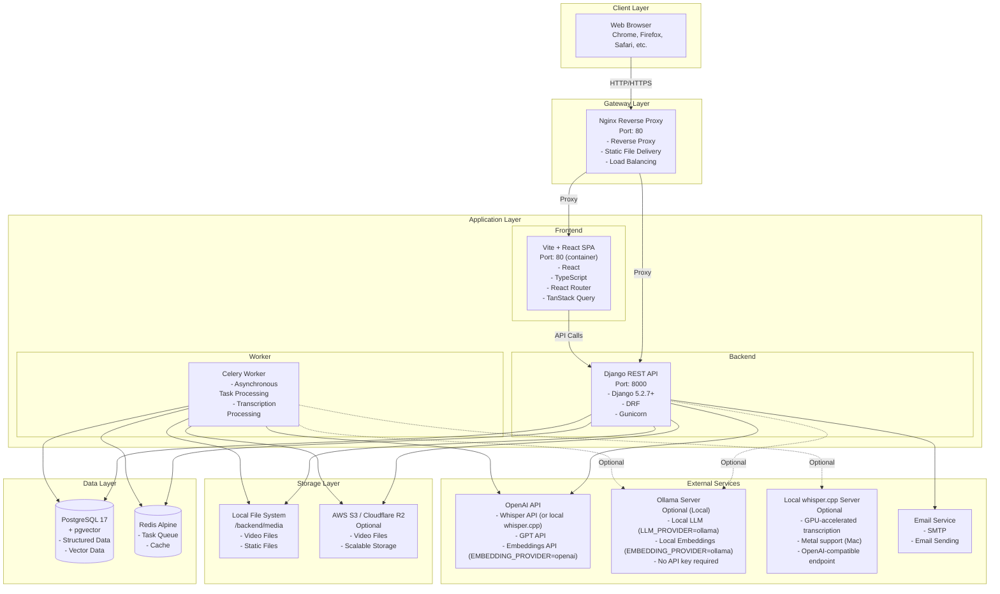
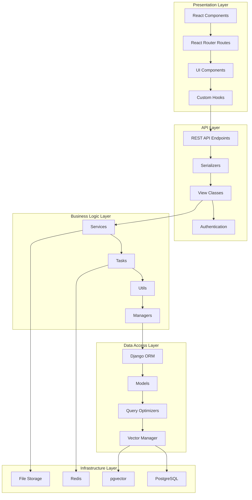
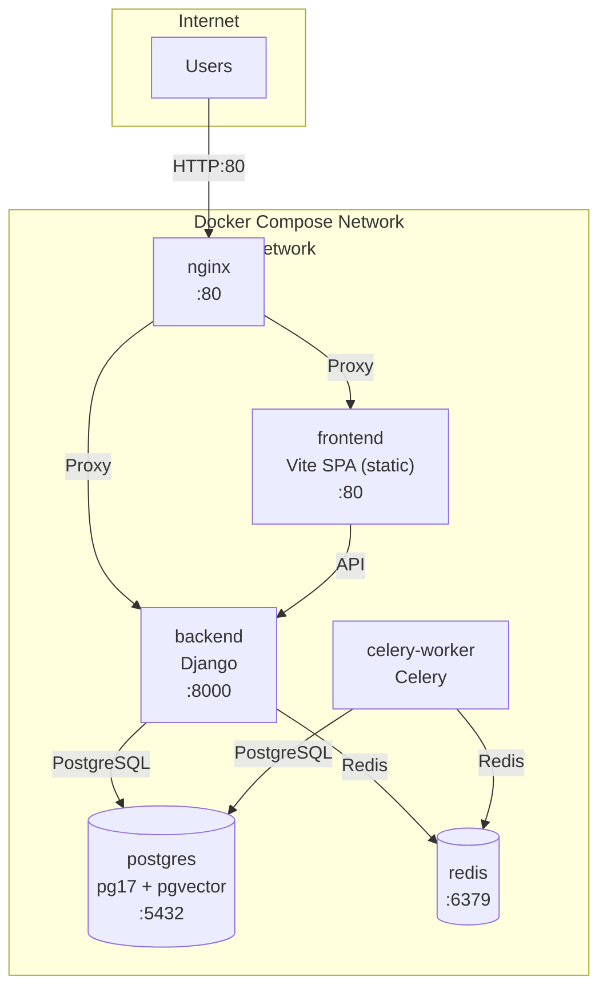
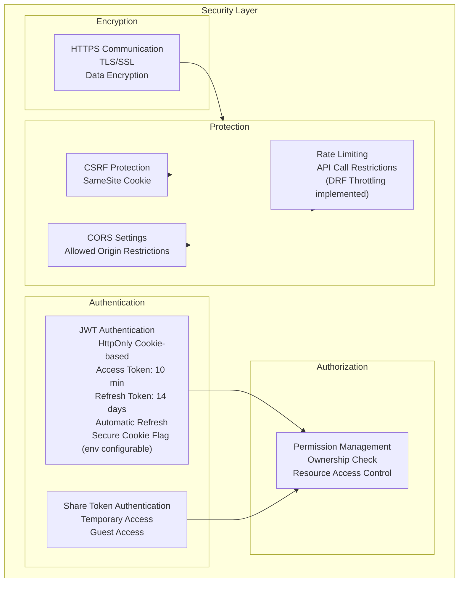
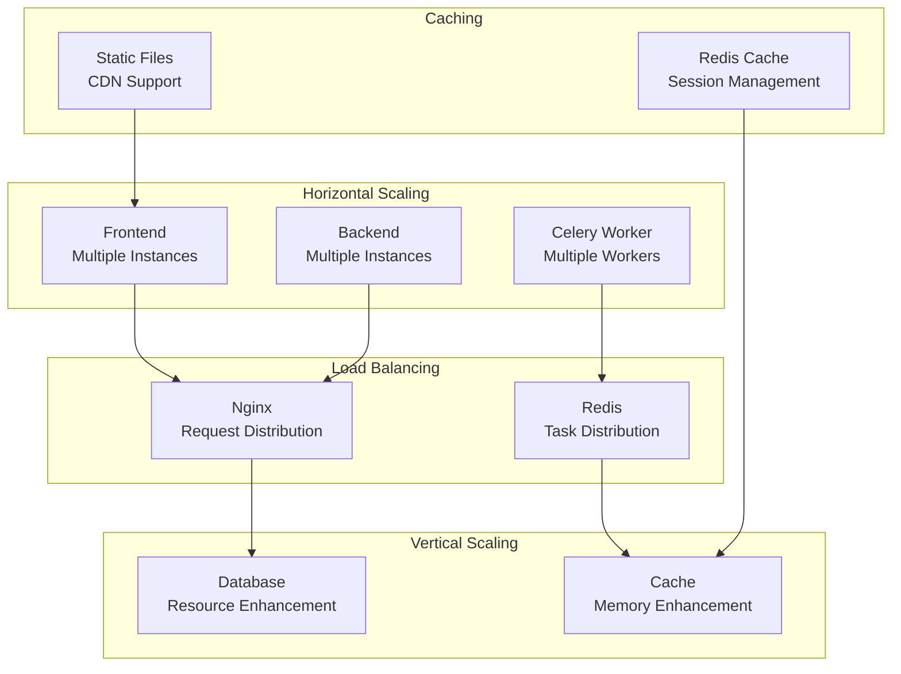
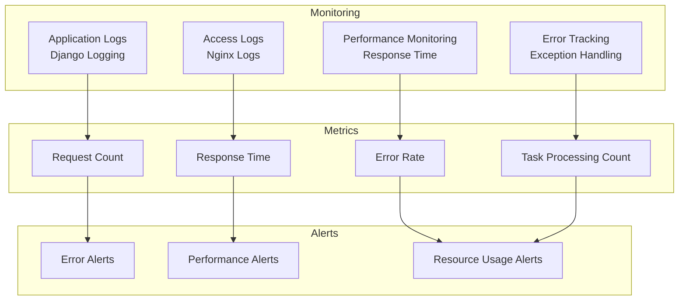
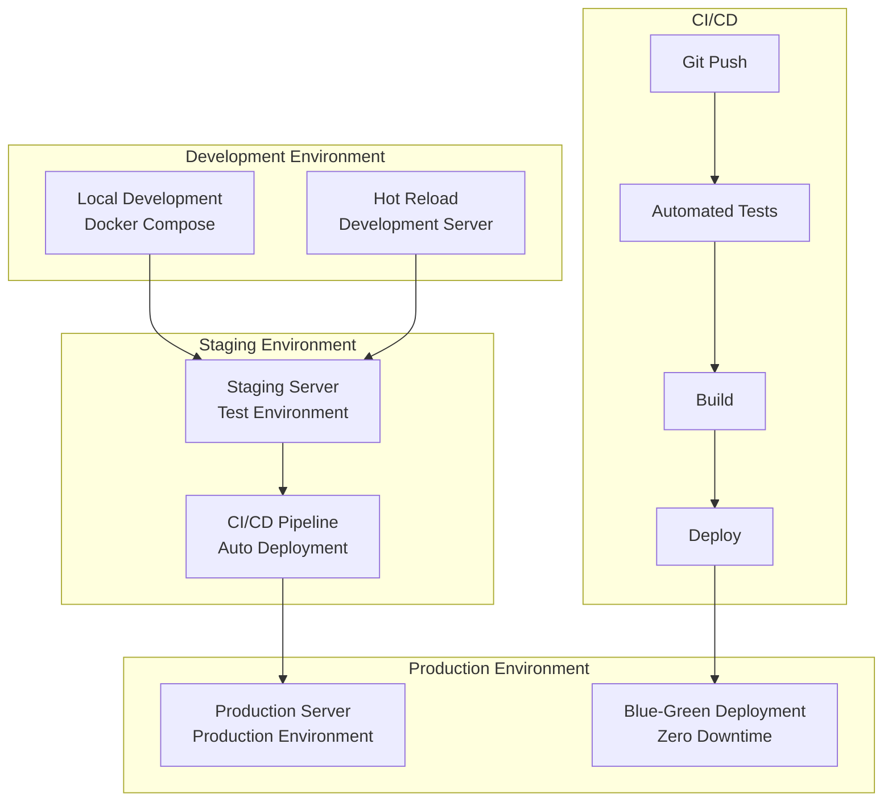

# System Configuration Diagram

## Overview

This diagram shows VideoQ's overall architecture and the default (Docker Compose) configuration.

## Overall System Configuration

## Layer-by-Layer Detailed Configuration

## Network Configuration

> Note: The diagram above matches the default `docker-compose.yml` (single instance per service).
> If you need horizontal scaling (multiple frontend/backend/worker instances, DB replicas, etc.), treat it as a production architecture concern.

## Security Configuration

## Scalability Configuration

## Monitoring & Logging Configuration

## Deployment Configuration

