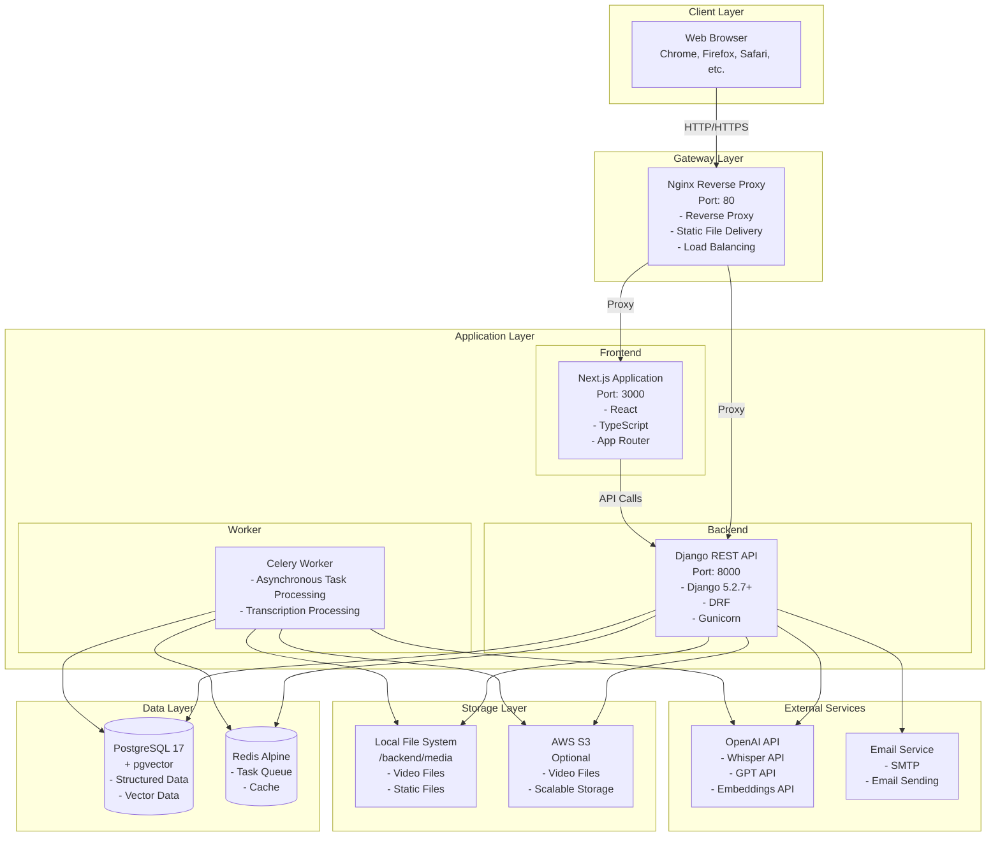
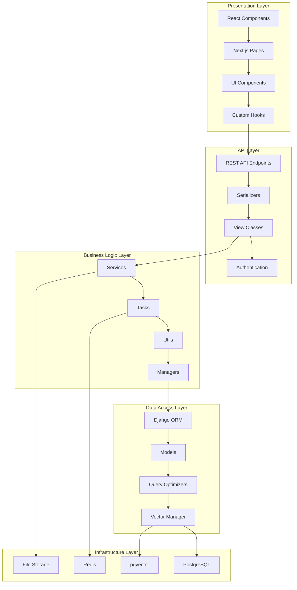
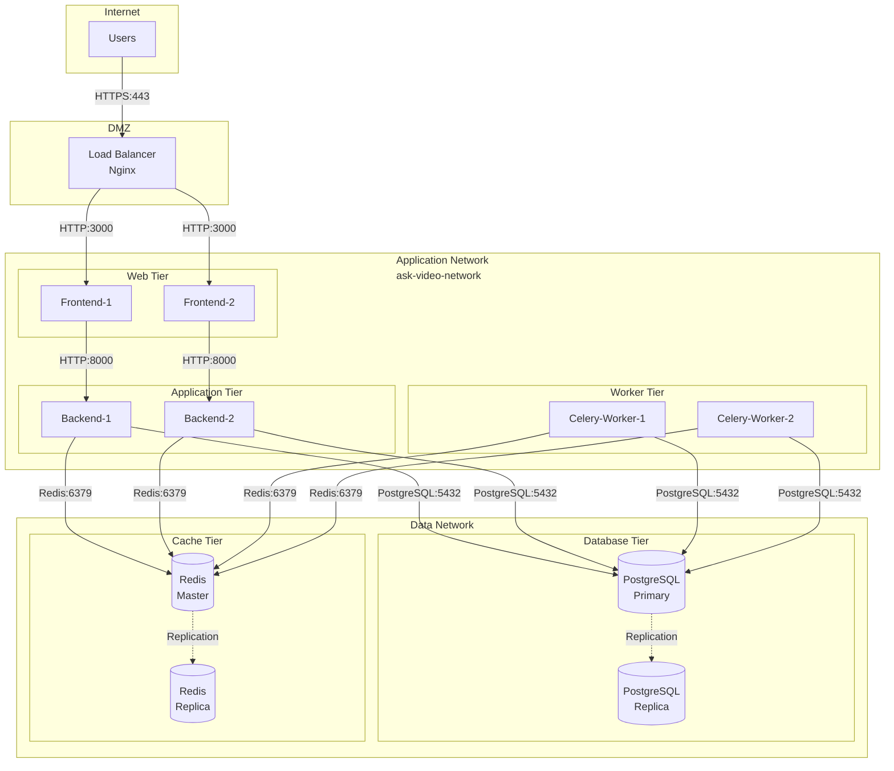
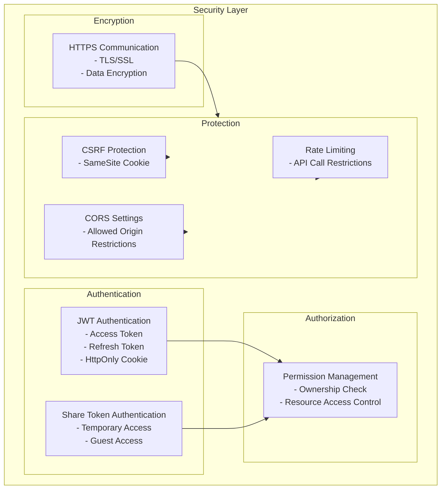
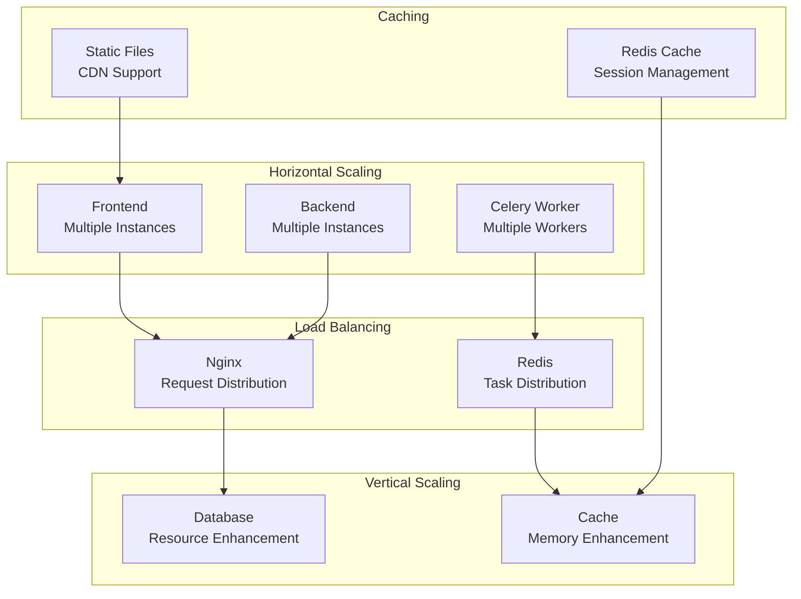
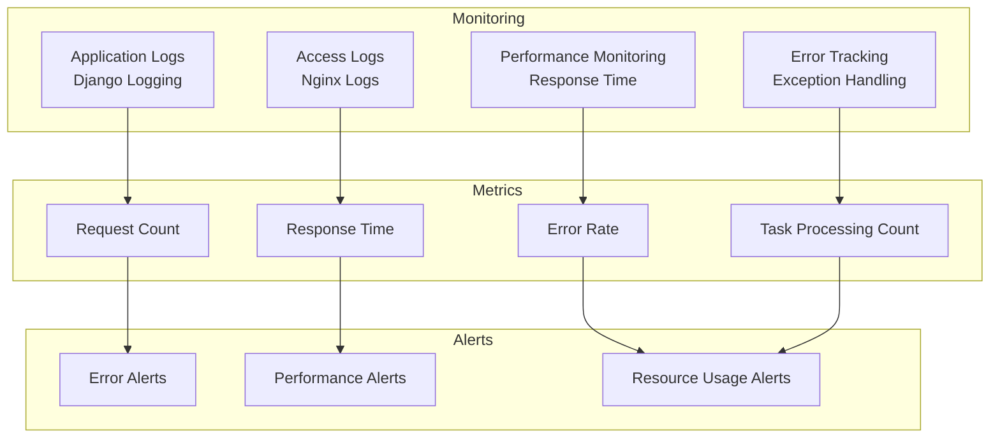
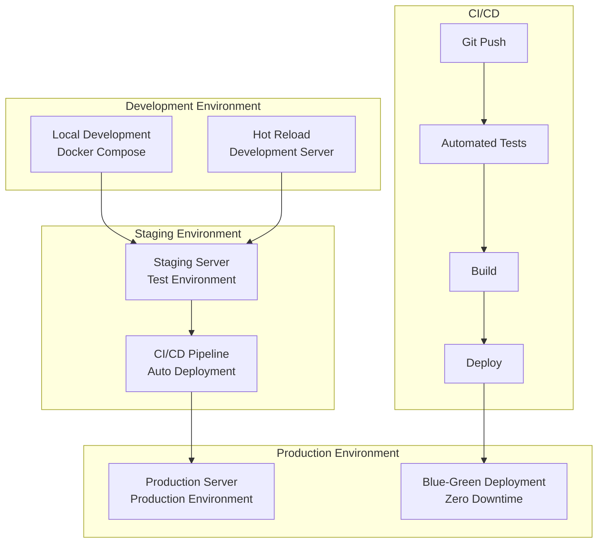

# System Configuration Diagram

## Overview

This diagram represents the overall architecture and system configuration of the Ask Video system.

## Overall System Configuration

## Layer-by-Layer Detailed Configuration

## Network Configuration

## Security Configuration

## Scalability Configuration

## Monitoring & Logging Configuration

## Deployment Configuration

