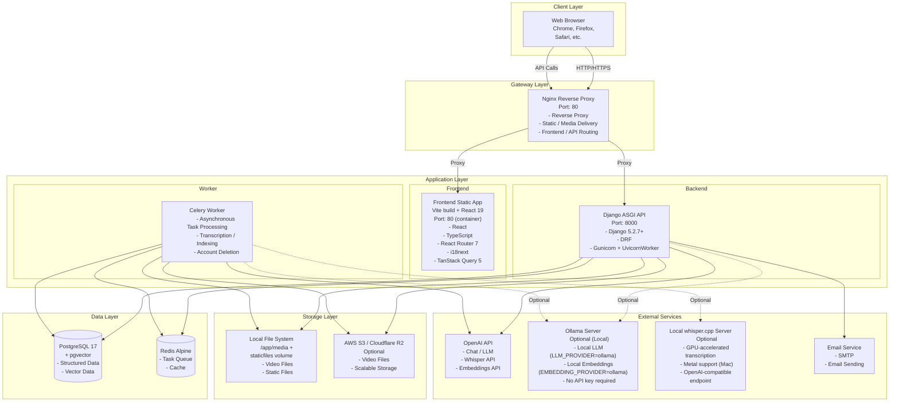
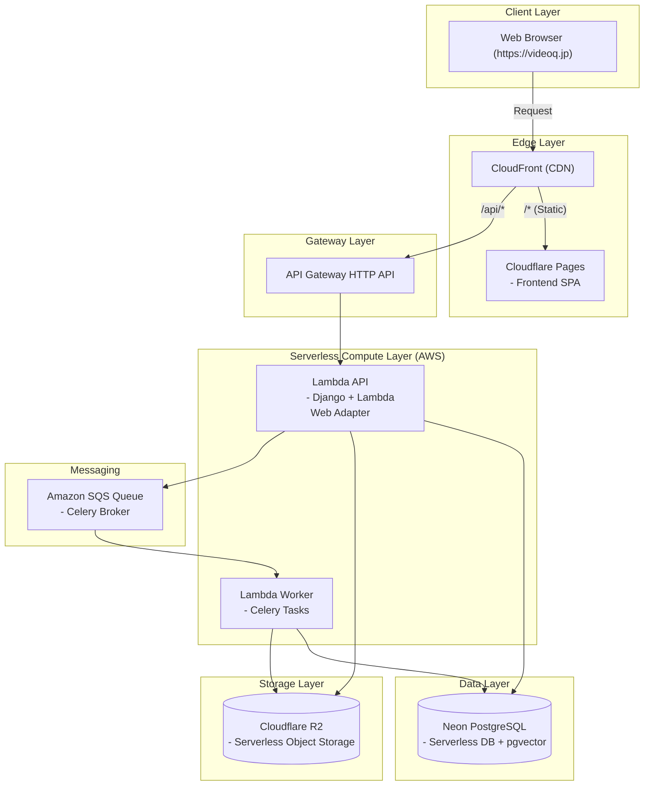
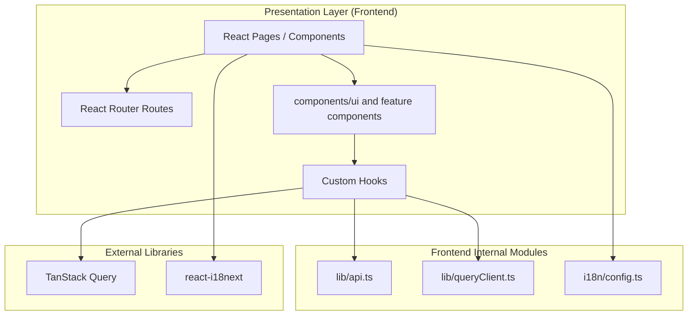
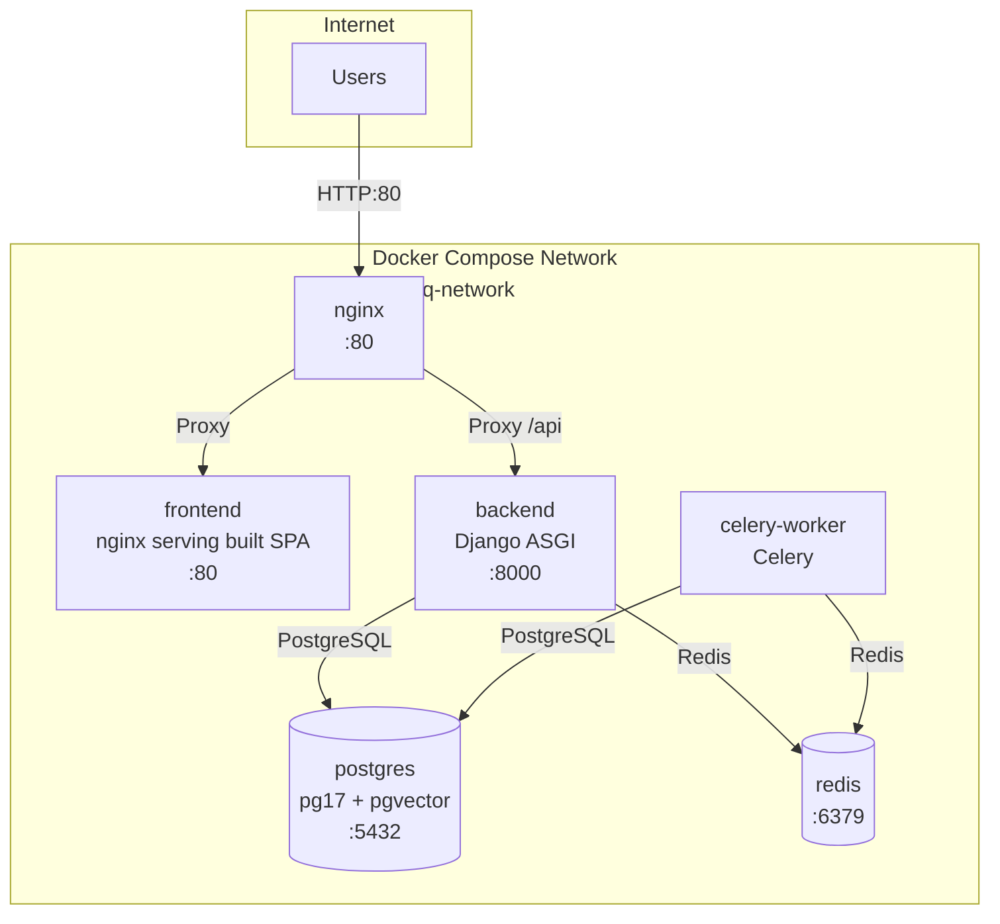
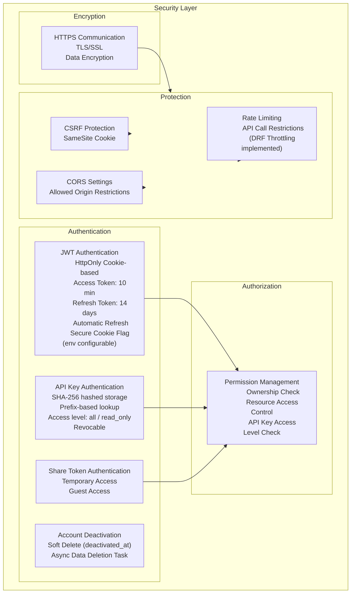
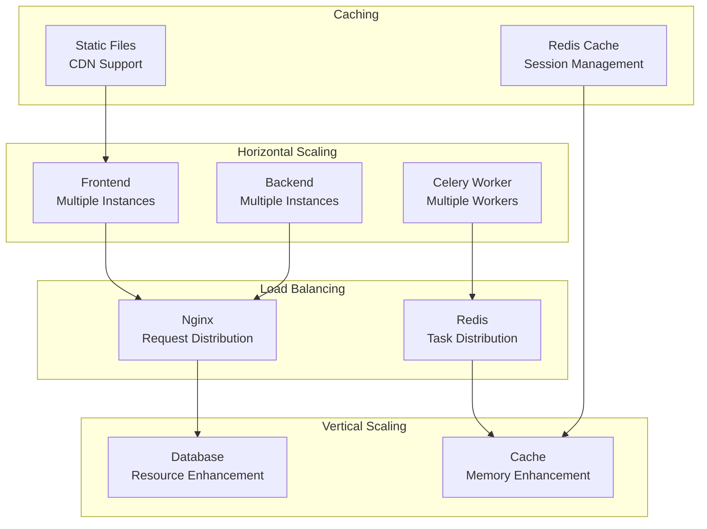
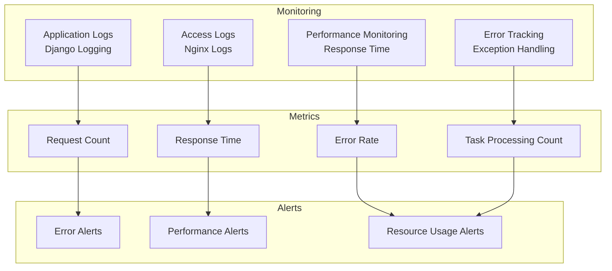
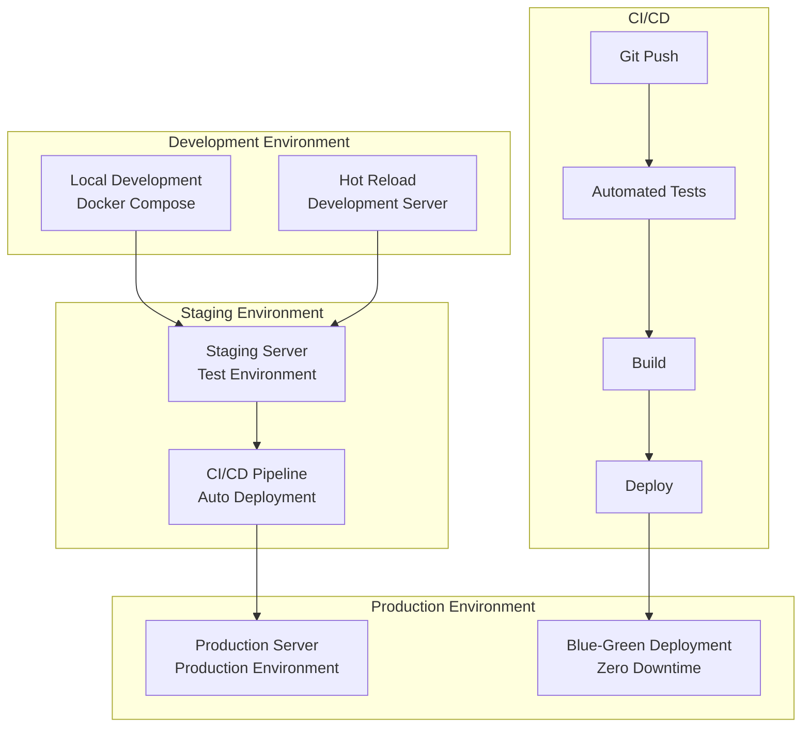

# システム構成図

## 概要

VideoQの全体アーキテクチャと、現行の `docker-compose.yml` に基づくデフォルト構成を示す図です。

## 全体システム構成

```mermaid
graph TB
    subgraph Client["Client Layer"]
        Browser["Web Browser
        Chrome, Firefox, Safari, etc."]
    end

    subgraph Gateway["Gateway Layer"]
        Nginx["Nginx Reverse Proxy
        Port: 80
        - Reverse Proxy
        - Static / Media Delivery
        - Frontend / API Routing"]
    end

    subgraph Application["Application Layer"]
        subgraph Frontend["Frontend"]
            FrontendSPA["Frontend Static App
            Vite build + React 19
            Port: 80 (container)
            - React
            - TypeScript
            - React Router 7
            - i18next
            - TanStack Query 5"]
        end

        subgraph Backend["Backend"]
            Django["Django ASGI API
            Port: 8000
            - Django 5.2.7+
            - DRF
            - Gunicorn + UvicornWorker"]
        end

        subgraph Worker["Worker"]
            Celery["Celery Worker
            - Asynchronous Task Processing
            - Transcription / Indexing
            - Account Deletion"]
        end
    end

    subgraph Data["Data Layer"]
        PostgreSQL[("PostgreSQL 17
        + pgvector
        - Structured Data
        - Vector Data")]
        Redis[("Redis Alpine
        - Task Queue
        - Cache")]
    end

    subgraph Storage["Storage Layer"]
        LocalFS["Local File System
        /app/media + staticfiles volume
        - Video Files
        - Static Files"]
        S3["AWS S3 / Cloudflare R2
        Optional
        - Video Files
        - Scalable Storage"]
    end

    subgraph External["External Services"]
        OpenAI["OpenAI API
        - Chat / LLM
        - Whisper API
        - Embeddings API"]
        Ollama["Ollama Server
        Optional (Local)
        - Local LLM (LLM_PROVIDER=ollama)
        - Local Embeddings (EMBEDDING_PROVIDER=ollama)
        - No API key required"]
        WhisperLocal["Local whisper.cpp Server
        Optional
        - GPU-accelerated transcription
        - Metal support (Mac)
        - OpenAI-compatible endpoint"]
        Email["Email Service
        - SMTP
        - Email Sending"]
    end

    Browser -->|HTTP/HTTPS| Nginx
    Nginx -->|Proxy| FrontendSPA
    Nginx -->|Proxy| Django
    Browser -->|API Calls| Nginx
    Django --> PostgreSQL
    Django --> Redis
    Django --> LocalFS
    Django --> S3
    Django --> OpenAI
    Django -.->|Optional| Ollama
    Django --> Email

    Celery --> Redis
    Celery --> PostgreSQL
    Celery --> LocalFS
    Celery --> S3
    Celery --> OpenAI
    Celery -.->|Optional| Ollama
    Celery -.->|Optional| WhisperLocal
```

## 本番環境（サーバーレス構成）

```mermaid
graph TB
    subgraph Client["Client Layer"]
        Browser["Web Browser (https://videoq.jp)"]
    end

    subgraph Edge["Edge Layer"]
        CloudFront["CloudFront (CDN)"]
        Pages["Cloudflare Pages
        - Frontend SPA"]
    end

    subgraph Gateway["Gateway Layer"]
        API_GW["API Gateway HTTP API"]
    end

    subgraph Compute["Serverless Compute Layer (AWS)"]
        LambdaAPI["Lambda API
        - Django + Lambda Web Adapter"]
        LambdaWorker["Lambda Worker
        - Celery Tasks"]
    end

    subgraph Messaging["Messaging"]
        SQS["Amazon SQS Queue
        - Celery Broker"]
    end

    subgraph Database["Data Layer"]
        NeonDB[("Neon PostgreSQL
        - Serverless DB + pgvector")]
    end

    subgraph Storage["Storage Layer"]
        R2[("Cloudflare R2
        - Serverless Object Storage")]
    end

    Browser -->|Request| CloudFront
    CloudFront -->|"/* (Static)"| Pages
    CloudFront -->|"/api/*"| API_GW
    
    API_GW --> LambdaAPI
    LambdaAPI --> NeonDB
    LambdaAPI --> R2
    LambdaAPI --> SQS
    
    SQS --> LambdaWorker
    LambdaWorker --> NeonDB
    LambdaWorker --> R2
```

## レイヤー別詳細構成

### フロントエンド

```mermaid
graph TB
    subgraph Presentation["Presentation Layer (Frontend)"]
        P1[React Pages / Components]
        P2[React Router Routes]
        P3[components/ui and feature components]
        P4[Custom Hooks]
    end

    subgraph FrontendModules["Frontend Internal Modules"]
        F1[lib/api.ts]
        F2[lib/queryClient.ts]
        F3[i18n/config.ts]
    end

    subgraph Lib["External Libraries"]
        L1[TanStack Query]
        L2[react-i18next]
    end

    P1 --> P2
    P1 --> P3
    P3 --> P4
    P4 --> F1
    P4 --> F2
    P1 --> F3
    P4 --> L1
    P1 --> L2
```

### バックエンド（クリーンアーキテクチャ）

```mermaid
graph TB
    subgraph Presentation["presentation/"]
        PV["Views - thin HTTP layer (video/, chat/, auth/, media/, billing/)"]
        PS[Serializers]
        PA[Django Admin - operational privileged path]
    end

    subgraph UseCases["use_cases/"]
        UV["video/ - CreateVideo, GetVideoDetail, ListVideos, UpdateVideo, DeleteVideo,
        FileUrl, RequestVideoUpload, ConfirmVideoUpload,
        GetVideoGroup, GetSharedGroup, ListVideoGroups,
        CreateVideoGroup, UpdateVideoGroup, DeleteVideoGroup,
        CreateTag, GetTagDetail, ListTags, UpdateTag, DeleteTag,
        AddVideoToGroup, AddVideosToGroup, RemoveVideoFromGroup, ReorderVideosInGroup,
        CreateShareLink, DeleteShareLink, AddTagsToVideo, RemoveTagFromVideo,
        EnforceVideoLimit, IndexVideoTranscript, ReindexAllVideos, RunTranscription"]
        UC["chat/ - SendMessage, GetChatHistory, ExportChatHistory,
        SubmitFeedback, GetChatAnalytics"]
        UA["auth/ - Login, Signup, VerifyEmail, RequestPasswordReset, ConfirmPasswordReset,
        GetCurrentUser, DeleteAccount, DeleteAccountData,
        ListApiKeys, CreateApiKey, RevokeApiKey,
        AuthorizeApiKey, ResolveApiKey, ResolveShareToken, RefreshToken"]
        UM[media/ - ResolveProtectedMedia]
        UB["billing/ - GetSubscription, GetPlans, CreateCheckoutSession,
        CreateBillingPortal, HandleWebhook,
        CheckStorageLimit, CheckProcessingLimit, CheckAiAnswersLimit,
        RecordStorageUsage, RecordProcessingUsage, RecordAiAnswerUsage, ClearOverQuota"]
        US[shared/ - ResourceNotFound, PermissionDenied]
    end

    subgraph Domain["domain/"]
        DV["video/ - VideoEntity, VideoRepository ABC (Query/Command/Transcription),
        VideoGroupRepository, TagRepository,
        VectorStoreGateway, VideoTaskGateway, VectorIndexingGateway,
        TranscriptionGateway, FileUrlResolver"]
        DC["chat/ - ChatRepository ABC, VideoGroupQueryRepository,
        RagGateway ABC, KeywordExtractor, SceneVideoInfoProvider,
        ChatLogEntity, ChatAnalyticsRaw, value_objects, services"]
        DA["auth/ - ApiKeyRepository ABC,
        TokenGateway, UserAuthGateway,
        AccountDeletionGateway, UserManagementGateway,
        UserDataDeletionGateway, EmailSenderGateway, AuthTaskGateway,
        ShareTokenResolverPort, ApiKeyResolverPort"]
        DM[media/ - ProtectedMediaRepository ABC]
        DB["billing/ - SubscriptionEntity, PlanType,
        SubscriptionRepository ABC,
        StorageLimitExceeded, ProcessingLimitExceeded,
        AiAnswersLimitExceeded, OverQuotaError"]
        DU["user/ - UserEntity, UserRepository ABC"]
        DS["shared/ - ResourceNotFound, PermissionDenied,
        transaction.py (TransactionManager port)"]
    end

    subgraph Infrastructure["infrastructure/"]
        IR["repositories/ - DjangoVideoRepository, DjangoChatRepository,
        DjangoUserRepository, DjangoMediaRepository,
        DjangoAccountDeletionRepository, DjangoApiKeyRepository,
        DjangoUserAuthGateway, DjangoUserDataDeletionGateway,
        DjangoSubscriptionRepository"]
        IE["external/ - RagChatGateway, DjangoVectorIndexingGateway,
        DjangoVectorStoreGateway, WhisperTranscriptionGateway,
        DjangoFileUrlResolver, FileUploadGateway,
        scene_indexer, vector_store, rag_service, rag_gateway, llm, prompts"]
        IT[transcription/ - audio_processing, srt_processing, DjangoVideoFileAccessor]
        IA["auth/ - SimpleJWTGateway, DjangoAuthGateway,
        CookieJWTValidator, ApiKeyResolver, ShareTokenResolver"]
        ITk[tasks/ - CeleryVideoTaskGateway, CeleryAuthTaskGateway]
        IC["chat/ - JanomeNltkKeywordExtractor, DjangoSceneVideoInfoProvider"]
        ICo["common/ - email, embeddings, whisper_client,
        query_optimizer, performance_utils, task_helpers,
        cipher, django_transaction"]
        ISo[scene_otsu/ - splitter, parsers, embedders, utils]
        ISt[storage/ - LocalMediaStorage]
        IM["models/ - User, Video, VideoGroup, VideoGroupMember,
        ChatLog, Tag, VideoTag, AccountDeletionRequest, UserApiKey,
        Subscription, SafeFileSystemStorage, SafeS3Boto3Storage"]
    end

    subgraph Container["Composition Root"]
        CDI[dependencies/*.py]
        CCR[composition_root/*.py]
        CK["contracts/ - task name constants, auth constants, media_validation"]
    end

    subgraph Entrypoints["Celery Entrypoints"]
        ET[entrypoints/tasks/ - transcription, account_deletion, reindexing, indexing]
    end

    subgraph Infra["Infrastructure (external)"]
        I1[(PostgreSQL + pgvector)]
        I2[(Redis)]
        I3[File Storage / S3]
        I4[OpenAI / Ollama API]
        I5[Celery Tasks]
    end

    PV --> CDI
    PA --> CDI
    CDI --> CCR
    CCR --> UseCases
    CCR --> Infrastructure
    UseCases --> Domain
    Infrastructure --> Domain
    Infrastructure --> I1
    Infrastructure --> I2
    Infrastructure --> I3
    Infrastructure --> I4
    Infrastructure --> I5
    Entrypoints --> UseCases
    Entrypoints --> CK
```

## ネットワーク構成

```mermaid
graph TB
    %% Default (Docker Compose) topology
    subgraph Internet["Internet"]
        Users[Users]
    end

    subgraph AppNetwork["Docker Compose Network
    videoq-network"]
        Nginx["nginx
        :80"]
        Frontend["frontend
        nginx serving built SPA
        :80"]
        Backend["backend
        Django ASGI
        :8000"]
        Worker["celery-worker
        Celery"]
        DB[("postgres
        pg17 + pgvector
        :5432")]
        Cache[("redis
        :6379")]
    end

    Users -->|HTTP:80| Nginx
    Nginx -->|Proxy| Frontend
    Nginx -->|Proxy /api| Backend
    Backend -->|PostgreSQL| DB
    Backend -->|Redis| Cache
    Worker -->|Redis| Cache
    Worker -->|PostgreSQL| DB
```

> 注記: 上図は現行の `docker-compose.yml`（サービスごとに単一インスタンス）に対応しています。
> 水平スケーリング（複数のフロントエンド/バックエンド/ワーカーインスタンス、DBレプリカ等）が必要な場合は、本番環境アーキテクチャとして検討してください。

## セキュリティ構成

```mermaid
graph TB
    subgraph Security["Security Layer"]
        subgraph Authentication["Authentication"]
            JWT["JWT Authentication
            HttpOnly Cookie-based
            Access Token: 10 min
            Refresh Token: 14 days
            Automatic Refresh
            Secure Cookie Flag (env configurable)"]
            ApiKey["API Key Authentication
            SHA-256 hashed storage
            Prefix-based lookup
            Access level: all / read_only
            Revocable"]
            ShareToken["Share Token Authentication
            Temporary Access
            Guest Access"]
            AccountDeactivation["Account Deactivation
            Soft Delete (deactivated_at)
            Async Data Deletion Task"]
        end

        subgraph Authorization["Authorization"]
            Permissions["Permission Management
            Ownership Check
            Resource Access Control
            API Key Access Level Check"]
        end

        subgraph Encryption["Encryption"]
            HTTPS["HTTPS Communication
            TLS/SSL
            Data Encryption"]
        end

        subgraph Protection["Protection"]
            CSRF["CSRF Protection
            SameSite Cookie"]
            CORS["CORS Settings
            Allowed Origin Restrictions"]
            RateLimit["Rate Limiting
            API Call Restrictions
            (DRF Throttling implemented)"]
        end
    end

    JWT --> Permissions
    ApiKey --> Permissions
    ShareToken --> Permissions
    HTTPS --> Protection
    CSRF --> Protection
    CORS --> Protection
    RateLimit --> Protection
```

## スケーラビリティ構成

```mermaid
graph TB
    subgraph Horizontal["Horizontal Scaling"]
        H1["Frontend
        Multiple Instances"]
        H2["Backend
        Multiple Instances"]
        H3["Celery Worker
        Multiple Workers"]
    end

    subgraph Vertical["Vertical Scaling"]
        V1["Database
        Resource Enhancement"]
        V2["Cache
        Memory Enhancement"]
    end

    subgraph LoadBalancing["Load Balancing"]
        LB1["Nginx
        Request Distribution"]
        LB2["Redis
        Task Distribution"]
    end

    subgraph Caching["Caching"]
        C1["Redis Cache
        Session Management"]
        C2["Static Files
        CDN Support"]
    end

    H1 --> LB1
    H2 --> LB1
    H3 --> LB2
    LB1 --> V1
    LB2 --> V2
    C1 --> V2
    C2 --> H1
```

## モニタリング・ログ構成

```mermaid
graph TB
    subgraph Monitoring["Monitoring"]
        M1["Application Logs
        Django Logging"]
        M2["Access Logs
        Nginx Logs"]
        M3["Performance Monitoring
        Response Time"]
        M4["Error Tracking
        Exception Handling"]
    end

    subgraph Metrics["Metrics"]
        Met1[Request Count]
        Met2[Response Time]
        Met3[Error Rate]
        Met4[Task Processing Count]
    end

    subgraph Alerts["Alerts"]
        A1[Error Alerts]
        A2[Performance Alerts]
        A3[Resource Usage Alerts]
    end

    M1 --> Met1
    M2 --> Met2
    M3 --> Met3
    M4 --> Met4
    Met1 --> A1
    Met2 --> A2
    Met3 --> A3
    Met4 --> A3
```

## デプロイ構成

```mermaid
graph TB
    subgraph Development["Development Environment"]
        Dev1["Local Development
        Docker Compose"]
        Dev2["Hot Reload
        Development Server"]
    end

    subgraph Staging["Staging Environment"]
        Stage1["Staging Server
        Test Environment"]
        Stage2["CI/CD Pipeline
        Auto Deployment"]
    end

    subgraph Production["Production Environment"]
        Prod1["Production Server
        Production Environment"]
        Prod2["Blue-Green Deployment
        Zero Downtime"]
    end

    subgraph CI_CD["CI/CD"]
        CI1[Git Push]
        CI2[Automated Tests]
        CI3[Build]
        CI4[Deploy]
    end

    Dev1 --> Stage1
    Dev2 --> Stage1
    Stage1 --> Stage2
    Stage2 --> Prod1
    CI1 --> CI2
    CI2 --> CI3
    CI3 --> CI4
    CI4 --> Prod2
```

---

## Related Documentation

- [📖 ドキュメント一覧](../README.md)
- [コンポーネント図](../design/component-diagram.md) — フロントエンド・バックエンドのコンポーネント構成
- [デプロイメント図](../design/deployment-diagram.md) — Docker Compose構成の詳細
- [フローチャート](flowchart.md) — 主要処理フロー
- [ER図](../database/er-diagram.md) — データモデル
