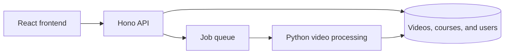
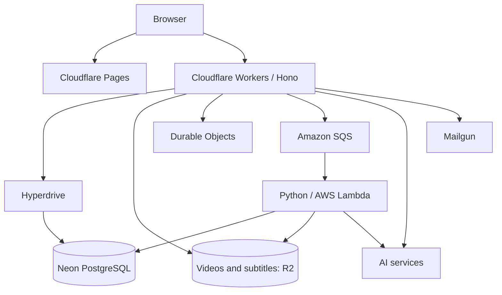

# System overview

VideoQ separates the API that responds to user actions from time-consuming video processing. Start with the three application components in this diagram to understand each technology's role.

```mermaid
flowchart LR
    Browser[React frontend] --> API[Hono API]
    API --> DB[(Videos, courses, and users)]
    API --> Queue[Job queue]
    Queue --> Worker[Python video processing]
    Worker --> DB
```

The frontend fetches state from the API. Once the worker saves transcripts and indexes, the frontend can use those results.

## Responsibilities of the three apps

| App | Responsibility | Main code |
|---|---|---|
| Web | Display, forms, question input, and playback | `apps/web/src/` |
| API | Authentication, access control, business logic, and job requests | `apps/api/src/` |
| Python worker | Transcription, indexing, PLOG generation, and answer evaluation | `apps/worker/worker_python/` |

Web and API share operation names and input/output types through `packages/trpc`. SQS JSON messages and the database form the boundary with Python.

## Local and production equivalents

| Role | Local | Production |
|---|---|---|
| Frontend | Static nginx build or Vite | Cloudflare Pages |
| API | Wrangler development server | Cloudflare Workers |
| Database | PostgreSQL + pgvector | Neon PostgreSQL + pgvector |
| API-to-DB connection | Local connection string | Hyperdrive |
| Video, subtitle, and other storage | MinIO | Cloudflare R2 |
| Job queue | ElasticMQ | Amazon SQS |
| Python worker | Container continuously polling the queue | AWS Lambda triggered by SQS |
| Temporary API state | Local Durable Objects | Cloudflare Durable Objects |

Locally, Caddy routes `http://localhost` to the frontend and API. Development Vite uses port 3000, and the documentation site uses 3001.

## Production layout

```mermaid
flowchart TB
    User[Browser] --> Pages[Cloudflare Pages]
    User --> API[Cloudflare Workers / Hono]
    API --> HD[Hyperdrive] --> DB[(Neon PostgreSQL)]
    API --> R2[(Videos and subtitles: R2)]
    API --> DO[Durable Objects]
    API --> Queue[Amazon SQS]
    Queue --> Worker[Python / AWS Lambda]
    Worker --> DB
    Worker --> R2
    API --> AI[AI services]
    Worker --> AI
    API --> Mail[Mailgun]
```

The API reaches the shared database through Hyperdrive; the Python worker uses a PostgreSQL connection. Check both when changing database columns.

## Durable Object roles

- `RATE_LIMITER`: Limits excessive requests over short periods.
- `STUDY_SESSION`: Stores temporary study state and controls concurrent operations in the same session.
- `TASK_SCHEDULER`: Schedules recovery of undelivered jobs and abandoned uploads.

Recovery is scheduled with Durable Object alarms. The current cron schedule is daily at `17 3 * * *` (UTC), for cleanup and recovery. Do not assume a five-minute cron schedule.

The implementation entry point is [app.ts](https://github.com/yukiharada1228/videoq/blob/main/apps/api/src/app.ts), and runtime configuration is in [wrangler.jsonc](https://github.com/yukiharada1228/videoq/blob/main/apps/api/wrangler.jsonc).

**Read next:** [Find your way around the code](../getting-started/codebase.md), [Job delivery and recovery](flowchart.md).
