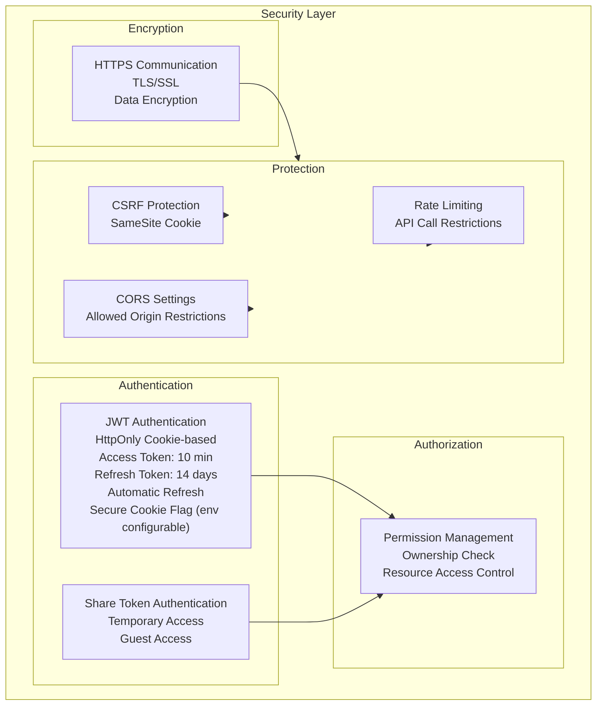

# システム構成図（System Configuration Diagram）

## Overview

VideoQの全体アーキテクチャと、デフォルト構成（Docker Compose）を表します。

## Overall System Configuration

```mermaid
graph TB
    subgraph Client["Client Layer"]
        Browser[Web Browser<br/>Chrome, Firefox, Safari, etc.]
    end
    
    subgraph Gateway["Gateway Layer"]
        Nginx[Nginx Reverse Proxy<br/>Port: 80<br/>- Reverse Proxy<br/>- Static File Delivery<br/>- Load Balancing]
    end
    
    subgraph Application["Application Layer"]
        subgraph Frontend["Frontend"]
            FrontendSPA[Vite + React SPA<br/>Port: 80 (container)<br/>- React<br/>- TypeScript<br/>- React Router]
        end
        
        subgraph Backend["Backend"]
            Django[Django REST API<br/>Port: 8000<br/>- Django 5.2.7+<br/>- DRF<br/>- Gunicorn]
        end
        
        subgraph Worker["Worker"]
            Celery[Celery Worker<br/>- Asynchronous Task Processing<br/>- Transcription Processing]
        end
    end
    
    subgraph Data["Data Layer"]
        PostgreSQL[(PostgreSQL 17<br/>+ pgvector<br/>- Structured Data<br/>- Vector Data)]
        Redis[(Redis Alpine<br/>- Task Queue<br/>- Cache)]
    end
    
    subgraph Storage["Storage Layer"]
        LocalFS[Local File System<br/>/backend/media<br/>- Video Files<br/>- Static Files]
        S3[AWS S3<br/>Optional<br/>- Video Files<br/>- Scalable Storage]
    end
    
    subgraph External["External Services"]
        OpenAI[OpenAI API<br/>- Whisper API<br/>- GPT API<br/>- Embeddings API]
        Email[Email Service<br/>- SMTP<br/>- Email Sending]
    end
    
    Browser -->|HTTP/HTTPS| Nginx
    Nginx -->|Proxy| FrontendSPA
    Nginx -->|Proxy| Django
    FrontendSPA -->|API Calls| Django
    Django --> PostgreSQL
    Django --> Redis
    Django --> LocalFS
    Django --> S3
    Django --> OpenAI
    Django --> Email
    Celery --> Redis
    Celery --> PostgreSQL
    Celery --> LocalFS
    Celery --> S3
    Celery --> OpenAI
```

## Layer-by-Layer Detailed Configuration


## Network Configuration


> Note: The diagram above matches the default `docker-compose.yml` (single instance per service).
> If you need horizontal scaling (multiple frontend/backend/worker instances, DB replicas, etc.), treat it as a production architecture concern.

## Security Configuration



## Scalability Configuration


## Monitoring & Logging Configuration


## Deployment Configuration


