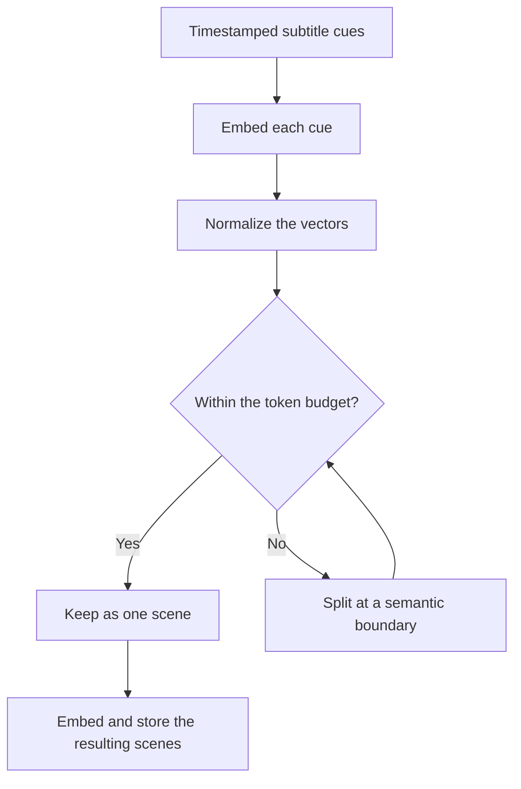

# Transcription and scene search

This page follows the data prepared before Q&A and the search performed after a question arrives. Start with [How AI builds an answer](../concepts/how-ai-works.md) for a worked example.

## 1. Obtain timestamped text

| Source | Current processing | When it cannot proceed |
|---|---|---|
| Uploaded video | Download the stored file, extract mono audio with FFmpeg, transcribe through the selected Whisper backend, and convert the segments to SRT | Missing file/audio, transcription failure, or an empty transcript |
| YouTube | Request subtitles through SearchAPI, trying manual subtitles first and automatic subtitles next, then convert them to SRT | Missing SearchAPI configuration or no usable subtitles |

The YouTube path does not fall back to downloading the video and transcribing its audio. The upload path supports OpenAI Whisper or a local compatible endpoint according to `WHISPER_BACKEND`. For larger audio files, the implementation splits audio exceeding 24 MiB into 600-second chunks and restores the time offsets in the returned segments. These are implementation choices, not a statement of a provider's current limits.

In development, disabling `ENABLE_HEAVY_PIPELINE` produces a one-second placeholder transcript. This can exercise state transitions but cannot test transcription accuracy or meaningful search. No video-frame analysis or slide OCR runs in this pipeline.

## 2. Group subtitles into scenes

An SRT cue contains a start time, an end time, and text. Whisper or YouTube may produce many short cues. VideoQ groups these into text scenes while keeping their position in the video.

The splitter uses a multidimensional Otsu criterion: it looks for a boundary that separates the before/after groups in embedding space. It recursively splits long ranges until each range fits the default budget of **512 tokens**. A short range can remain one scene even when its topic changes; this is a length-bounded segmentation algorithm, not an LLM identifying every topic.

If a single cue itself exceeds the budget, the code splits its tokens and distributes its time interval proportionally. Those intermediate timestamps are estimates. If scene splitting raises an exception, the worker keeps the original SRT, so the 512-token scene size is not guaranteed on that fallback path.

## 3. Store searchable scene data

The indexing job parses the scene SRT, embeds each scene's text, and writes rows to `scene_embeddings`. Embedding requests are batched in groups of 64. Each row contains text plus its vector and metadata: owner, video ID/title, scene index, and start/end times.

Indexing replaces that video's existing vector rows. API search and worker indexing must use compatible embedding models and dimensions. The current database column has **1536 dimensions**; changing a model setting alone does not migrate the column or rebuild old vectors. A changed embedding model requires reindexing the material that will be searched with it.

During initial processing, when indexing finishes, Q&A can use the scenes. PLOG is built in a subsequent job, so search readiness and study-mode readiness are separate. This handoff does **not** run after a transcript edit or a search reindex. See [update scope and verification](#update-scope) below and [video states](../design/state-diagram.md).

## 4. Search when the model requests evidence

`search_scenes` receives a natural-language query and, optionally, video IDs within the authorized course. The API:

1. Rejects requested video IDs outside the allowed set.
2. Embeds the search query through the configured embedding provider.
3. Uses PGVector similarity search, filtered by owner and allowed video IDs.
4. Returns up to `RETRIEVER_K = 20` scenes by default, including text, video title/ID, and timestamps.

For example, a query about “perpendicular vectors” may find a scene describing “an angle of ninety degrees” even if it does not repeat the question's words. Whether it succeeds depends on the transcript and embeddings.

The current application does not apply a minimum similarity cutoff or a second reranking model. It discards the returned numeric scores when preparing tool results. “20 scenes returned” therefore means candidate material was found, not that all 20 scenes answer the question. A nonempty index can return weak matches instead of returning no results.

The model can revise its query and search again, up to three times per answer. The application's scene collector deduplicates results using video ID and start/end times, assigning stable `[1]`, `[2]`, and subsequent numbers within that answer. Those numbers are neither global scene IDs nor confidence scores.

## 5. Send evidence to the answer model

A scene tool result contains the citation number, video title, timestamps, and subtitle text. Course metadata comes from a separate tool. The answer model sees these results during the current tool loop and writes a response under the configured instructions.

This path does not perform a web search. The available tools read registered course information and indexed scenes. A long-video summary is limited by the scenes actually retrieved; there is no automatic traversal of every scene to ensure full coverage.

## What changes after an edit or rebuild? {#update-scope}

The initial flow is **transcription → scene indexing → PLOG generation**. Later updates have different scopes; “reindex” and “rebuild PLOG” are separate operations.

| Operation | Data updated | What happens to manual edits? | Where to verify completion |
|---|---|---|---|
| Initial upload / YouTube import | Obtain transcript, group scenes, index them, then enqueue PLOG concepts, relationships, questions, and hints | This creates a new resource; do not use this flow as a way to preserve edits on an existing video | Video becomes `completed` for search; separately check the learning graph's build status and contents |
| Save an edited transcript | Save SRT and register a `reindex_video_transcript` job in the same DB transaction; the worker later replaces that video's scene text/vectors, or deletes its vectors if the transcript was cleared. Study support reads the saved transcript directly, independently of this reindex | Existing PLOG edits remain unchanged, including any questions/hints that still reflect the old transcript | Reopen the transcript to check persistence; check worker completion separately for Q&A search as described below. The video's existing `completed` status is not evidence of this reindex finishing |
| Reindex search embeddings from Admin | `reindex_all_videos_embeddings` rebuilds the search index from completed videos with nonempty stored transcripts; it does not transcribe audio or build PLOG | Stored transcripts and manually edited PLOG data remain unchanged | Admin returns a queued job ID; check that job's worker logs / `job_executions` status, then test a new search |
| Rebuild PLOG from the video's learning graph | Generate from the stored transcript and replace concepts (with new IDs), edges, learning objects, and summary nodes; delete DB learner states linked to the old concepts | Existing manual concept, relationship, question, and hint edits are replaced, not merged. Transcript and scene index remain unchanged | Check PLOG `pending` / `running` → `ready` or `failed`, then inspect the generated contents. `ready` may still contain an empty or unusable graph |

Saving identical transcript text does not enqueue another reindex. Changing only a title or description does not regenerate PLOG either. Search reindexing does not update PLOG concept embeddings; see [embedding configuration](../guides/embeddings.md) when changing models.

### When to treat PLOG as potentially outdated

After **any saved transcript change** following the transcript used for the last PLOG build or manual review, treat the graph as potentially outdated until the owner reviews the affected data or rebuilds it from the corrected transcript. Text, timing, removed passages, and an emptied transcript all count. A title-only edit or reindex of an unchanged transcript does not itself imply changed learning content.

This is a review policy, not an automatically detected application status. The current implementation does not store a transcript revision/hash on the PLOG build and has no stale badge or automatic Study block. A graph can still say `ready` and be used by Study after its source changes. Study support reads nearby passages directly from the stored transcript, so its next read can combine corrected subtitles with older saved questions or hints even while the Q&A search reindex is pending or has failed.

- For a typo or timing correction, compare the affected concept labels, source quotes, introduction times, relationships, questions, and hints. Keep using the graph once those remain valid or have been corrected manually; rebuilding is optional.
- If a definition, answer, prerequisite, or substantial passage changed, pause use of the affected Study material and review/correct it or rebuild before relying on it again. Prefer targeted manual corrections when preserving edited learning content matters.
- A search reindex alone never establishes that PLOG is current. Avoid editing the transcript during a PLOG build; it uses the transcript read when that job started.

Copy any manual material you want to keep before rebuilding. The panel asks for confirmation when rebuilding an existing ready graph, but it does not offer a merge or restore of old edits. See [rebuilding during active Study](../plog/README.md#rebuild-and-active-study).

### Verify a subtitle correction in Q&A and Study {#verify-transcript-update}

Use a video you own, with completed initial processing, in a course. For example, suppose a spoken explanation of the **dot product** was transcribed as “cross product.”

1. Open the video detail page and note the incorrect subtitle's time and any affected learning-graph question/hint. Copy edited learning material you may want to retain.
2. Choose **Edit** in the transcript panel, correct the term in the SRT text while preserving cue numbers and timestamps, then **Save transcript**. Reopen or reload the transcript to confirm the corrected text was saved. This proves persistence, not completion of the asynchronous search update.
3. Before checking Q&A search, wait for the edit's reindex job to finish. Study support's direct transcript read does not depend on this job. The current UI has no per-edit index completion indicator. In local development, run `docker compose logs --since=10m worker` and match `reindex_video_transcript`, the video ID, and the dispatch/job ID to the save time. Look for `Successfully reindexed transcript for video …` (or the vectors-deleted message for a cleared transcript). An operator can check that same job in `job_executions` has `status = 'completed'`; a queue delivery/outbox completion only proves delivery. If it failed or never started, investigate worker/API delivery logs before assuming a fixed waiting time is enough.
4. In that course's **Q&A**, ask a new, self-contained question such as “How is the dot product defined in this lesson?” Open the cited scene and compare its time and corrected transcript with the answer. Old displayed answers and saved chat logs do not regenerate. Correct wording from the model alone is not proof that reindexing completed; if uncertain, have an operator inspect that video's stored `scene_embeddings` text and retrieved context.
5. Return to the video's **Learning graph** and inspect the affected concept, opening question, and hint ladder. They have not automatically changed. Apply targeted edits, or choose **Rebuild** after preserving needed edits and accepting their replacement. Wait for `ready`, inspect the actual generated content, and correct omissions or errors; regeneration does not guarantee the corrected passage is included.
6. After either manual edits or a rebuild, select **Study → Start over** and confirm to begin a [fresh verification session](../plog/README.md#verify-in-fresh-session), then ask about the corrected concept. Work through any prerequisites presented first, then check the target concept's saved opening question and subsequent hints. Switching Q&A → Study in the original tab only clears visible dialogue; existing progress can cause the test message to be graded as a reply to an earlier question.

The update paths are implemented in [updateVideo](https://github.com/yukiharada1228/videoq/blob/main/apps/api/src/repositories/video-repository.ts), [transcript reindexing](https://github.com/yukiharada1228/videoq/blob/main/apps/worker/worker_python/tasks/reindex_video_transcript.py), [full reindexing](https://github.com/yukiharada1228/videoq/blob/main/apps/worker/worker_python/tasks/reindexing.py), and [PLOG replacement](https://github.com/yukiharada1228/videoq/blob/main/apps/worker/worker_python/pipeline/plog_build.py).

## Diagnose a poor answer at the right step

| Symptom | First check |
|---|---|
| A slide's equation is missing | Whether the equation was spoken or present in subtitles |
| Names or technical terms are wrong | The stored transcript before changing the answer prompt |
| A citation starts too early or late | Original subtitle timing and any proportional split of a long cue |
| The answer discusses another lesson | Course membership, the model's selected video IDs, and the search query |
| Retrieved passages are only loosely related | Transcript coverage and embedding compatibility; no minimum-score filter currently removes weak matches |
| Video says `completed` but study mode is unavailable | PLOG status and graph readiness, independently of search indexing |

## Implementation reference

| File | Responsibility |
|---|---|
| [transcription.py](https://github.com/yukiharada1228/videoq/blob/main/apps/worker/worker_python/pipeline/transcription.py) | Audio/subtitle acquisition and the development placeholder |
| [scene_otsu/](https://github.com/yukiharada1228/videoq/tree/main/apps/worker/worker_python/pipeline/scene_otsu) | Segmentation, token counting, and fallback to the original SRT |
| [vector_index.py](https://github.com/yukiharada1228/videoq/blob/main/apps/worker/worker_python/pipeline/vector_index.py) | Scene embeddings and metadata storage |
| [vector-repository.ts](https://github.com/yukiharada1228/videoq/blob/main/apps/api/src/repositories/vector-repository.ts) | Search scope and result count |
| [rag.ts](https://github.com/yukiharada1228/videoq/blob/main/apps/api/src/lib/rag.ts) | Tool loop, scene deduplication, and citation numbering |

**Read next:** [Q&A prompts and answer evaluation](prompt-engineering.md).
