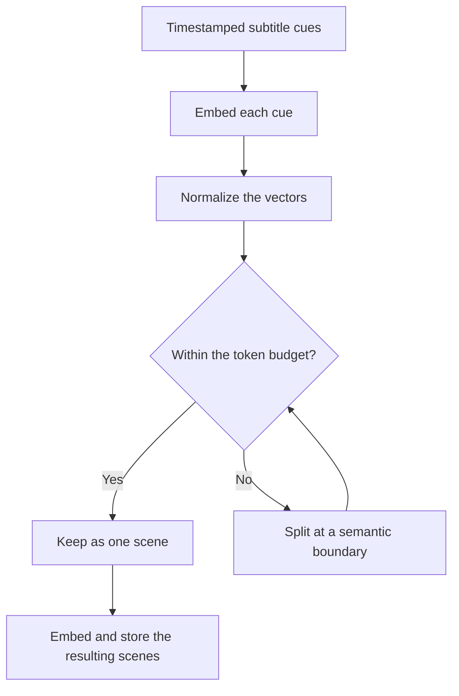

# Transcription and scene search

This page follows the data prepared before Q&A and the search performed after a question arrives. Start with [How AI builds an answer](../concepts/how-ai-works.md) for a worked example.

## 1. Obtain timestamped text

| Source | Current processing | When it cannot proceed |
|---|---|---|
| Uploaded video | Download the stored file, extract mono audio with FFmpeg, transcribe through the selected Whisper backend, and convert the segments to SRT | Missing file/audio, transcription failure, or an empty transcript |
| YouTube | Request subtitles through SearchAPI, trying manual subtitles first and automatic subtitles next, then convert them to SRT | Missing SearchAPI configuration or no usable subtitles |

The YouTube path does not fall back to downloading the video and transcribing its audio. The upload path supports OpenAI Whisper or a local compatible endpoint according to `WHISPER_BACKEND`. For larger audio files, the implementation splits audio exceeding 24 MiB into 600-second chunks and restores the time offsets in the returned segments. These are implementation choices, not a statement of a provider's current limits.

In development, disabling `ENABLE_HEAVY_PIPELINE` produces a one-second placeholder transcript. This can exercise state transitions but cannot test transcription accuracy or meaningful search. No video-frame analysis or slide OCR runs in this pipeline.

## 2. Group subtitles into scenes

An SRT cue contains a start time, an end time, and text. Whisper or YouTube may produce many short cues. VideoQ groups these into text scenes while keeping their position in the video.

The splitter uses a multidimensional Otsu criterion: it looks for a boundary that separates the before/after groups in embedding space. It recursively splits long ranges until each range fits the default budget of **512 tokens**. A short range can remain one scene even when its topic changes; this is a length-bounded segmentation algorithm, not an LLM identifying every topic.

If a single cue itself exceeds the budget, the code splits its tokens and distributes its time interval proportionally. Those intermediate timestamps are estimates. If scene splitting raises an exception, the worker keeps the original SRT, so the 512-token scene size is not guaranteed on that fallback path.

## 3. Store searchable scene data

The indexing job parses the scene SRT, embeds each scene's text, and writes rows to `scene_embeddings`. Embedding requests are batched in groups of 64. Each row contains text plus its vector and metadata: owner, video ID/title, scene index, and start/end times.

Indexing replaces that video's existing vector rows. API search and worker indexing must use compatible embedding models and dimensions. The current database column has **1536 dimensions**; changing a model setting alone does not migrate the column or rebuild old vectors. A changed embedding model requires reindexing the material that will be searched with it.

After initial indexing completes, Q&A can search the scenes. See [update scope and verification](#update-scope) and [video states](../design/state-diagram.md).

## 4. Search when the model requests evidence

`search_scenes` receives a natural-language query and, optionally, video IDs within the authorized course. The API:

1. Rejects requested video IDs outside the allowed set.
2. Embeds the search query through the configured embedding provider.
3. Uses PGVector similarity search, filtered by owner and allowed video IDs.
4. Returns up to `RETRIEVER_K = 20` scenes by default, including text, video title/ID, and timestamps.

For example, a query about “perpendicular vectors” may find a scene describing “an angle of ninety degrees” even if it does not repeat the question's words. Whether it succeeds depends on the transcript and embeddings.

The current application does not apply a minimum similarity cutoff or a second reranking model. It discards the returned numeric scores when preparing tool results. “20 scenes returned” therefore means candidate material was found, not that all 20 scenes answer the question. A nonempty index can return weak matches instead of returning no results.

The model can revise its query and search again, up to three times per answer. The application's scene collector deduplicates results using video ID and start/end times, assigning stable `[1]`, `[2]`, and subsequent numbers within that answer. Those numbers are neither global scene IDs nor confidence scores.

## 5. Send evidence to the answer model

A scene tool result contains the citation number, video title, timestamps, and subtitle text. Course metadata comes from a separate tool. The answer model sees these results during the current tool loop and writes a response under the configured instructions.

This path does not perform a web search. The available tools read registered course information and indexed scenes. A long-video summary is limited by the scenes actually retrieved; there is no automatic traversal of every scene to ensure full coverage.

## What changes when editing or reindexing {#update-scope}

Initial processing follows **transcription → scene indexing**, then marks the video `completed`.

| Operation | Updated data | How to verify completion |
|---|---|---|
| Initial upload / YouTube import | Obtain a transcript, group scenes, and create the search index | Check the video's `completed` status |
| Save an edited transcript | Save SRT and register `reindex_video_transcript` in one DB transaction. The worker replaces that video's scene text/vectors, or deletes its vectors if the transcript was cleared | Reopen the transcript to confirm saving, then check the reindex job separately |
| Reindex embeddings from Admin | `reindex_all_videos_embeddings` rebuilds search data for completed videos with nonempty transcripts, leaving stored transcripts unchanged | Match the returned job ID to worker logs / `job_executions` |

Saving identical transcript text or changing only a title or description does not enqueue a reindex. See [embedding configuration](../guides/embeddings.md) before changing models.

### Verify a subtitle correction in Q&A {#verify-transcript-update}

1. Open a video you own, select **Edit** in the transcript panel, correct the text while preserving SRT numbering and timestamps, and **Save**.
2. Reopen the transcript to confirm persistence. The video's existing `completed` label does not confirm this edit's reindex has finished.
3. Run `docker compose logs --since=10m worker` and match `reindex_video_transcript`, the video ID, and the job ID to the save time. Check for `Successfully reindexed transcript for video …`. An operator can also verify that job's `job_executions.status = 'completed'`. Outbox completion only confirms delivery.
4. Send a new question naming the subject in the same course. Compare its citations and timestamps with the corrected transcript. Previously displayed or saved answers are not regenerated.

See [updateVideo](https://github.com/yukiharada1228/videoq/blob/main/apps/api/src/repositories/video-repository.ts), [transcript reindexing](https://github.com/yukiharada1228/videoq/blob/main/apps/worker/worker_python/tasks/reindex_video_transcript.py), and [full reindexing](https://github.com/yukiharada1228/videoq/blob/main/apps/worker/worker_python/tasks/reindexing.py).

## Diagnose a poor answer at the right step

| Symptom | First check |
|---|---|
| A slide's equation is missing | Whether the equation was spoken or present in subtitles |
| Names or technical terms are wrong | The stored transcript before changing the answer prompt |
| A citation starts too early or late | Original subtitle timing and any proportional split of a long cue |
| The answer discusses another lesson | Course membership, the model's selected video IDs, and the search query |
| Retrieved passages are only loosely related | Transcript coverage and embedding compatibility; no minimum-score filter currently removes weak matches |

## Implementation reference

| File | Responsibility |
|---|---|
| [transcription.py](https://github.com/yukiharada1228/videoq/blob/main/apps/worker/worker_python/pipeline/transcription.py) | Audio/subtitle acquisition and the development placeholder |
| [scene_otsu/](https://github.com/yukiharada1228/videoq/tree/main/apps/worker/worker_python/pipeline/scene_otsu) | Segmentation, token counting, and fallback to the original SRT |
| [vector_index.py](https://github.com/yukiharada1228/videoq/blob/main/apps/worker/worker_python/pipeline/vector_index.py) | Scene embeddings and metadata storage |
| [vector-repository.ts](https://github.com/yukiharada1228/videoq/blob/main/apps/api/src/repositories/vector-repository.ts) | Search scope and result count |
| [rag.ts](https://github.com/yukiharada1228/videoq/blob/main/apps/api/src/lib/rag.ts) | Tool loop, scene deduplication, and citation numbering |

**Read next:** [Q&A prompts and answer evaluation](prompt-engineering.md).
