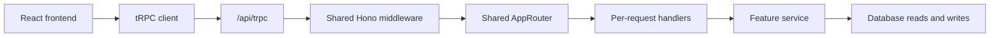

# tRPC API design

This reference explains how ordinary data fetching and updates share types between the frontend and API.
If this is your first API change, start with [Change the API](../guides/api.md).

A **procedure** is one operation such as `videos.get`; a **contract** is its input/output agreement.
This page explains where contracts live and how they connect to Hono's implementation.

## Approach

VideoQ standardizes regular JSON APIs on tRPC. React and Hono share `AppRouter`,
with procedure names, input validation, and input/output types managed as one contract.
No OpenAPI schema or API reference UI is generated.



## Workspace boundaries

```text
packages/trpc/
├── src/init.ts          tRPC setup, auth/permission middleware, error formatter
├── src/inputs/          Zod inputs: source of validation and handler input types
├── src/outputs.ts       Zod outputs: source of validation and handler output types
├── src/model-schemas.ts Output validation schemas for shared DTOs
├── src/routers/         Domain routers and procedure wiring
├── src/router.ts        AppRouter composition
├── src/contracts.ts     Zod-derived input/output maps and handler contracts
├── src/models.ts        API / SPA DTOs derived from output schemas
├── src/context.ts       Framework-independent request context
└── src/schema.ts        Shared runtime constants

apps/api/src/trpc/
├── context.ts           Builds auth and handlers from a Hono request
└── handlers/            Connects services to procedure contracts

apps/web/src/lib/
├── trpc.ts              Batch client, TanStack Query options, per-procedure 401 detection
├── api-error.ts         Shared raw HTTP / tRPC error reading
└── api.ts               Better Auth, SSE, CSV, upload, and media URL adapters
```

`packages/trpc` does not depend on Hono, the database, or Cloudflare bindings.
The API implementation is injected as a `ctx.call()` adapter, and Web imports `AppRouter` as a type only.

Define input schemas once in `src/inputs/`. A procedure's `.input()` and `RpcInputMap`
reference the same schema. Handlers receive `z.output` types after defaults and transforms
have been applied. SPA caller types are still inferred from `AppRouter`.

The admin form imports its quota and usage field schemas through `@videoq/trpc/admin`.
It converts text to numbers (blank to null) and validates every field before making
any update. The API enforces the same limits: upload size is a positive integer;
processing and AI quotas/counters are non-negative integers, all at most 2,147,483,647.
Storage quotas may be fractional and non-negative; storage usage must be a non-negative
safe integer. Null quotas mean unlimited, while zero means no allowance. Required
counters cannot be blank. `usage_period_start` accepts null or an ISO datetime with
an explicit timezone, so malformed dates are rejected before database writes.
The Python worker converts minute limits to seconds with bigint arithmetic and
compares usage against the remaining allowance, avoiding integer overflow during
quota checks.

Define every procedure's output schema in `src/outputs.ts`. `.output()` and `RpcOutputMap`
use the same schemas, and shared DTOs are derived from `src/model-schemas.ts` and `src/schema.ts`.
Output validation checks required fields and types, and strips undeclared fields.
Tag writes are restricted to palette names by `tagColorSchema`, while outputs also accept
legacy stored hex colors.

## List search

Video keywords and admin username/email queries use case-insensitive, literal
substring matching. `%`, `_`, and `\` are ordinary search characters, not SQL
wildcards. Both repositories use the same pattern escaping, and each list's
total count and paginated rows use the same search predicate.

## React and caching

Use `createTRPCOptionsProxy` from `@trpc/tanstack-react-query` with TanStack Query hooks,
for example `useQuery(trpc.videos.get.queryOptions({ id }))`.
The Vite SPA shares its client and QueryClient, with the cache provided by `QueryClientProvider`.

Use `useQueryClient()` for cache operations. Use `queryKey()` / `queryFilter()` for individual
queries and `pathFilter()` for whole lists, updating both regular and infinite queries.
Infinite scrolling uses `infiniteQueryOptions()` with `initialCursor: 0`.

## Authentication and authorization

- `publicProcedure`: Public information, or operations whose handler validates a share token.
- `protectedProcedure`: Requires a Better Auth browser session.
- `adminProcedure`: Lazily verifies superuser status.

Integration API keys and OAuth Bearer tokens are for MCP transport only. They do not authenticate
regular tRPC, SSE, CSV, multipart upload, or media routes.

The SPA's `AuthProvider` owns session revalidation, login redirects and cache
replacement when the account changes. `useAuth` only reads the app profile;
mounting more profile consumers must not add more redirects. A profile request
failure alone is not evidence that the browser session expired.

Email verification caches a successful token confirmation across reconnects and
remounts. The page renders its translated success message; the auth adapter does
not manufacture display text from a successful provider response.

Settings reads integration metadata through `account.integrationApiKeys` and
`account.connectedApps`. Both require the current browser session and return
only that user's display fields, without API-key hashes, client secrets, or
private metadata. The repository reads the complete list with explicit column
selection; it does not inherit Better Auth's default 100-row adapter limit.
Connected-app names are joined in the same query, avoiding a browser request
for each client. Output types come from the shared schemas. Missing consent
creation dates remain null, and consents have no token-expiry display field.
Key creation and revocation, OAuth consent, and disconnect still use Better Auth.

## Endpoints that stay in Hono

Use raw routes only when the HTTP protocol or payload transport itself matters:

- Better Auth and OAuth / OIDC discovery
- Stripe webhooks
- MCP Streamable HTTP
- Health / readiness
- Media binaries
- Multipart video uploads
- Chat SSE
- Chat history CSV export

For a new regular JSON operation, define its input schema in `packages/trpc/src/inputs`
and output schema in `packages/trpc/src/outputs.ts`. Wire `.input()` / `.output()` in
`packages/trpc/src/routers` and add its implementation in `apps/api/src/trpc/handlers`.

## Error contract

In addition to standard tRPC error codes and HTTP statuses, error data preserves
`applicationCode` for existing UI decisions and `details` for field validation.
Internal error messages are replaced with fixed text before being exposed.
Output validation failures use `INTERNAL_SERVER_ERROR`, distinct from input `VALIDATION_ERROR`.
Output validation errors do not include `applicationCode` or validation `details`.

The SPA receives standard `TRPCClientError` objects directly. Use `getApiError()` when a screen
needs the application code or details. The link detects expired authentication per procedure,
including mixed batches with HTTP 207. Logout is signaled only once per HTTP response.

tRPC's adapter `onError` logs the request ID, procedure, error code, safe error attributes,
and stack frames for internal exceptions. It does not log inputs, cookies, query strings,
SQL parameters in error messages, or personal data.
