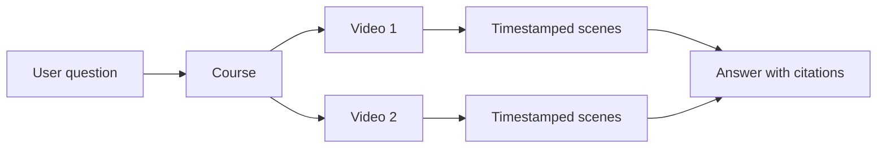

# Videos, courses, and scenes

The basic VideoQ workflow is to **add videos, organize them into a course, and ask questions about that course**. Understanding these three steps makes screen and code names easier to follow.

## A concrete example

Suppose you add “Preparing the development environment” and “Implementing the API” to a course called “New team member training.”

When you ask “How do I start the API?”, VideoQ searches transcripts of videos in that course. Scenes used in the answer include timestamps so you can return to the original video.

| Name | Meaning | Example |
|---|---|---|
| Video | One registered video with its title, transcript, and processing state | “Implementing the API” |
| Course | A set of videos grouped for questions and sharing | “New team member training” |
| Scene | A transcript segment with start and end times | Startup instructions from 02:10 to 02:40 |
| Tag | A label for organizing videos | “Introduction”, “Backend” |
| Chat log | A record of a question, answer, citations, and feedback | An answer explaining startup steps |

## Course membership has two meanings

Distinguish videos from people when reading the code:

- `video_course_members`: A join table for the **videos included in a course** and their display order.
- Course invitations and participation: Features that manage access for **people using a course**.

Removing a video from a course and deleting the stored video itself are also separate operations.

## Owners, participants, and administrators

Videos and courses have owners. Share links and invitations let others use permitted courses. Available operations depend on access to the data, not just login status.

See [Sharing, invitations, and chat history](course-sharing.md) to compare permissions, whose AI allowance a question uses, and who can read learners' questions.

Administrators manage users, usage limits, reindexing, and related tasks. **Hiding a button does not enforce permissions.** The API must also check access to the target data. See [authentication and access control](auth.md).

**Read next:** [System overview](../architecture/system-configuration-diagram.md). For table details, see the [data dictionary](../database/data-dictionary.md).
