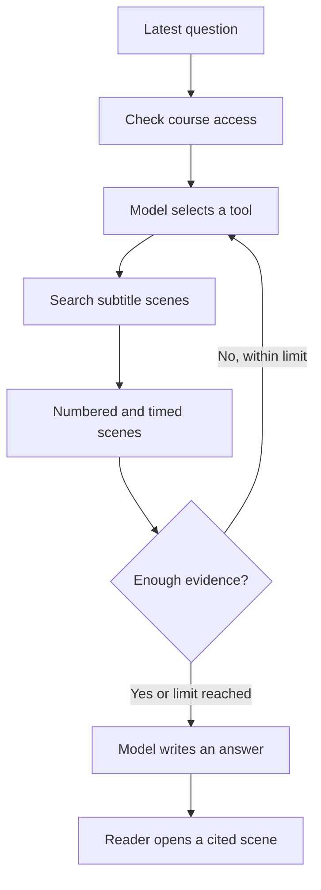

# How AI builds an answer

VideoQ prepares text from videos, retrieves material relevant to a question, and asks a language model to write an answer using that material. This is **RAG** (retrieval-augmented generation). The steps below describe the current implementation; they are not a claim that every answer is correct.

## What does the AI actually read?

For an uploaded file, the worker extracts **audio** and transcribes it with Whisper. For a YouTube import, it retrieves existing subtitles through SearchAPI. Both paths produce text with timestamps.

The current pipeline does not send video frames to a vision model or read slides with OCR. A diagram, equation, gesture, or on-screen label that is never spoken or included in subtitles may therefore be missing from the information used to answer.

The system has several distinct AI jobs:

| Job | Input | Result |
|---|---|---|
| Transcription for uploads | Extracted audio | Timestamped text |
| Embedding | Subtitle text or a search query | Numbers used to compare meaning |
| Q&A | Latest question, instructions, and tool results | Answer text with scene references |
| Learning-data generation | A bounded excerpt of the transcript | Concepts, opening questions, and hints |
| Study mode | Learner reply, selected concept, and relevant state/material | A grade or supporting response |
| Answer-quality evaluation | Saved question, answer, and retrieved material | Quality metrics recorded after the answer |

An embedding does not write an answer. It helps find text for the language model to read. [See transcription and scene search](../architecture/transcription-and-search.md) for the preparation steps.

## Follow one question

Suppose a course contains a lesson explaining the dot product, and you ask:

> How does the dot product relate to the angle between two vectors?

The following is an **illustrative example**, not a captured production conversation. The search wording, returned scenes, number of searches, and answer can vary.



1. **Fix the accessible scope.** The API establishes the course and its allowed video IDs. The model cannot expand that scope by asking for another course's videos.
2. **Choose a tool and query.** For this content question, the model is instructed to use `search_scenes`. A possible query is “dot product angle cosine relationship.” It can rephrase the question to search for relevant material.
3. **Retrieve scenes.** The API embeds the query and searches the course's indexed subtitle text. Each search returns up to 20 scenes by default. It does not send the whole video to the answer model.
4. **Read the evidence.** A tool result might look like this:

   ```text
   [1] Dot product lesson 00:02:10,000 - 00:02:35,000
   The dot product is the product of the two vector lengths and the cosine of their angle.
   ```

5. **Search again if needed.** The model may request another search, for example to find the explanation of perpendicular vectors. At most three scene searches are available per answer.
6. **Write an answer.** With the example scene above, a possible answer is: “The dot product depends on the cosine of the angle as well as the lengths of the two vectors. [1]” The reference connects the sentence to the retrieved scene.
7. **Check the source.** Selecting the citation opens the video's associated time. The timestamp comes from the stored subtitle scene; the answer wording comes from the model.

The application assigns scene numbers, keeps them stable when a scene is found again, and provides citation data to the UI. The model chooses where to place those numbers in its prose. A citation helps you verify an answer; it does not prove that every statement is supported.

## Why do some answers have no scene citation?

“How many videos are in this course?” can be answered using `get_course_info`, which reads registered course and video information. That tool does not need subtitle search. Metadata is not assigned scene citation numbers.

For a question about a **specific lesson**, the model is instructed to identify it using course information, then restrict scene searches to the matching video IDs. A video's position in the list is not automatically its lecture number. A saved description can answer “What is the description?”, but it is not a substitute for searching the lesson when explaining its content.

## Does it remember the conversation?

Ordinary Q&A is offered as **independent questions**, including course chats and shared links. This keeps the subject and evidence scope explicit in each question and avoids carrying earlier answers or unrelated topics into the next answer.

The browser sends only the latest question. The answer model starts with the system instructions and that **latest user question**. Earlier user questions and assistant answers are not passed as conversation history. Tool calls and results from the current answer are available during that answer's generation.

Consequently, “Why is that?” may lack the subject it needs. “Why is the dot product zero for perpendicular vectors?” is more self-contained. Saving chat logs and showing past messages in the UI does not mean the model receives them on its next call.

For example, after “What is the dot product?”, sending “Give me an example” starts a new question without the dot-product subject. The expected contract is that the previous topic is **not carried over**; the model's wording can vary, and asking for clarification is not guaranteed. Send “Give me an example of the dot product” to request that example explicitly.

Study mode uses a different flow: it reads the previous assistant question for grading and maintains concept progress and hint position in a study session. [See how study mode makes decisions](../plog/README.md).

## What decides the next action?

| Decision | Who makes it? |
|---|---|
| Which course and videos may be accessed | API permission checks and search filters |
| Whether to request metadata or subtitle scenes, and what to search for | Model, guided by tool descriptions and prompts |
| How many search results and tool calls are allowed | Program constants and argument validation |
| How to phrase an answer and where to cite evidence | Model, following instructions |
| Which concept follows a mastered concept in study mode | Program rules using the saved learning graph |

Instructions ask the model to stay within the retrieved evidence and acknowledge missing information. This instruction is not the same as a program proving the answer correct. The search currently has no application-level minimum similarity cutoff, so even returned scenes can be irrelevant. A broad summary may cover only the retrieved excerpts, rather than every part of a long video.

## Where the data goes

Audio transcription, embeddings, answer generation, and evaluation call their configured model services. These services receive the audio or text needed for their respective step. Choosing local transcription or local embeddings alone does not make all AI processing local; Q&A, PLOG generation, and evaluation have their own calls.

This describes the application's data flow. It does not establish a provider's retention or training policy. No production credentials or account identifiers are needed to understand or configure the flow.

## Explore the implementation

- [Transcription and scene search](../architecture/transcription-and-search.md): subtitles, scene boundaries, embeddings, and search limits.
- [Q&A prompts and answer evaluation](../architecture/prompt-engineering.md): model inputs, tool decisions, failure behavior, and quality checks.
- [PLOG and study mode](../plog/README.md): generated questions, grading, hints, and progress.

The Q&A implementation is [rag.ts](https://github.com/yukiharada1228/videoq/blob/main/apps/api/src/lib/rag.ts). Its tools read [course information](https://github.com/yukiharada1228/videoq/blob/main/apps/api/src/lib/rag-course-info.ts) and [scene search results](https://github.com/yukiharada1228/videoq/blob/main/apps/api/src/repositories/vector-repository.ts). These are the source of truth when behavior changes.
