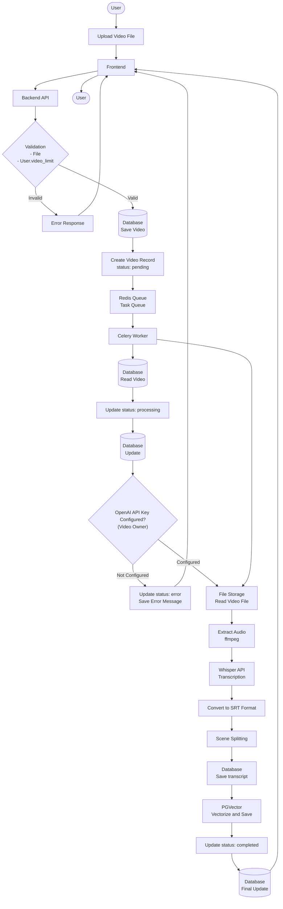
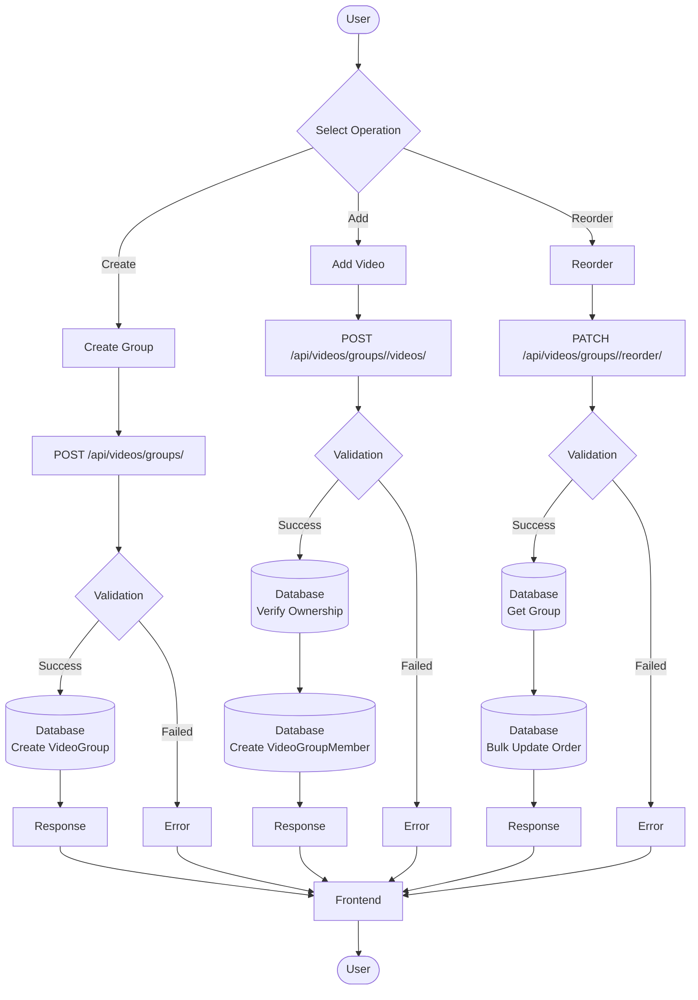
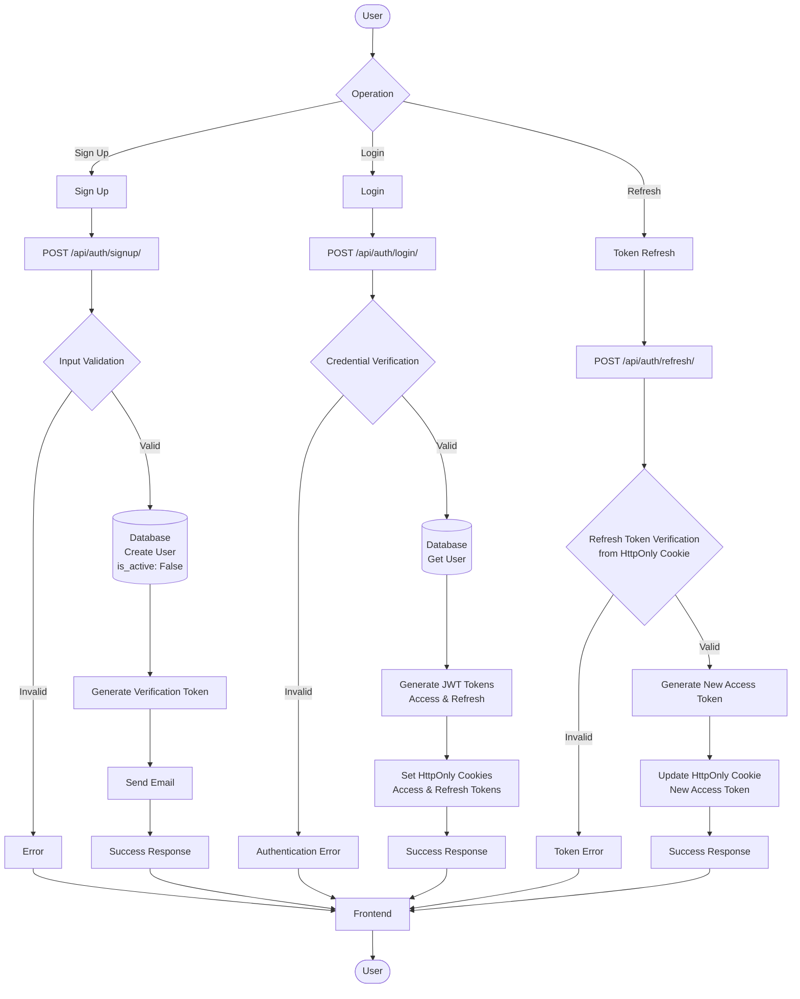
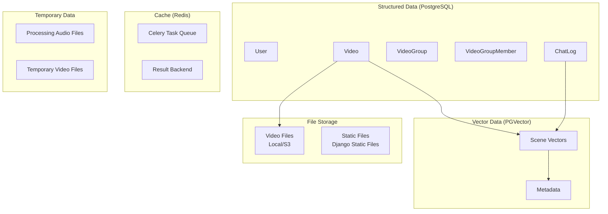

# Data Flow Diagram

## Overview

This diagram represents the data flow in the VideoQ system.

## 1. Data Flow from Video Upload to Transcription



## 2. Chat Processing (RAG) Data Flow

```mermaid
flowchart TD
    Start([User]) --> Input[Input Question]
    Input --> Frontend[Frontend]
    Frontend --> API[Backend API<br/>/api/chat/]
    
    API --> Auth{Authentication Check}
    Auth -->|Failed| Error1[Authentication Error]
    Auth -->|Success| GetAPIKey[Get OpenAI API Key<br>(User)]
    
    GetAPIKey --> GetGroup[(Database<br/>Get VideoGroup)]
    
    GetGroup --> VectorSearch[PGVector<br/>Vector Search]
    VectorSearch --> RelatedScenes[Get Related Scenes]
    RelatedScenes --> BuildContext[Build Context]
    
    BuildContext --> LLM[OpenAI API<br/>LLM Call]
    LLM --> Answer[Generate Answer]
    
    Answer --> SaveLog[(Database<br/>Save ChatLog)]
    SaveLog --> Response[Generate Response]
    Response --> Frontend
    Frontend --> End([User])
    
    Error1 --> Frontend
```

## 3. Group Management Data Flow



## 4. Sharing Feature Data Flow

```mermaid
flowchart TD
    Start1([Owner]) --> Generate[Generate Share Link]
    Generate --> API1[POST /api/videos/groups/<id>/share/]
    API1 --> Validate1[(Database<br/>Verify Ownership)]
    Validate1 --> GenerateToken[Generate Token]
    GenerateToken --> SaveToken[(Database<br/>Save share_token)]
    SaveToken --> ReturnURL[Return Share URL]
    ReturnURL --> Share[Send Share URL]
    
    Share --> Guest([Guest])
    Guest --> Access[Access Share URL]
    Access --> Frontend[Frontend]
    Frontend --> API2[GET /api/videos/groups/shared/<token>/]
    
    API2 --> ValidateToken[(Database<br/>Verify Token)]
    ValidateToken --> GetGroup[(Database<br/>Get VideoGroup)]
    GetGroup --> GetVideos[(Database<br/>Get Related Videos)]
    GetVideos --> Response[Return Group Information]
    Response --> Frontend
    Frontend --> Guest
    
    Guest --> Chat[Send Chat]
    Chat --> API3[POST /api/chat/?share_token=<token>]
    API3 --> ValidateToken2[(Database<br/>Verify Token)]
    ValidateToken2 --> GetAPIKey[Get OpenAI API Key<br>(Group Owner)]
    GetAPIKey --> RAG[RAG Processing]
    RAG --> SaveLog[(Database<br/>Save ChatLog<br/>is_shared_origin: True)]
    SaveLog --> ReturnAnswer[Return Answer]
    ReturnAnswer --> Frontend
    Frontend --> Guest
```

## 5. Authentication Data Flow



## 6. Data Storage Types



## Data Flow Characteristics

### Asynchronous Processing
- Video transcription is processed asynchronously by Celery Worker
- Redis is used as message broker

### Vector Search
- Similarity search using PGVector
- Search related scenes for RAG

### Data Integrity
- Referential integrity through foreign key constraints
- Consistency guarantee through transactions

### Scalability
- File storage supports S3
- Vector search is accelerated with pgvector
