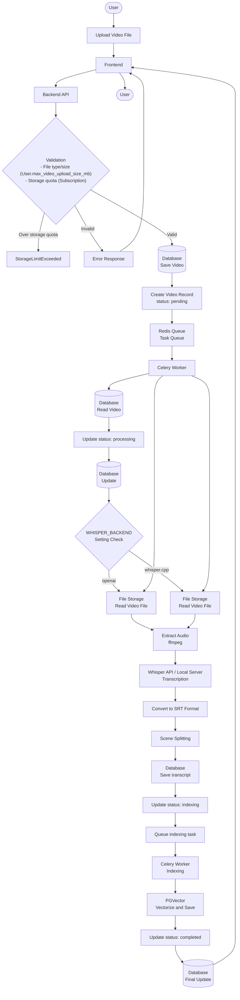
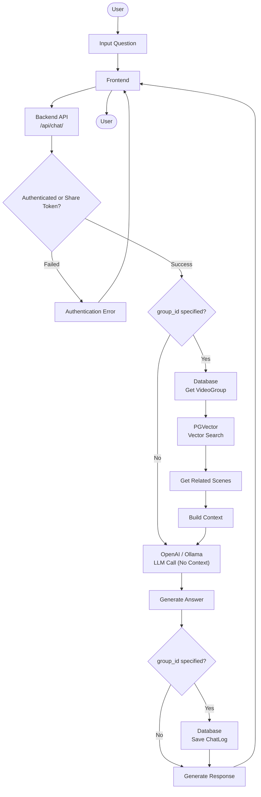
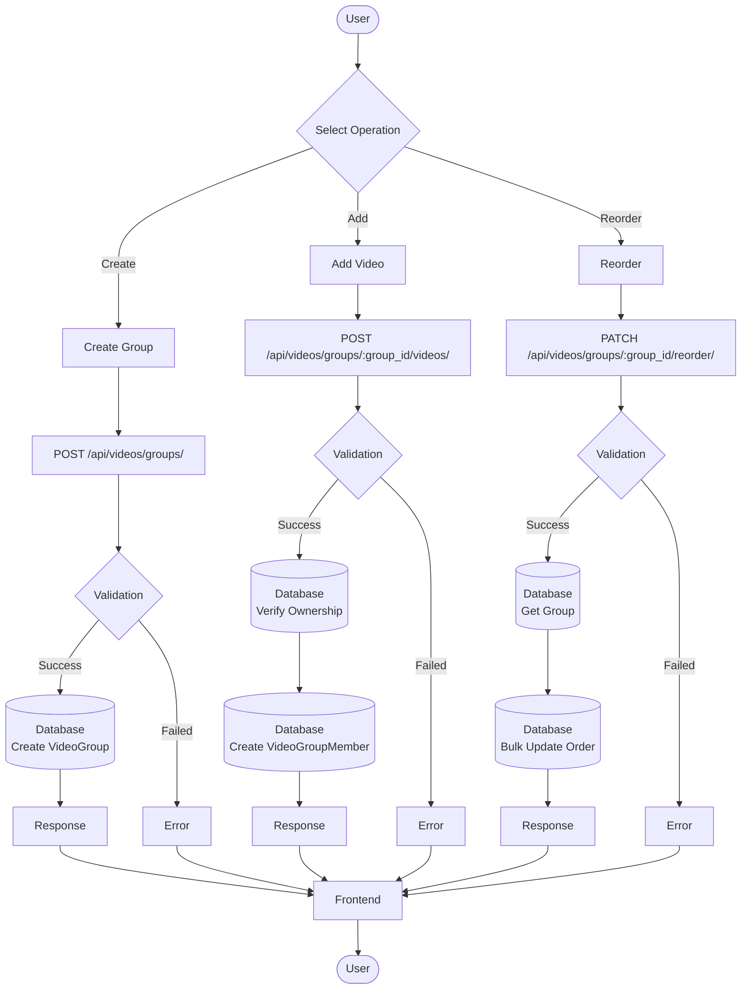
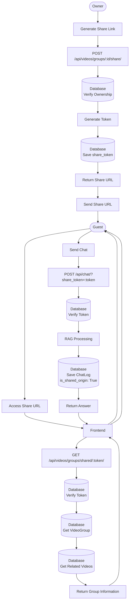
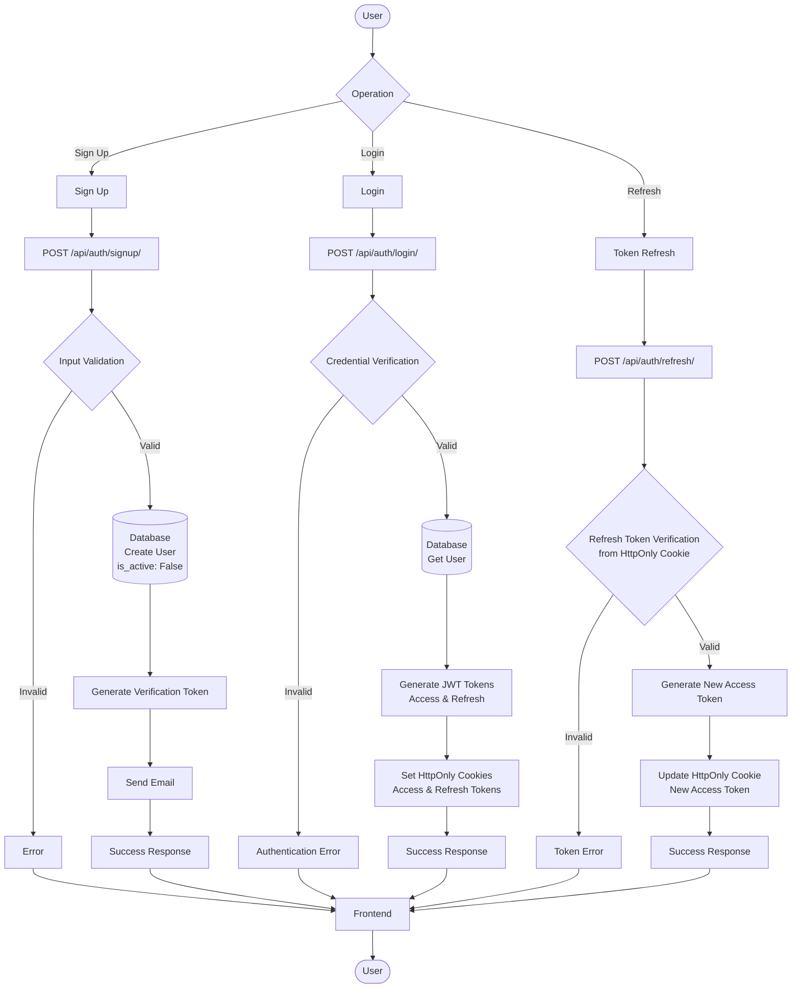
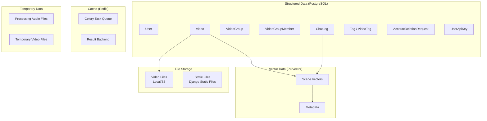
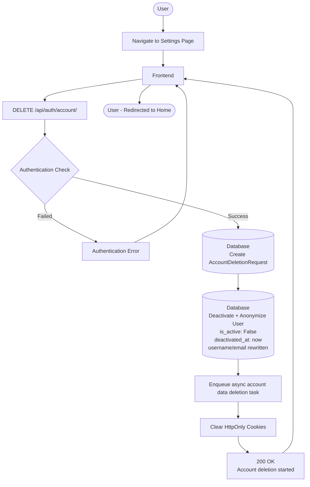
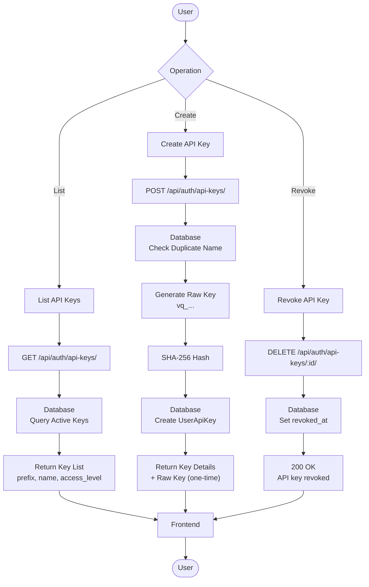
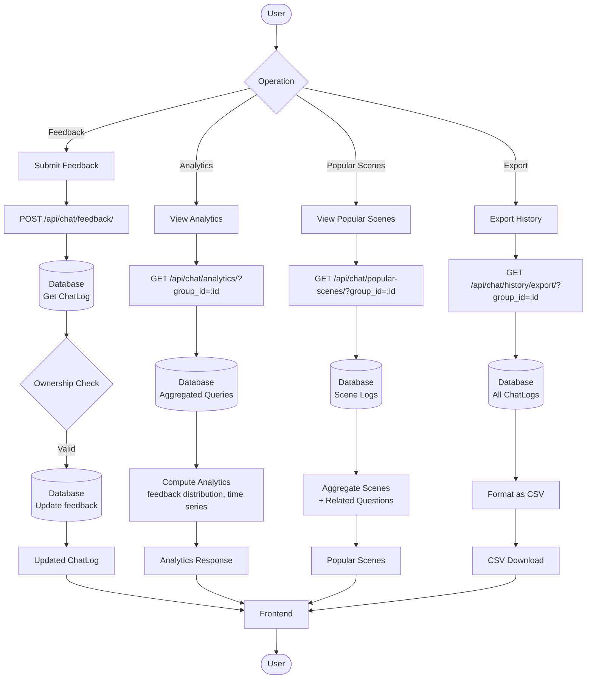

# データフロー図

## 概要

VideoQシステムのデータフローを示す図です。

## 1. 動画アップロードから文字起こしまでのデータフロー

```mermaid
flowchart TD
    Start([User]) --> Upload[Upload Video File]
    Upload --> Frontend[Frontend]
    Frontend --> API[Backend API]
    
    API --> Validate{"Validation<br>- File type/size (User.max_video_upload_size_mb)<br>- Storage quota (Subscription)"}
    Validate -->|Over storage quota| QuotaError[StorageLimitExceeded]
    Validate -->|Invalid| Error[Error Response]
    Validate -->|Valid| SaveDB[(Database<br/>Save Video)]
    
    SaveDB --> CreateRecord[Create Video Record<br/>status: pending]
    CreateRecord --> Queue[Redis Queue<br/>Task Queue]
    
    Queue --> Worker[Celery Worker]
    Worker --> ReadDB[(Database<br/>Read Video)]
    ReadDB --> UpdateStatus[Update status: processing]
    UpdateStatus --> SaveDB2[(Database<br/>Update)]
    
    SaveDB2 --> CheckBackend{"WHISPER_BACKEND<br>Setting Check"}
    CheckBackend -->|whisper.cpp| ReadFile2[File Storage<br/>Read Video File]
    CheckBackend -->|openai| ReadFile[File Storage<br/>Read Video File]

    Worker --> ReadFile[File Storage<br/>Read Video File]
    Worker --> ReadFile2
    ReadFile --> Extract[Extract Audio<br/>ffmpeg]
    ReadFile2 --> Extract
    Extract --> Transcribe[Whisper API / Local Server<br/>Transcription]
    Transcribe --> SRT[Convert to SRT Format]
    SRT --> SceneSplit[Scene Splitting]
    
    SceneSplit --> SaveTranscript[Database<br/>Save transcript]
    SaveTranscript --> UpdateIndexing[Update status: indexing]
    UpdateIndexing --> QueueIndexing[Queue indexing task]
    QueueIndexing --> IndexWorker[Celery Worker<br/>Indexing]
    IndexWorker --> Vectorize[PGVector<br/>Vectorize and Save]
    Vectorize --> UpdateComplete[Update status: completed]
    UpdateComplete --> SaveDB3[(Database<br/>Final Update)]
    
    Error --> Frontend
    SaveDB3 --> Frontend
    Frontend --> End([User])
```

## 2. チャット処理（RAG）データフロー

```mermaid
flowchart TD
    Start([User]) --> Input[Input Question]
    Input --> Frontend[Frontend]
    Frontend --> API["Backend API<br>/api/chat/"]
    
    API --> Auth{Authenticated or Share Token?}
    Auth -->|Failed| Error1[Authentication Error]
    Auth -->|Success| CheckGroup{group_id specified?}
    CheckGroup -->|Yes| GetGroup["Database<br>Get VideoGroup"]
    CheckGroup -->|No| LLM["OpenAI / Ollama<br>LLM Call (No Context)"]

    GetGroup --> VectorSearch["PGVector<br>Vector Search"]
    VectorSearch --> RelatedScenes[Get Related Scenes]
    RelatedScenes --> BuildContext[Build Context]
    
    BuildContext --> LLM
    LLM --> Answer[Generate Answer]

    Answer --> SaveLog{group_id specified?}
    SaveLog -->|Yes| PersistLog["Database<br>Save ChatLog"]
    SaveLog -->|No| Response[Generate Response]
    PersistLog --> Response
    Response --> Frontend
    Frontend --> End([User])
    
    Error1 --> Frontend
```

## 3. グループ管理データフロー

```mermaid
flowchart TD
    Start([User]) --> Action{Select Operation}
    
    Action -->|Create| Create[Create Group]
    Action -->|Add| Add[Add Video]
    Action -->|Reorder| Reorder[Reorder]
    
    Create --> API1[POST /api/videos/groups/]
    Add --> API2[POST /api/videos/groups/:group_id/videos/]
    Reorder --> API3[PATCH /api/videos/groups/:group_id/reorder/]
    
    API1 --> Validate1{Validation}
    API2 --> Validate2{Validation}
    API3 --> Validate3{Validation}
    
    Validate1 -->|Success| Save1[(Database<br/>Create VideoGroup)]
    Validate2 -->|Success| Check[(Database<br/>Verify Ownership)]
    Validate3 -->|Success| Check2[(Database<br/>Get Group)]
    
    Check --> Save2[(Database<br/>Create VideoGroupMember)]
    Check2 --> Update[(Database<br/>Bulk Update Order)]
    
    Save1 --> Response1[Response]
    Save2 --> Response2[Response]
    Update --> Response3[Response]
    
    Response1 --> Frontend
    Response2 --> Frontend
    Response3 --> Frontend
    Frontend --> End([User])
    
    Validate1 -->|Failed| Error1[Error]
    Validate2 -->|Failed| Error2[Error]
    Validate3 -->|Failed| Error3[Error]
    Error1 --> Frontend
    Error2 --> Frontend
    Error3 --> Frontend
```

## 4. 共有機能データフロー

```mermaid
flowchart TD
    Start1([Owner]) --> Generate[Generate Share Link]
    Generate --> API1[POST /api/videos/groups/:id/share/]
    API1 --> Validate1[(Database<br>Verify Ownership)]
    Validate1 --> GenerateToken[Generate Token]
    GenerateToken --> SaveToken[(Database<br>Save share_token)]
    SaveToken --> ReturnURL[Return Share URL]
    ReturnURL --> Share[Send Share URL]
    
    Share --> Guest([Guest])
    Guest --> Access[Access Share URL]
    Access --> Frontend[Frontend]
    Frontend --> API2[GET /api/videos/groups/shared/:token/]
    
    API2 --> ValidateToken[(Database<br>Verify Token)]
    ValidateToken --> GetGroup[(Database<br>Get VideoGroup)]
    GetGroup --> GetVideos[(Database<br>Get Related Videos)]
    GetVideos --> Response[Return Group Information]
    Response --> Frontend
    Frontend --> Guest
    
    Guest --> Chat[Send Chat]
    Chat --> API3[POST /api/chat/?share_token=:token]
    API3 --> ValidateToken2[(Database<br>Verify Token)]
    ValidateToken2 --> RAG[RAG Processing]
    RAG --> SaveLog[(Database<br>Save ChatLog<br>is_shared_origin: True)]
    SaveLog --> ReturnAnswer[Return Answer]
    ReturnAnswer --> Frontend
    Frontend --> Guest
```

## 5. 認証データフロー

```mermaid
flowchart TD
    Start([User]) --> Action{Operation}
    
    Action -->|Sign Up| Signup[Sign Up]
    Action -->|Login| Login[Login]
    Action -->|Refresh| Refresh[Token Refresh]
    
    Signup --> API1[POST /api/auth/signup/]
    Login --> API2[POST /api/auth/login/]
    Refresh --> API3[POST /api/auth/refresh/]
    
    API1 --> Validate1{Input Validation}
    Validate1 -->|Invalid| Error1[Error]
    Validate1 -->|Valid| CreateUser[(Database<br/>Create User<br/>is_active: False)]
    CreateUser --> GenerateToken[Generate Verification Token]
    GenerateToken --> SendEmail[Send Email]
    SendEmail --> Response1[Success Response]
    
    API2 --> Validate2{Credential Verification}
    Validate2 -->|Invalid| Error2[Authentication Error]
    Validate2 -->|Valid| GetUser[(Database<br/>Get User)]
    GetUser --> GenerateJWT[Generate JWT Tokens<br/>Access & Refresh]
    GenerateJWT --> SetCookie[Set HttpOnly Cookies<br/>Access & Refresh Tokens]
    SetCookie --> Response2[Success Response]
    
    API3 --> ValidateToken{"Refresh Token Verification<br>from HttpOnly Cookie"}
    ValidateToken -->|Invalid| Error3[Token Error]
    ValidateToken -->|Valid| GenerateAccess[Generate New Access Token]
    GenerateAccess --> SetCookie2[Update HttpOnly Cookie<br/>New Access Token]
    SetCookie2 --> Response3[Success Response]
    
    Response1 --> Frontend
    Response2 --> Frontend
    Response3 --> Frontend
    Error1 --> Frontend
    Error2 --> Frontend
    Error3 --> Frontend
    Frontend --> End([User])
```

## 6. データストレージ種別

```mermaid
graph TB
    subgraph StructuredData["Structured Data (PostgreSQL)"]
        D1[User]
        D2[Video]
        D3[VideoGroup]
        D4[VideoGroupMember]
        D5[ChatLog]
        D6[Tag / VideoTag]
        D7[AccountDeletionRequest]
        D8[UserApiKey]
    end
    
    subgraph VectorData["Vector Data (PGVector)"]
        V1[Scene Vectors]
        V2[Metadata]
    end
    
    subgraph FileStorage["File Storage"]
        F1[Video Files<br/>Local/S3]
        F2[Static Files<br/>Django Static Files]
    end
    
    subgraph Cache["Cache (Redis)"]
        C1[Celery Task Queue]
        C2[Result Backend]
    end
    
    subgraph Temporary["Temporary Data"]
        T1[Processing Audio Files]
        T2[Temporary Video Files]
    end
    
    D2 --> F1
    D2 --> V1
    V1 --> V2
    D5 --> V1
```

## データフロー特性

### 非同期処理
- 動画の文字起こしはCelery Workerによって非同期に処理されます
- Redisをメッセージブローカーとして使用

### ベクトル検索
- PGVectorを使用した類似検索
- RAG用に関連シーンを検索

### データ整合性
- 外部キー制約による参照整合性
- `transaction.atomic` による整合性保証

### スケーラビリティ
- ファイルストレージはS3に対応
- ベクトル検索はpgvectorで高速化

## 7. アカウント無効化データフロー

```mermaid
flowchart TD
    Start([User]) --> Navigate[Navigate to Settings Page]
    Navigate --> Frontend[Frontend]
    Frontend --> API[DELETE /api/auth/account/]
    
    API --> Auth{Authentication Check}
    Auth -->|Failed| Error1[Authentication Error]
    Auth -->|Success| CreateRequest[(Database<br/>Create AccountDeletionRequest)]

    CreateRequest --> DeactivateUser[(Database<br/>Deactivate + Anonymize User<br/>is_active: False<br/>deactivated_at: now<br/>username/email rewritten)]
    DeactivateUser --> EnqueueTask[Enqueue async account data deletion task]
    EnqueueTask --> ClearCookies[Clear HttpOnly Cookies]
    ClearCookies --> Response[200 OK<br/>Account deletion started]
    Response --> Frontend
    Frontend --> End([User - Redirected to Home])
    
    Error1 --> Frontend
```

## 8. APIキーデータフロー

```mermaid
flowchart TD
    Start([User]) --> Action{Operation}

    Action -->|List| List[List API Keys]
    Action -->|Create| Create[Create API Key]
    Action -->|Revoke| Revoke[Revoke API Key]

    List --> API1[GET /api/auth/api-keys/]
    Create --> API2[POST /api/auth/api-keys/]
    Revoke --> API3[DELETE /api/auth/api-keys/:id/]

    API1 --> QueryKeys["Database<br>Query Active Keys"]
    QueryKeys --> Response1["Return Key List<br>prefix, name, access_level"]
    Response1 --> Frontend

    API2 --> CheckDup["Database<br>Check Duplicate Name"]
    CheckDup --> GenKey["Generate Raw Key<br>vq_..."]
    GenKey --> HashKey[SHA-256 Hash]
    HashKey --> SaveKey["Database<br>Create UserApiKey"]
    SaveKey --> Response2["Return Key Details<br>+ Raw Key (one-time)"]
    Response2 --> Frontend

    API3 --> SetRevoked["Database<br>Set revoked_at"]
    SetRevoked --> Response3["200 OK<br>API key revoked"]
    Response3 --> Frontend

    Frontend --> End([User])
```

## 9. チャット分析・フィードバックデータフロー

```mermaid
flowchart TD
    Start([User]) --> Action{Operation}

    Action -->|Feedback| Feedback[Submit Feedback]
    Action -->|Analytics| Analytics[View Analytics]
    Action -->|Popular Scenes| Scenes[View Popular Scenes]
    Action -->|Export| Export[Export History]

    Feedback --> API1[POST /api/chat/feedback/]
    API1 --> GetLog[(Database<br>Get ChatLog)]
    GetLog --> VerifyAccess{Ownership Check}
    VerifyAccess -->|Valid| UpdateFeedback[(Database<br>Update feedback)]
    UpdateFeedback --> Response1[Updated ChatLog]
    Response1 --> Frontend

    Analytics --> API2[GET /api/chat/analytics/?group_id=:id]
    API2 --> GetRawData[(Database<br>Aggregated Queries)]
    GetRawData --> ComputeAnalytics[Compute Analytics<br>feedback distribution, time series]
    ComputeAnalytics --> Response2[Analytics Response]
    Response2 --> Frontend

    Scenes --> API3[GET /api/chat/popular-scenes/?group_id=:id]
    API3 --> GetSceneLogs[(Database<br>Scene Logs)]
    GetSceneLogs --> AggregateScenes[Aggregate Scenes<br>+ Related Questions]
    AggregateScenes --> Response3[Popular Scenes]
    Response3 --> Frontend

    Export --> API4[GET /api/chat/history/export/?group_id=:id]
    API4 --> GetAllLogs[(Database<br>All ChatLogs)]
    GetAllLogs --> FormatCSV[Format as CSV]
    FormatCSV --> Response4[CSV Download]
    Response4 --> Frontend

    Frontend --> End([User])
```

---

## Related Documentation

- [📖 ドキュメント一覧](../README.md)
- [ER図](er-diagram.md) — エンティティ関連図
- [データ辞書](data-dictionary.md) — テーブル・カラム定義
- [シーケンス図](../design/sequence-diagram.md) — 処理シーケンスの詳細
- [フローチャート](../architecture/flowchart.md) — 処理フロー
