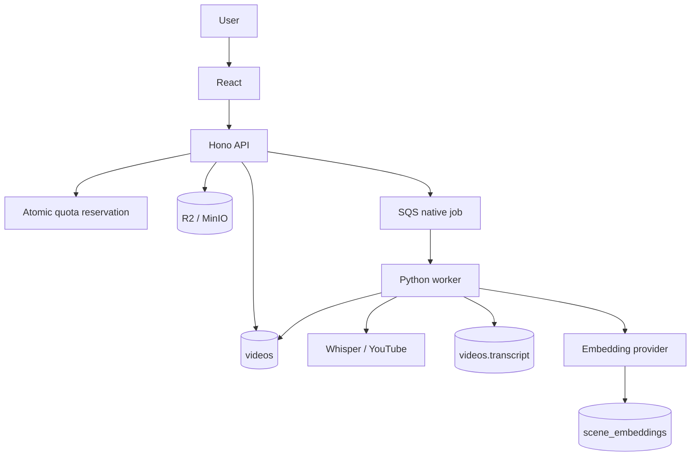
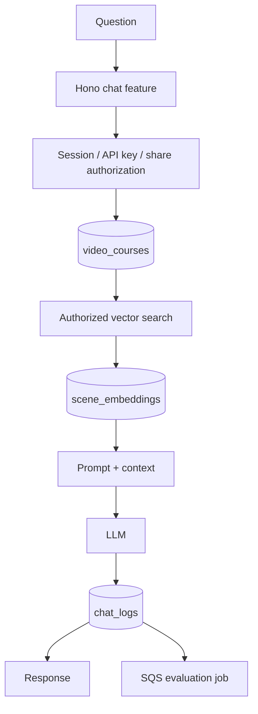
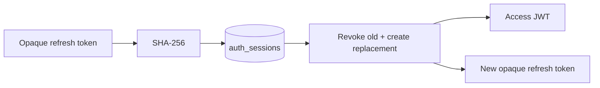
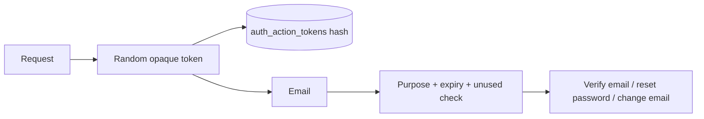

# データフロー図

## 動画 upload と処理

```mermaid
flowchart TD
    User --> UI[React]
    UI --> API[Hono API]
    API --> Quota[Atomic quota reservation]
    API --> R2[(R2 / MinIO)]
    API --> Video[(videos)]
    API --> SQS[SQS native job]
    SQS --> Worker[Python worker]
    Worker --> Whisper[Whisper / YouTube]
    Worker --> Transcript[(videos.transcript)]
    Worker --> Embed[Embedding provider]
    Embed --> Scenes[(scene_embeddings)]
    Worker --> Video
```

## RAG chat

```mermaid
flowchart TD
    Question --> API[Hono chat feature]
    API --> Auth[Session / API key / share authorization]
    Auth --> Course[(video_courses)]
    Course --> Search[Authorized vector search]
    Search --> Scenes[(scene_embeddings)]
    Scenes --> Prompt[Prompt + context]
    Prompt --> LLM[LLM]
    LLM --> Log[(chat_logs)]
    Log --> Response
    Log --> SQS[SQS evaluation job]
```

## Session refresh

```mermaid
flowchart LR
    Refresh[Opaque refresh token] --> Hash[SHA-256]
    Hash --> Session[(auth_sessions)]
    Session --> Rotate[Revoke old + create replacement]
    Rotate --> Access[Access JWT]
    Rotate --> NewRefresh[New opaque refresh token]
```

## Action token

```mermaid
flowchart LR
    Request --> Token[Random opaque token]
    Token --> Hash[(auth_action_tokens hash)]
    Token --> Email
    Email --> Consume[Purpose + expiry + unused check]
    Consume --> Mutation[Verify email / reset password / change email]
```
