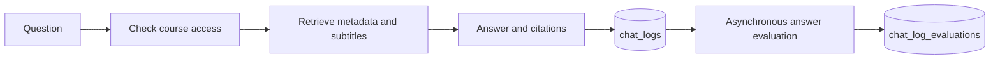

# Where data is stored

Video files and information about those videos are stored separately. When investigating a problem, first identify which kind of data you need to inspect.

## From video to search data

```mermaid
flowchart LR
    File[Video file] --> Store[(R2 / MinIO)]
    Store --> Worker[Python worker]
    Worker --> Transcript[(Transcript in videos)]
    Transcript --> Index[Generate embeddings]
    Index --> Scenes[(scene_embeddings)]
```

`videos` stores the title, owner, file reference, transcript, processing state, and related metadata. The file itself is not stored in a DB row.

`scene_embeddings` enables semantic search of transcript segments. The API converts questions into numeric search vectors and finds similar scenes within permitted videos.

## Questions and answers

```mermaid
flowchart LR
    Question[Question] --> Access[Check course access]
    Access --> Context[Retrieve metadata and subtitles]
    Context --> Answer[Answer and citations]
    Answer --> Logs[(chat_logs)]
    Logs --> Evaluation[Asynchronous answer evaluation]
    Evaluation --> Scores[(chat_log_evaluations)]
```

Chat records and answer evaluations use separate tables. Returning an answer and completing its evaluation are separate events.

## Other storage locations

| Data | Storage or management |
|---|---|
| Browser login state | Better Auth `session` and browser cookies |
| External API keys saved by users | Encrypted in the database |
| MCP API keys and OAuth | `apikey`, `oauth_*`, and related tables |
| Undelivered jobs | `external_tasks` |
| Worker execution records | `job_executions` |

**Related:** [Data dictionary](data-dictionary.md), [ER diagrams](er-diagram.md), [Job delivery and recovery](../architecture/flowchart.md).
