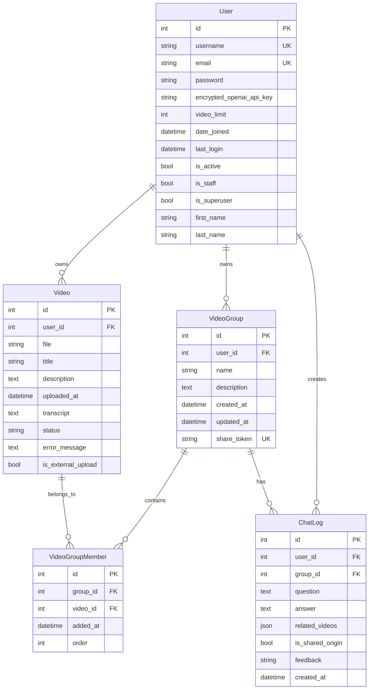

# ER Diagram

## Overview

This diagram represents the database entities and relationships of the Ask Video system.

## ER Diagram

## Relationship Details

### User - Video (1:N)
- **Relationship**: One user owns multiple videos
- **Foreign Key**: `Video.user_id` → `User.id`
- **Delete Action**: CASCADE (videos are deleted when user is deleted)

### User - VideoGroup (1:N)
- **Relationship**: One user owns multiple video groups
- **Foreign Key**: `VideoGroup.user_id` → `User.id`
- **Delete Action**: CASCADE (groups are deleted when user is deleted)

### User - ChatLog (1:N)
- **Relationship**: One user creates multiple chat logs
- **Foreign Key**: `ChatLog.user_id` → `User.id`
- **Delete Action**: CASCADE (chat logs are deleted when user is deleted)

### VideoGroup - VideoGroupMember (1:N)
- **Relationship**: One group has multiple members
- **Foreign Key**: `VideoGroupMember.group_id` → `VideoGroup.id`
- **Delete Action**: CASCADE (members are deleted when group is deleted)

### Video - VideoGroupMember (1:N)
- **Relationship**: One video can belong to multiple groups
- **Foreign Key**: `VideoGroupMember.video_id` → `Video.id`
- **Delete Action**: CASCADE (memberships are deleted when video is deleted)

### VideoGroup - ChatLog (1:N)
- **Relationship**: One group has multiple chat logs
- **Foreign Key**: `ChatLog.group_id` → `VideoGroup.id`
- **Delete Action**: CASCADE (chat logs are deleted when group is deleted)

### VideoGroup - Video (N:M through VideoGroupMember)
- **Relationship**: Many-to-many relationship (via intermediate table)
- **Intermediate Table**: `VideoGroupMember`
- **Additional Attributes**: `order` (order within group)

## Constraints

### Primary Key
- All tables have `id` as the primary key

### Unique Constraints
- `User.username`: Username is unique
- `User.email`: Email address is unique
- `VideoGroup.share_token`: Share token is unique (NULL allowed)
- `VideoGroupMember(group_id, video_id)`: Cannot add the same video to the same group multiple times

### Foreign Key Constraints
- All foreign keys have CASCADE delete set
- Referential integrity is guaranteed

### Check Constraints
- `Video.status`: Must be one of 'pending', 'processing', 'completed', 'error'
- `ChatLog.feedback`: Must be 'good', 'bad', or NULL
- `User.video_limit`: Must be a positive integer

## Indexes

### Automatic Indexes
- Primary Key: All `id` columns
- Foreign Keys: All foreign key columns
- Unique Constraints: `username`, `email`, `share_token`

### Custom Indexes
- `Video.uploaded_at`: For descending sort (Meta.ordering)
- `VideoGroup.created_at`: For descending sort (Meta.ordering)
- `ChatLog.created_at`: For descending sort (Meta.ordering)
- `VideoGroupMember(order, added_at)`: For order sorting (Meta.ordering)

## pgvector Extension

### Vector Storage
- Uses PostgreSQL's pgvector extension
- Stores vectorized text for each video scene
- Stores metadata such as `video_id`, `user_id`, `video_title`, `start_time`, `end_time`
- Used for RAG (Retrieval-Augmented Generation)
